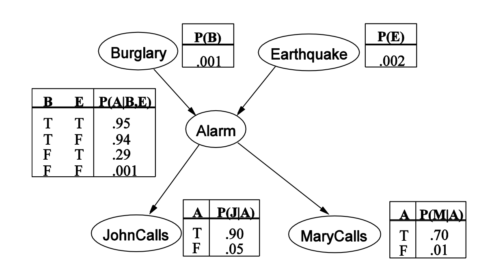
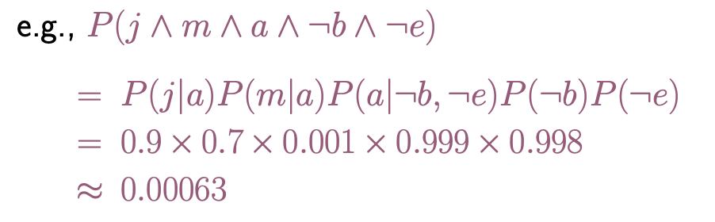
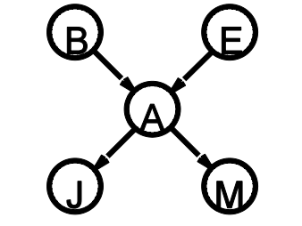
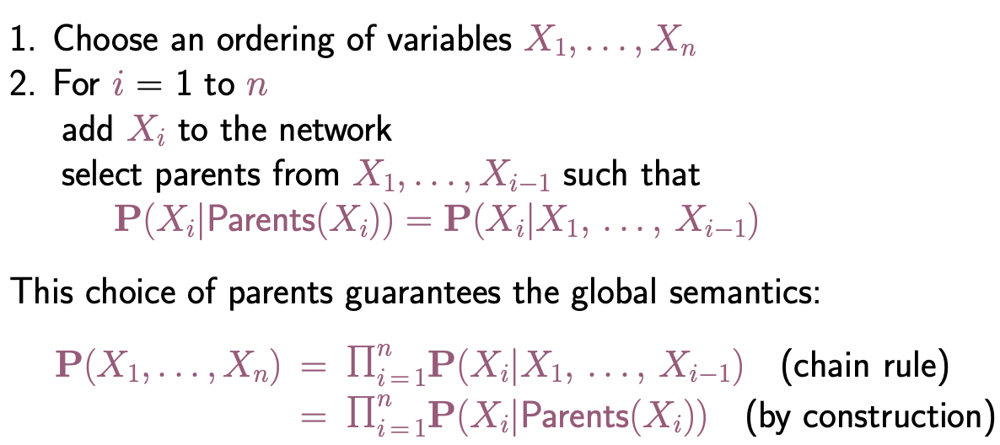

### Bayesian Network

-  A **<u>simple</u>**, **<u>graphical notation</u>** for conditional independence assertions and hence for **<u>compact specification of full joint distribution</u>**
- Example
  - 
- Compactness
  - Growth linear with n $O(n*2^k)$, comparing to $O(2^n)$ for the full joint distribution.
- Global Semantics
  - Full joint distribution as product of the local conditional distributions
  - 
  - Given the graph
    - 

- Local Semantics
  - Each node is conditionally independent of its non-descendants given its parents
- Constructing Bayesian Networks
  - 

### Inference Task

- Simple queries — Computer posterior marginal $P(X_I|E=e)$

  - $P(NoGas|Gauge=empty,Lights=on, starts=false)$
  - Example
    - 

- Conjuncive queries

  - $P(X_i,X_j|E=e) = P(X_i|E=e)P(X_j|X_i,E=e)$

  