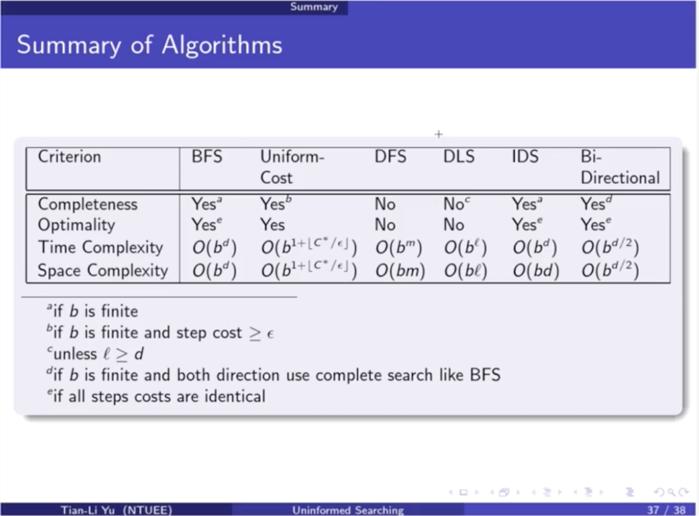

### Problem Solving Agents

- Online
  
  - You have to explore the environment while make decision
  
- Offline

  - More like a search problem where you have the information of the environment and rule of the environment

- Evaluate problems from

  - states
  - actions
  - Goal test
  - Path cost

  

### Uninformative Search

- Evaluate using
  - Completeness
    - Does it always find a solution if one exist
  - Time complexity
    - Number of nodes generated/expanded
  - Space complexity
    - Maximum number of nodes in memory
  - Optimality
    - Does it always find a lest-cost solution
- Parameters
  - b
    - Maximum branching factor of the search tree
  - d
    - Depth of the least-cost solution (goal)
  - m
    - Maximum depth of the state space (may be $\infty$)
  - $\epsilon $ 
    - A arbitrary positive integer
- BFS (Uniform-cost search with all cost = 1)
  - Time
    - $1+b^2+b^3+…+b^d = O(b^d)$
    - Exponential growth in d
  - space
    - $O(b^d )$ 
    - keeps every node in memory
- Uniform-cost search (general form for BFS)
  - Optimality
    - Yes, since will always expand the less cost node first
  - Time and space
    - We only need to store those point that has the overall cost smaller than destination
    - Where is # of nodes with g $\leq$ cost of optimal solution.
- DFS
  - Completeness
    - No, may fails in infinite-depth spaces, spaces with loops modify to avoid repeated states along path.
  - Time
    - $O(b^m)$
    - Terrible if m is much larger than d but if solutions are dense, might be much faster than BFS.
  - Space
    - $O(bm)$
    - Linear space
  - Optimal
    - No, may expand non-optimal solution first.
- DLS (Depth-limited search)
  - Restrict the maximum depth that could explore by DFS
  - Will complete only if $l \geq d \ \text{where } l \ \text{is the limited depth}$
- IDS (Iteratively Deepening Search)
  - Time
    - $(d+1)b^0+db^1+(d-1)b^2+…+b^d=O(b^d)$
    - (d+1) is the root
  - Space
    - $O(bd)$
  - Optimality
    - ==Only if the step cost are 1 (identical)==
    - Why this?
- 