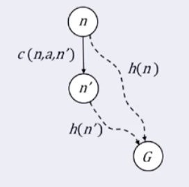

### Best-First Search

- Use **<u>evaluation function</u>** for each node to estimate desirability
  
  - Might be a straight-line distance from current node to the goal
- Properties
  - Completeness
    
    - No, can get stuck in a loop, since the heuristic function may not reflect the real cost.
  - Times
    
    - $O(b^m)$ For the worst time, but a good heuristic can give dramatic improvement
  - Space
    
    - $O(b^m)$, it keeps all nodes in memory
  - Optimal
    
    - No
    
      

### A\*

- Evaluation function

  - $f(n) = g(n) + h(n)$, where
  - $g(n) = $ cost os far to reach n (path cost)
  - $h(n)=$ Estimated cost to goal from $n$
  - $f(n) =$ Estimated total cost of path through $n$ to goal

- Optimality (those two conditions are sufficient but unnecessary condition)

  - Admissible (**tree** and **graph**)

    - $\forall n, h(n) \leq h^*(n), $ where $h^*$ is the actual cost.

    - Suppose we have a map like this

      

    - Note that G is the real goal we want, G' is another worse goal, n is any node between the starting point and G

    - If we prove that give $0 \leq h(n) \leq h^*(n)$ , n is always expanded before G', by the mathematically induction, we can say that G will be expanded before G’

    - So we have $0 \leq h(G) \leq h^*(G) = 0 \implies h(G) = 0$ , since from goal to goal cost nothing in the perfect heuristic function

    - Therefore, $h(G') = 0$, since G' is another goal

    - We need to prove $f(G') > f(n)$

    - $f(G') \\= g(G') + h(G') \\= g(G')\\ > g(G) \\= g(n) + h^*(n)\\ \geq g(n) + h(n) \\ =f(n)$

    - Therefore, we can conclude that $f(G') \geq f(n)$ 

  - Consistency (only **<u>graph</u>**) aka. Monotonic (triangle inequality)

    - $\forall\ $successor n' of any n generated by any action a where c is the moving cost, which is $h(n) \leq c(n,a,n') + h(n')$
    - Lemma : If h(n) is consistent, the values of $f$ along any path in $A^*$ are non-decreasing
    - 
    - Which is same to proof $f(n') \geq f(n)$ 
    - Given $c(n,a,n') + h(n') \geq h(n)$
    - $f(n') \\=g(n') + h(n') \\ = g(n) + c(n,a,n') + h(n') \\\geq g(n) + h(n )\\=f(n)  $

-  Completeness

  - Yes, unless there are infinitely many nodes with $f \leq f(G)$

- Space Complexity
  
  - $O(b^d)$ 
  - Keeps all node in memory
  
- Time complexity
  
  - $O(b^{\epsilon d})$ , $\epsilon$ is the relative error can be calculated in $(h^* - h)/h^*$

### Dominance of heuristic

- If $\forall n\ h_1(n) \geq h_2(n)$ , both of them are admissible, then we said $h_1$ is dominate $h_2$ , using $h1$ may give us a better time complexity

  

### How to come up with heuristic function?

- Relaxed problems
  
  - Admissible heuristics can be derived from the relaxed version of the problem
- Finding informative features
  - Finding which features help us faster approaching our goal
  - Using ML to find hyper-parameters
- Learning from experience
  - When finishing a game, then look back to see how we can improve
  - Normally using a utility function
  - Reinforcement learning 
  
  

### Iterative Improvement algorithms

- Sometimes we don't care about the path, we are only interesting in the goal state itself
- Each state is a set of **<u>configurations</u>**, we are willing to find optimal configuration
  - Travelling salesperson problem
  - Find configuration satisfying constraints
  - N-queens problem
- Only keeping the current state and try to improve it
- Constant space, suitable for online as well as offline search
- Hill climbing search (gradient ascent/descent)
  - Keep searching for the larger successor, if there is no such successor, then we return the current node.
  - But this algorithm might stuck at local maximal