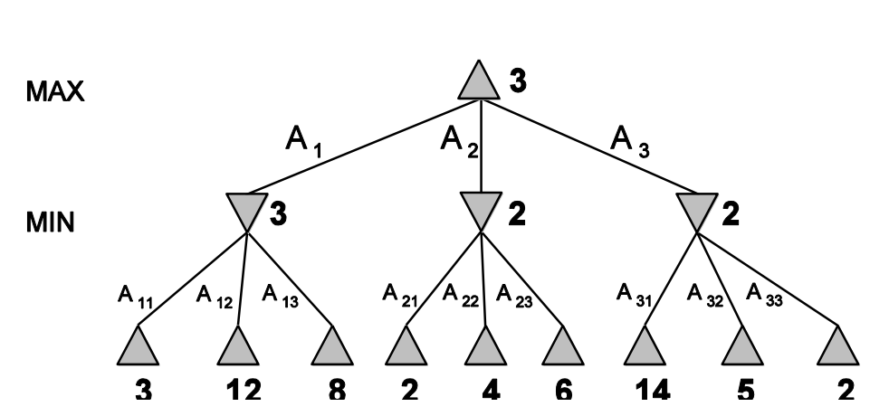
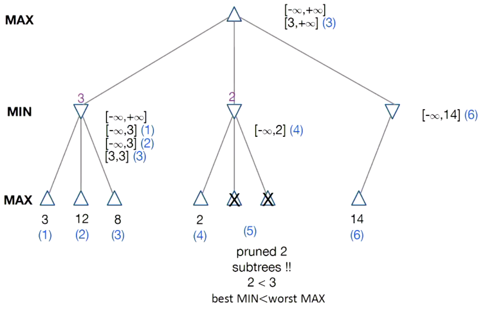
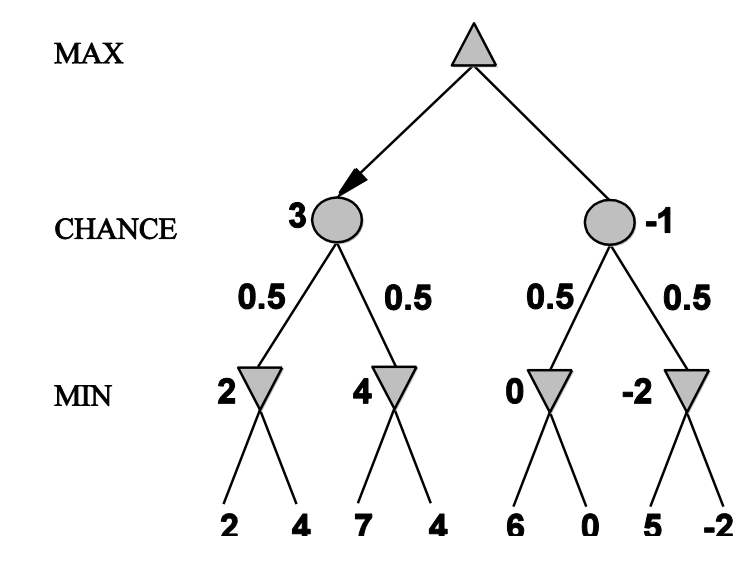

### Real World Game

- It has lots of limitations
  - Unpredictable opponent
  - Time limitations
    - Unlikely to find a goal, must approximate
- Some of the game are only have imperfect information, and depends on chance
  - Poker (cannot see the card of our opponents)
  - Bridge
  - Nuclear war
- Some of the game are deterministic but with imperfect information
  - battleship

### Representing a game as a search problem

- Need to consider
  - Initial state
    - How do we start the game
  - actions
    - How can one player move in the environment
  - Termial test
    - Win condition
    - Lose condition
    - Draw condition
  - Utility function (numeric reward for outcome)
    - Chess: +1,0,-1
    - Poker: cash won or lost

- Method
  - Minimax
    - Assumption: our opponent is rational and won't let us always do the best decision.
    - Deterministic perfect-information games
    - Maximise the minimal value in successor (we should chose A1 to go in the following example)
    - 
    - Properties
      - Complete
        - Yes, if the tree is finite
      - Optimal
        - Yes, if against an optimal opponent
        - Otherwise, no
      - Time complexity 
        - $O(b^m)$
      - Space complexity (DFS exploration)
        - $O(bm)$
    - Resource limits 
      - Cutoff Test
        - Depth limit
        - Quiescence search
          - If there is no significant move in successor, we stop searching, otherwise, keep searching deeper
      - Evaluation Function
        - Estimated desirability of position
          - Like alphaZero using residual-CNN to estimate how likely we are going to move to that state
        - Typically linear weighted sum of features depends on how important they are
          - $eval(s) = w_1f_1(s) + w_2f_2(s) + … + w_nf_n(s)$
  - Minimax cutoff
    - A cutoff strategy of when we stop stop the minimax searching
    - Replace 
      - <u>terminal state</u> by <u>cutoff</u>
        - We can terminate the search when there is no significant changes
      - <u>Utility</u> by <u>eval</u>

- How to make search quicker?  ($\alpha-\beta$ pruning)

  - Prune part of the tree without exploring them
  - Key point is we can remove a branch if we find a better results (in this case, higher low value) in other branch already
  - 
  - In this case, the final results won't be affected.
  - With perfect ordering, Time complexity = $O(b^{\frac{m}{2}})$
    - We can now doubles depth of search
    - How?
      - Using iteratively deepening
      - Using heuristic to search the better node first
- Improvement
    - <u>Utility of a node expansion</u> , which we tend to expand the node which is higher in utility results, hopefully it may lead us to a better decision. 
      - A extension on those abilities would be using <u>goal-directed reasoning</u>

### Non-deterministic Game

- Which path to take depends on chance
  - 

- We have to handle the all the expectations, therefore, $\alpha-\beta$ pruning does not so well.