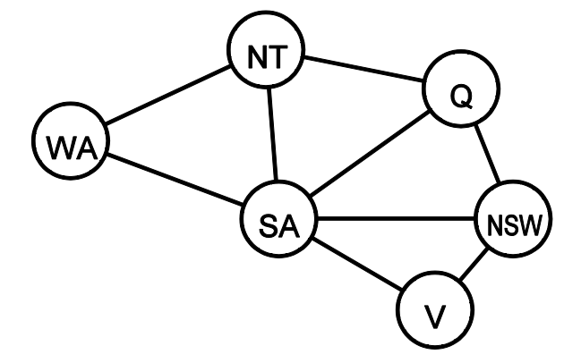
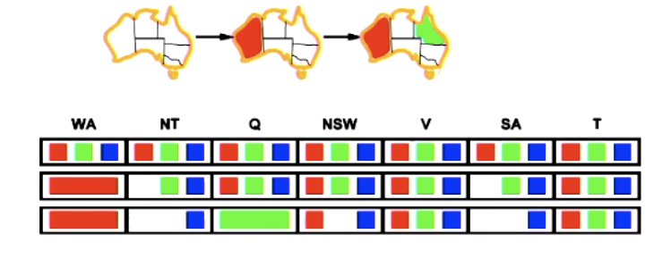
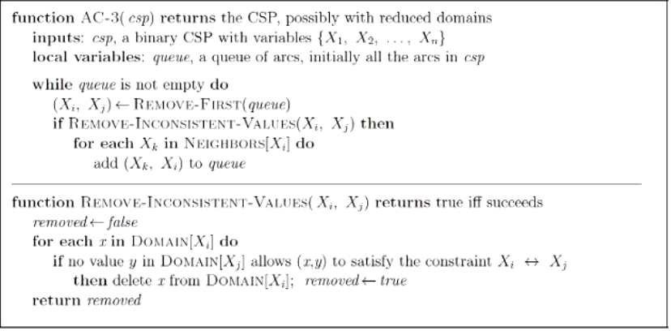
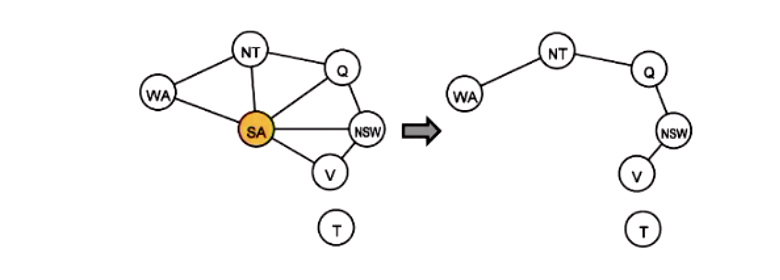

### CSP (Constraint Satisfaction Problems)

- Definition
  - State
    - Defined by *<u>variable</u>* $X_i$ with values from *<u>domain</u>* $D_i$
  - Goal test
    - Set of constrains specifying allowable combinations of values for subsets of variables
- Question type
  - Binary CSP
    - Each constraint relates at most two variables
  - Constraint graph
    - Nodes are variables, arcs show constrains
    - 
- Variable type
  - Discrete variables
    - Finite domains, size d $\to$ $O(d^n)$ complete assignments, where n is the variable
    - e.g.
      - Boolean CSPs, including boolean satisfiability (NP-Complete)
      - Job scheduling, variables are start/end days for each job
      - Linear constrains solvable, non-linear undecidable
  - Continuous variables
    - Start/end times for Hubble Telescope observations
    - Linear constrains solvable in polynomial time by linear programming (LP)

### Standard Search Formulation (Incremental)

- $b= (n-l)d$ at depth $l$, hence $n!d^n$ level

### Backtracking Search

- Equal to DFS for with one variable assigned per node
- $b = d$ and there are $d^n$ leaves
- How to speed up the backtrace search
- Minimum remaining values (MRV)
    - Choose the variable with the fewest legal values
  - Use degree heuristic (can act like a tie-breaker)
    - Choose the variable with the most constraints on remaining variables.
    - Variable ordering and value selection help significantly
  - Least constraining value
    - Choose the one that will remain us more options
- Forward checking

  - Keep track of how many possible solution left for each state
  - 
  - 
  - SA and NT are neighbor but left same color
  - We need to propagate our choice further instead of only their neighbors
  - To prevent later failure
- Constraint propagation

  - **Arc Consistency**
- X $\to$ Y is arc consistent iff for each of them at least have one value that satisfies the constraint between X and Y
    - If X loses a value, neighbors of X need to be rechecked.
    - 
      - Remove the condition that could not be satisfy
  - $O(n^2d^3)$ can be reduced to $O(n^2d^2)$
  - But detecting all is NP-hard
  -  Too slow, what to do?

    - Split into connected component, reduce time complexity dramatically

    - Turn graph to tree

      - Use topological sort and then start the AC(arc consistency) check from the bottom node and its parent(s).
  - Can be solved in $O(nd^2)$
    - Actually are $O(d^c (n-c)d^2)$
    - Very fast for small c
      - How to form a tree from a graph?
        - Cut-set conditioning
        - Initiate a point and cut it from the graph, then we can get a tree
      - 
        - But find the minimal set of point is a NP-hard problem
- Local Search
    
      - Using hill-climbing and min-conflicts heuristic which make selection with the least number of violation
      - Tries to change one variable assignment at a time.
      - Really fast, can solve n-queen problem in linear time