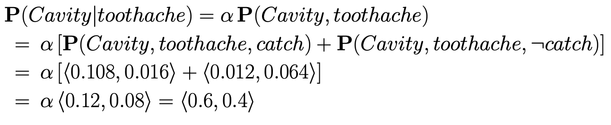
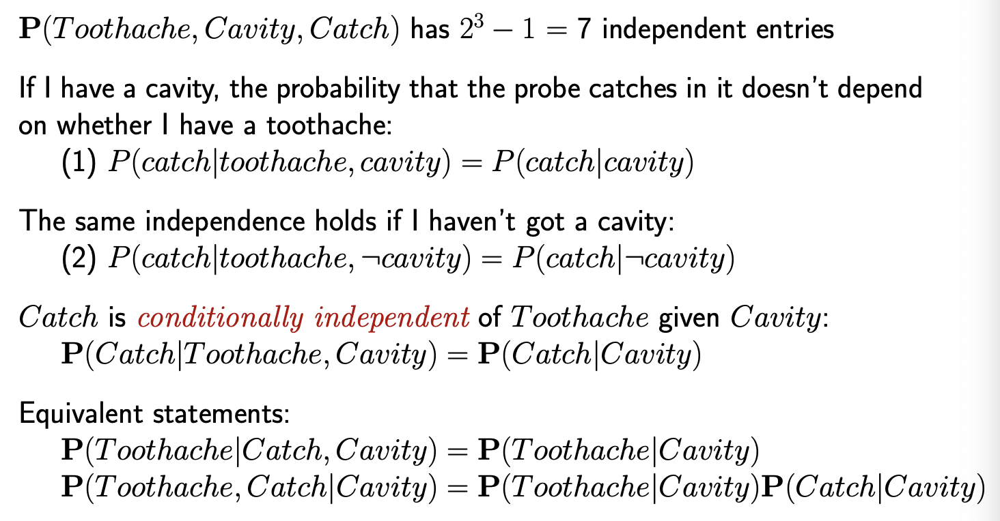
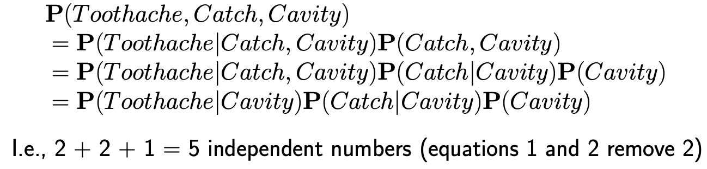

### Inference by enumeration

- Use hidden variable
  - 

- Problem

  - Worst case time complexity $O(d^n)$ where d is the largest arity
  - Space complexity $O(d^n)$ to store the joint distribution
  - Independent entry number are calculated by $2^n -1$

- Solution — conditional probability

  - 

  
  - Therefore, we could have
    - 