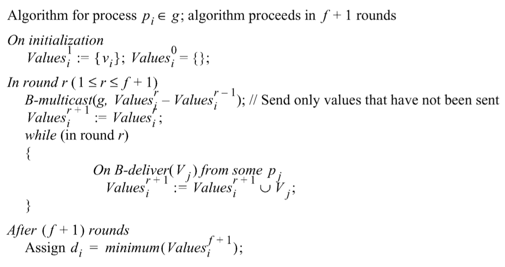

# Consensus

## What is?

- Short
  - Agreement on a value or action to be taken
- Long
  - We have N process
  - They can reliably communicate
  - Each process p have two states
    - Initial or undecided
    - Decided
  - Design a protocol that at the end
    - All (correct) process set their decision to the same value
    - Only set once

## Application

- Proof of work in block chain
- Keep a local list of know-others in a distributed environment
- Receiving same updates in the same order
- Mutual exclusive access to resources

## Properties

- Terminate
  - Eventually each correct process sets its decision variable
- Agreement
  - The decision value of all correct processes is the same
  - If $p_i$ and $p_j$ are correct and have entered the <u>decided state</u>, then $d_i = d_j \ (i,j=1,2,..,N)$
- Integrity
  - If the correct processes all proposed the same value, 
  - then any correct process in the <u>decided state</u> has chosen that value

## Three Problems

### Consensus

- Discussed above

### Byzantine generals

- Hardness (integrity)
  - If the commander is correct, then all correct processes decide on the value that the commander proposed
  - However, the commander may not be correct
- To solve this without any authentication technique (digital signature)
  - If $m$ is number of failure process
  - We need at least $3m$ correct process to reach consensus
  - In total $3m + 1$

 

### Interactive consistency (IC)

- Goal
  - All correct processes agree on a <u>vector of values</u>
  - Each component corresponding to one process’ agreed value
- Properties
  - Agreement
    - The decision vector of all correct processes is the same
  - Integrity
    - If $p_i$ is correct, then all correct processes decide on $v_i$ as the i-th component of their vector 

> It is possible to construct solutions out of the solutions to other problems among these three

## Consensus in a synchronous system

- We have
  - Upper bound on send and receive
    - As in a synchronous system
  - Maximum crashes $f$
    - Can reach consensus in $f+1$ round
- Algorithm
  - 
  - Set empty value set for 0 iteration, and put its own value in the 1 iteration
  - For each round (starting from 1 to $f+1$)
    1. B-Multicast all the value in the current iteration value set but **NOT** in last iteration value set
    2. NextValueSet = current value set
    3. For any received B-multicast message from other process, put it in the NextValueSet
  - This multicast mechanism follows the R-multicast, as
    - Every received value has been multicasted
- Why $f+1$?
  - If the server crash before sending out any message, that’s fine since its own value will not get involved in the final decision.
  - Therefore, we should consider the case the the message only send its message to its next one (using the above algorithm)
    - Say, p1 send values to p2 and crashed before sending its value to anyone else, and p2 sends values to p3 and crashed, etc.
  - In round $f+1$, as we assume at most $f$ crashes
    - The $p_{f+1}$ will received the value from a crashed machine $p_f$, including all the previously crashed value
    - In this case, we could agree on one value even if that value belongs to previous crashed one

- Proof
  - Use proof by contradiction
  - Use the concept of
    - If we have more crash,
    - it will result in different values between some correct process