# Distributed Transactions

## What is?

- Transaction in which more than one server is involved
- Execution of program accessing sharded data at multiple sites
- Types
  - Flat distributed transaction
    - Multiple servers are called by a client
    - 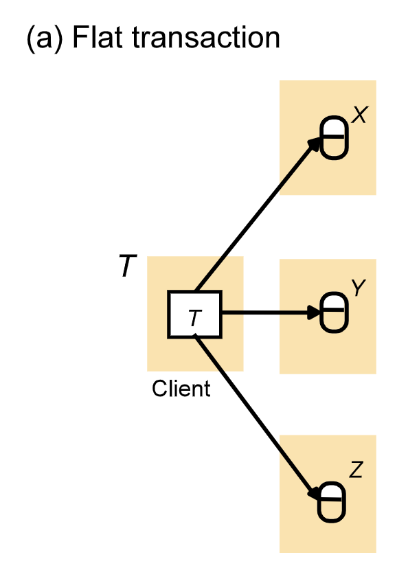
  - Nested distributed transaction
    - A server calls other servers
    - 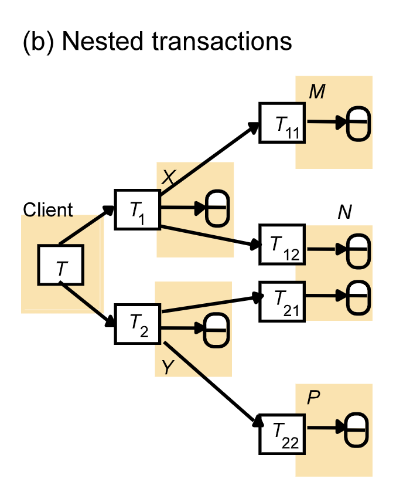
- Challenge
  - We know how to serialize transactions locally on a server
  - Distributed transactions must also be serialized globally

## Coordination

### Why?

Need to achieve atomicity in distributed transaction. When a distributed transaction end, either all of the servers commit the transaction or all of them abort the transaction.

### Approach

- One server becomes a coordinator and the others becomes workers or participants
- Who?
  - Simple transaction
    - First server
  - Nested transaction
    - Top-level server
- Each transaction is globally identifiable (server ID + unique #)
- Coordinator
  - Maintians a list of participating servers
  - Collects results from workers and makes a decision to guarantee congruent commitment of transaction
- Workers (participants)
  - Know the coordinator 
  - Reports result to the coordinator and follow its decision

## Atomic Commit Protocol

### Properties

- All participants that decide reach the same decision
- If any participant decides commit, then all participants must have voted yes
- If all participants vote yes and no failure occur, the all participants decide commit
- Each participant decides at most once

### Broadcast

- Validity
  - If a coordinator broadcasts a message $m$, then all participants eventually received $m$
- Integrity
  - For any message m, each participant receives $m$ at most once and only if a coordinator actually broadcasts $m$
- Timeliness (synchronous system only)
  - There is a known constant $d$ such that a broadcast of $m$ initiated at time $t$, is received by every participant by $t+d$

## Multiple Phase Commit Protocol

### Why? (In the context of one phase commit)

- Coordinator keeps sending workers a commit or abort request until all of them acknowledged that they had carried it out
  - Very long waiting period, especially when someone crashed
- Does not allow a coordinator to make a unilateral decision to  abort a transaction when a client requests a commit (but something goes wrong)
  - Servers do not have decision consensus process among themselves
  - Concurrcny control
    - Resolution of a deadlock can lead to aborting of a transaction
  - Server may have crashed and been restarted

### Two phase commit (2PC) protocol

- Why
  - Allow any participant to choose to abort a transaction
    - Reach consensus
  - General, inexpensive and widely used
- Phase 1
  - Each participant votes
  - If it votes to commit, it is prepared
    - Cannot change after vote
  - Must save updates in permanent store if in case it crashes
  - 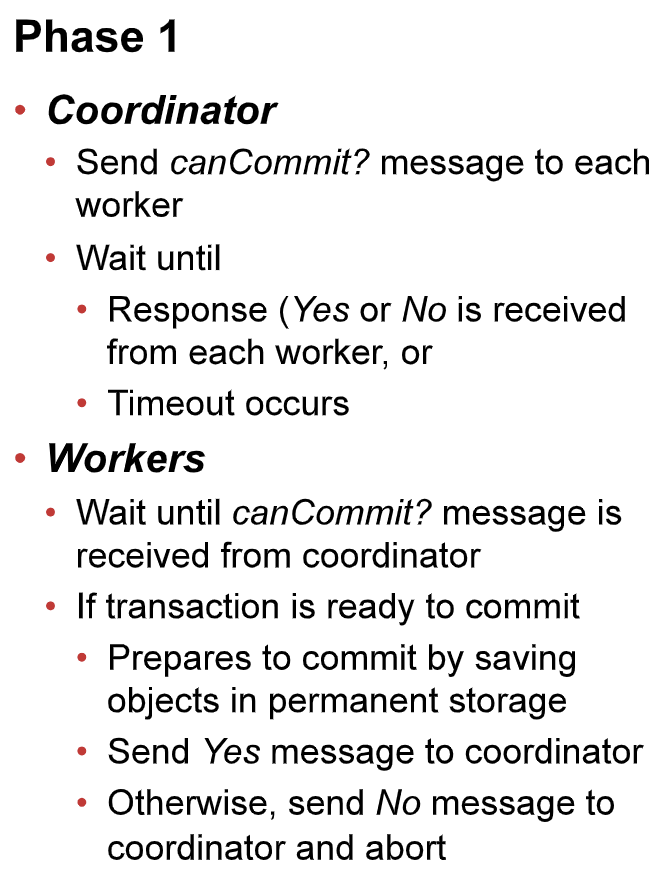
- Phase 2
  - Workers carry out the joint decision
  - 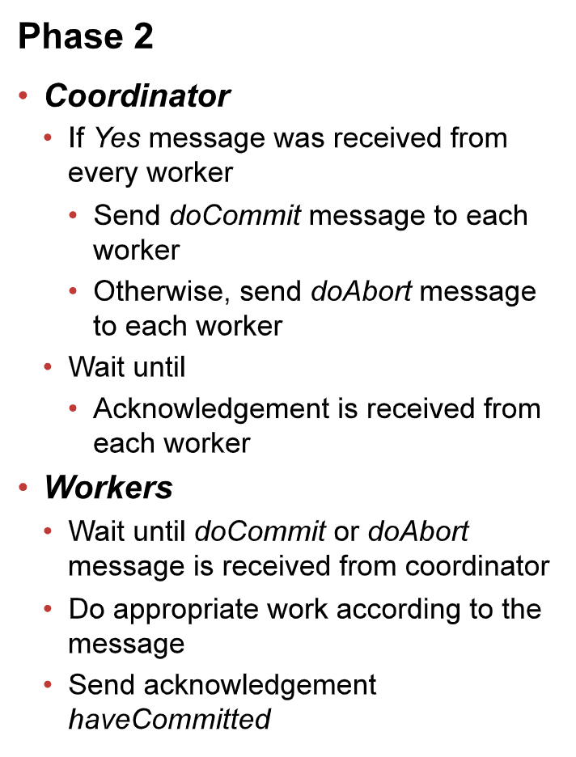
- Operations
  - 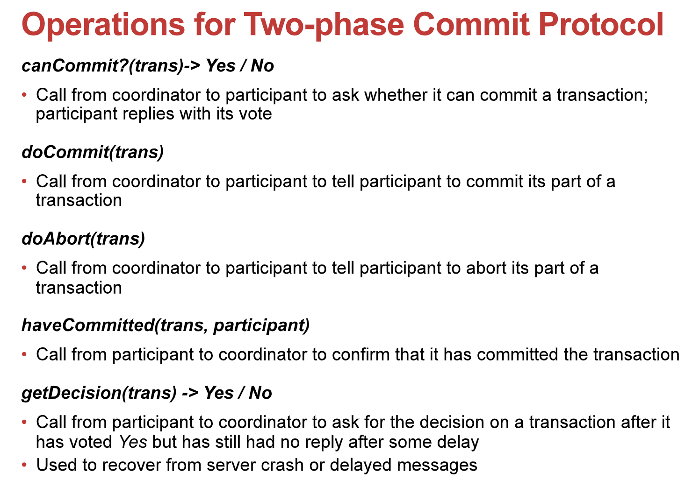

- Time-out actions in the 2PC
  - Avoid blocking forever when a process crashes or a message is lost
  - Uncertain participant (phase 2) has has voted yes but received no feedback
    - Use *getDecision* method to ask coordinator about the outcome
  - Participant has carried out client requests, but has not received a *doCommit* from the coordinator
    - It can abort unilaterally
  - Coordinator delayed in waiting for votes (phase 1)
    - It can abort and send *doAbort* to participants
- Performance
  - Suppose N participants
  - No failures
    - N canCommit + N Yes/No + N doCommit = 3N
    - Cost is proportional to 3N without counting *haveCommitted*
  - If failure occur
    - There may be arbitrarily many server and communication failures
    - 2PC is guaranteed to complete eventually, but it is not possible to say when
      - Delays to participants in uncertain state
    - 3PCs design to alleviate such delays
      - 3PC example
        - 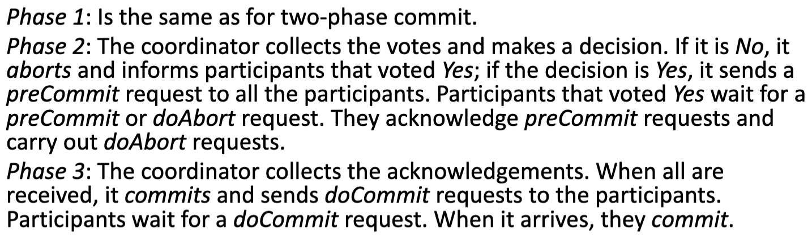
      - In 2PC, the state uncertain exists since a worker vote yes, but not yet received any results
        - And don’t know how long it will receive it
        - And cannot abort unilaterally
      - That’s why we need 3PC which
        - If the worker does not received a ACK for a certain period of time.
          - The uncertain time only last until the coordinator ACK its message
        - It knows that the coordinator may failed.
        - Therefore, it can abort the transaction unilaterally.
      - However, it requires more messages and more rounds for normal case

### Nested Transactions

- Properties
  
  - The outermost transaction in a set of nested transactions is called the <u>top-level transaction</u>, others are known as <u>subtransactions</u>
    - Using the following examples
      - T is top-level transaction
      - Others are subtransactions
  - Parent transaction start early than child transaction, and end after all child transaction finish
    - Assume no failures
  - Arranged in level
    - Sub-transactions can be open
  - Any depth of nesting
  - Objects in different servers can be invoked in parallel
  - Better performance
  
- Extra Actions
  
- 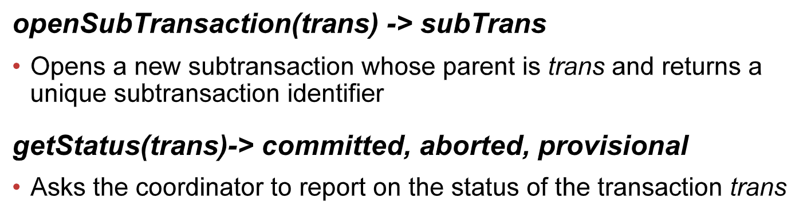
  
- Nested Rules
  - A parent can commit even if a sub-transaction aborts
  - If a parent aborts, then its sub-transactions must abort even if they provisionally may have committed
  
- Informations
  - Each coordinator has a list of its sub-transactions

  - When a nested transaction provisionally commits,

    - it reports its status and the status of its descendants to its parent. 

  - When a nested transaction aborts,

    - it just reports abort to its parent without giving any information about its descendants.

  - Example
    - 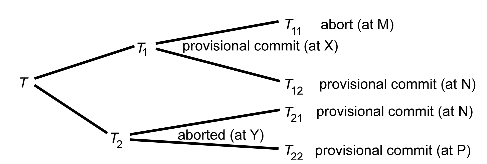
    
    - 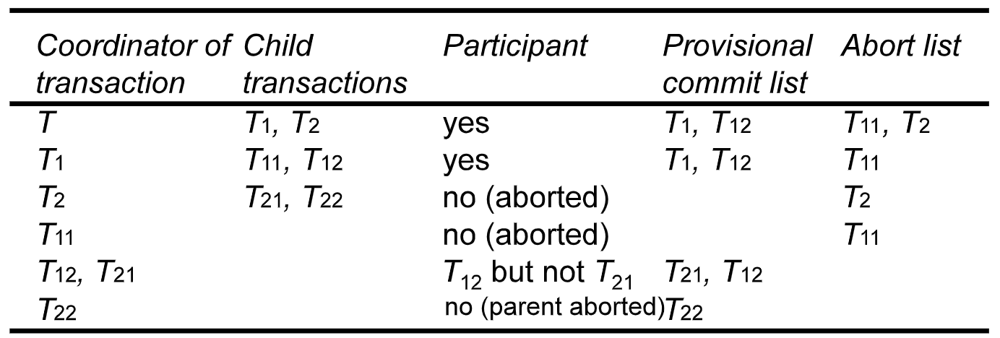
    
    - In this case, $T_{21}\ and\ T_{22}$ are <u>**orphan**</u>
    
      - Since their parent aborted without passing information about them to the top-level transaction
    
        - The abort could be explicitly, or crashed
    
        - Their coordinator can however, make enquiries about the status of their parent by using $getStatus$ operation
    
          

#### Hierarchical Two-phase commit protocol

- 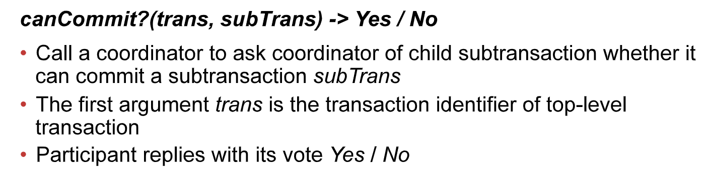
  - $trans$ is the TID of the top-level transaction, for use when preparing the data
  - $subTrans$ is the TID for subTransactions, for example, in this case could be $T_1$.
    - The participant receiving the call looks in its transaction list for any provisionally committed transaction or subtransaction matching this ID.
- In this case, the two-phase commit protocol becomes a <u>multi-level nested protocol</u>
  - Recursively ask whether it can commit or not
- <u>Coordinator</u> sends *<u>canCommit?</u>* to coordinator of sub-transactions one level down the tree
  - Coordinators are define as the server that the real transaction runs on
  - For example, both $T_{12}$ and $T_{21}$ runs at server $N$. In this case, $N$ is the coordinator for both of them.
  - That is why we need $subTrans$ in $canCommit?$ as only care, for example, the subtransaction of $T_1$, which only $T_{12}$ will be deal with in the server $N$.
- Propagate to next level down the tree and so forth
- Aborted sub-transactions ignored.
  - Like $T_2$
- Participants collect replies from children before replying
- If any provisionally committed sub-transaction found
  - Prepares the object and votes **<u>Yes</u>**
  - otherwise
    - Assume must have crashed and vote **<u>No</u>**

- Timeout Actions in Nested 2PC
  - Issues
    - Participant has finished but has not yet received *<u>canCommit?</u>*
    - Participant is prepared to <u>*commit*</u>
    - Coordinator is waiting for votes
  - Introduce additional delay
    - Use *<u>getStatus</u>* on parent, whose coordinator should remain active for a while
    - If parent does not reply
      - abort

#### Flat two phase commit

- In this approach, the coordinator of the top-level transaction sends $canCommit?$ messages to the coordinators of <u>all of the subtransactions</u> in the provisional commit list
  - In this case, $T_1$ and $T_{12}$
- A new version of commit in this case
  - 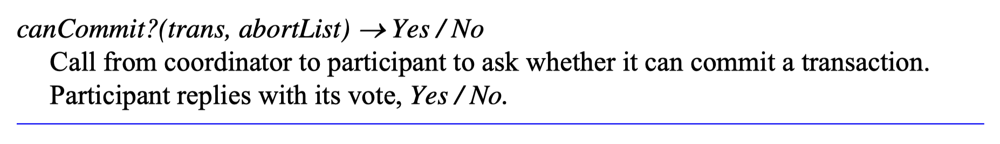
  - The first value is the top-level TID where each coordinator could match it with the corresponding transactions
  - However, in our case, both $T_{21}$ and $T_{12}$ has the same coordinator, if only TID is checked, both will be commit. However, we know $T_2$ has abort.
  - Therefore, we need thee second value to check whether those sub-transactions have aborted ancestors in $abortList$
    - Do not commit those, if so.
  - The whole process could be described in
    - 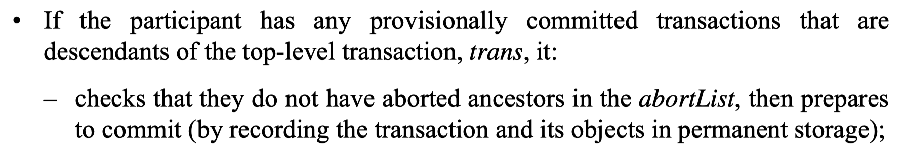

#### Comparison between hierarchic and flat

- Hierarchic
  - The participant only need look for subtransactions of its immediate parent
  - Need to pass a series of messages down and up the tree in stages.
- Flat
  - The flat protocol needs to have the abort list in order to eliminate transactions whose parents have aborted
  - It allows the coordinator of the top-level transaction to communicate directly with all of the participants

## Concurrency control

### Requirements

- Needed at each server to ensure consistency
  - In DS, consistency needed across multiple servers

### Approaches Overview

- Locking
  - Processes that run at different servers can lock object
- Optimistic concurrency control
  - Validate transaction at multiple servers in parallel before committing
- Timestamp ordering
  - Globally unique timestamps
  - Agreement on the ordering of servers’ timestamps using synchronized physical clock

### Locking

- Locks
  - Control availability of objects
  - Lock manager held at the same server as objects
  - To acquire the lock
    - Contact server for that object you want to acquire the lock
  - To release
    - Must delay until transactions committed or aborted at all the servers involved in the transaction
- Issues
  - Locks acquired independently
  - Cyclic dependencies may arise
  - Distributed deadlock detection and resolution needed

### Timestamp Ordering

- For a single server
  - Coordinator issue unique timestamp to each transaction
  - Versions of objects committed in timestamp order
  - Ensuers serializability
- In distributed transactions
  - Coordinator issue globally unique timestamps to the client opening transcation
    - <local timestamp, server ID>
  - Server jointly make sure serial equivalence
    - If T access an object before U, then T is before U at all objects
  - Synchronized clocks <u>sometimes</u> used for efficiency
  - Objects committed in global timestamp order
  - If conflicts are not resolved
    - abort and inform coordinator

### Optimistic Concurrency Control

- Single server

  - Alternative to locking (avoid overhead and deadlocks)
  - Transactions allowed to proceed but
    - Validated before allowed to commit
      - If conflict arises may be aborted
      - Serialized according to this order

- Distributed

  - Must be validated by multiple independent servers
    - In the **<u>first phase</u>** of two-phase commit protocol
  - Global validation needed
    - Serialize across servers
  - May result in a deadlock
    - As different server could validate different transaction at same time, where they may interleaving with each other
    - Independent servers may schedule transactions <u>**in different order**</u> as well
    - 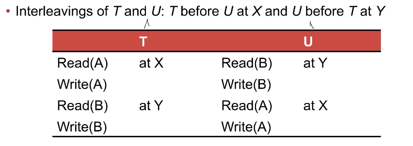

  - Global validation needed
    - Some premise that we made for single server optimistic concurrency control does not hold
    - There may be conflict between the transaction which currently being validation

## Distributed Deadlock

- Singe server transactions can experience deadlocks
  - Prevent or detect and resolve
  - Use of timeouts is clumsy, detection is preferable
    - Wait-for graphs
- Distributed transactions
  - Lead to distributed deadlocks
  - In theory can construct global wait-for graph from local ones
  - A cycle in a global wait-for graph that is not in local ones is a distributed deadlock
- Example
  - 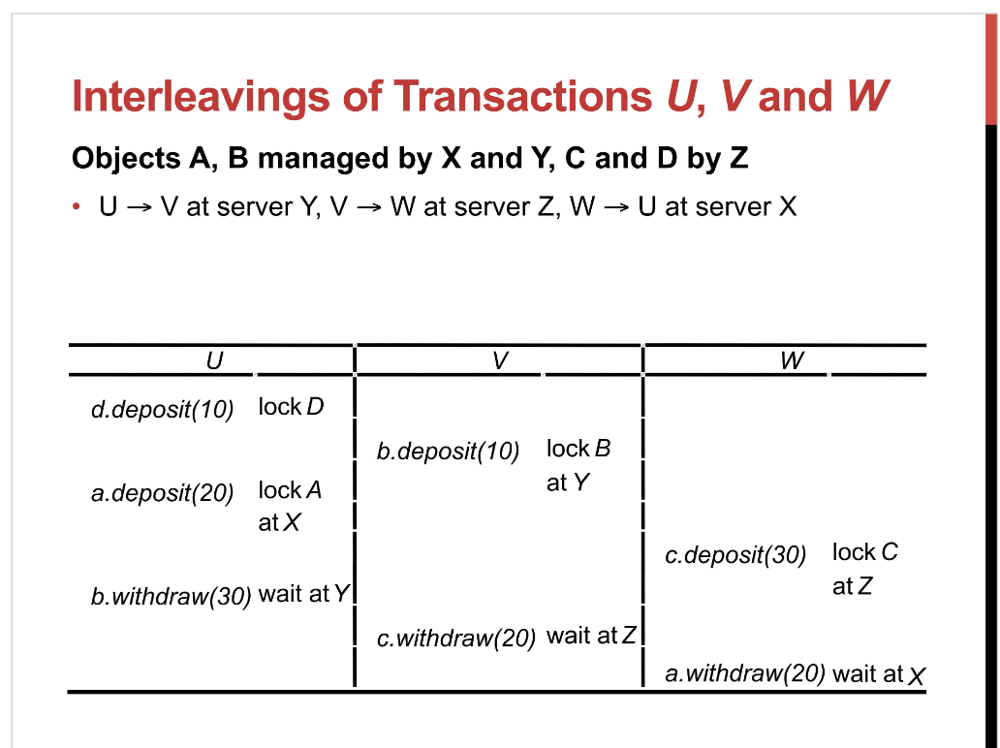
  - 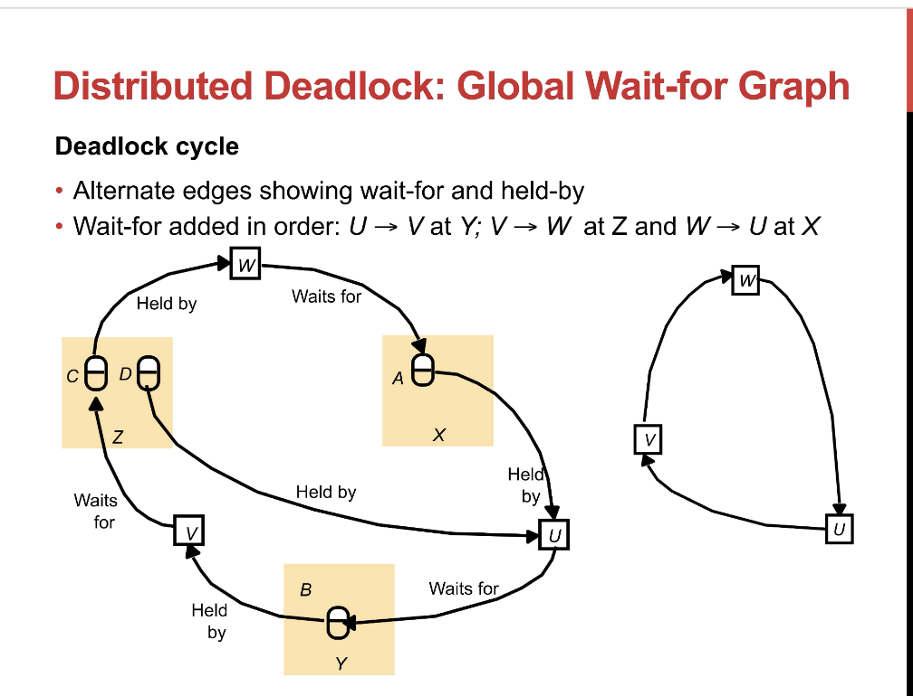

### Centralised Deadlock detection

- One server takes on role of global deadlock detector
- Other servers send it their local graphs from time to time
- Global deadlock detector detects deadlocks, makes decisions about which transactions to abort and informs the other servers
- Problems
  - Poor availability
  - Lack of fault tolerance
  - No ability to scale

### Phantom deadlocks

- A detected ‘deadlock’ is actually not a deadlock
- Happens 
  - when there appears to be a cycle, but one of the transactions has released a lock
    - Not following 2PC
  - Some node crashed
- Example
  - Suppose U releases the object at X then waits for V at Y
  - Global detector gets Y’s graph before X's
  - We abort a transaction that does not need to abort
  - 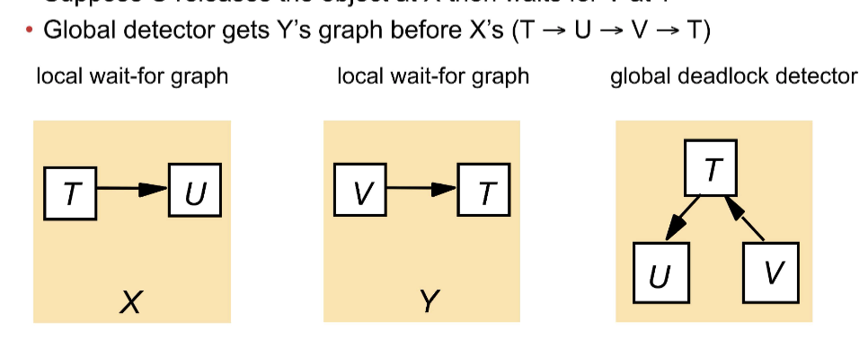

### Edge Chasing (Path Pushing)

- Distributed approach to deadlock detection

- Does not solve for phantom deadlock, but prevent single point of failure and have better scalability

- Ideas
  - No global wait-for graph
  - Each server knows about some of the edges
  - Servers try to find cycles by sending ***probes***
    - Follow the edges of the graph through the distributed system
  - When should a server send a probe?
    - 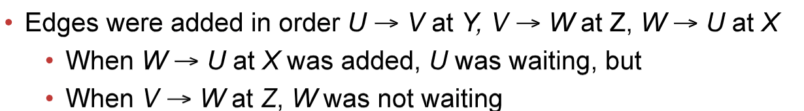
  - Send a probe when an edge $T_1 \rightarrow T_2$ when $T_2$ is waiting
  - Each coordinator records if its transactions are active or waiting
    - Local lock manager tells coordinators if transactions start/stop waiting
    - When a transaction is aborted to break a deadlock, the coordinator tells the participants that locks are removed and edges taken from wait-for graph

- Three Steps

  - Initiation
    - Algorithm start when server notice T start waiting U and U waiting for someone else
    -  If U is sharing a lock, probes are sent to all the holder
  - Detection
    - Detection consists of receiving probes and deciding whether deadlock has occurred and whether to forward the probes
      - When a server receives probe $<T \rightarrow U>$ it checks if U is waiting
      - If $U \rightarrow V$
        - Forward $<T \rightarrow U \rightarrow V>$ to server where V waits
    - When new edge added, server performs cycle check
  - Resolution
    - When a cycle is detected, a transaction in the cycle is aborted to break the deadlock
  - Example
    - 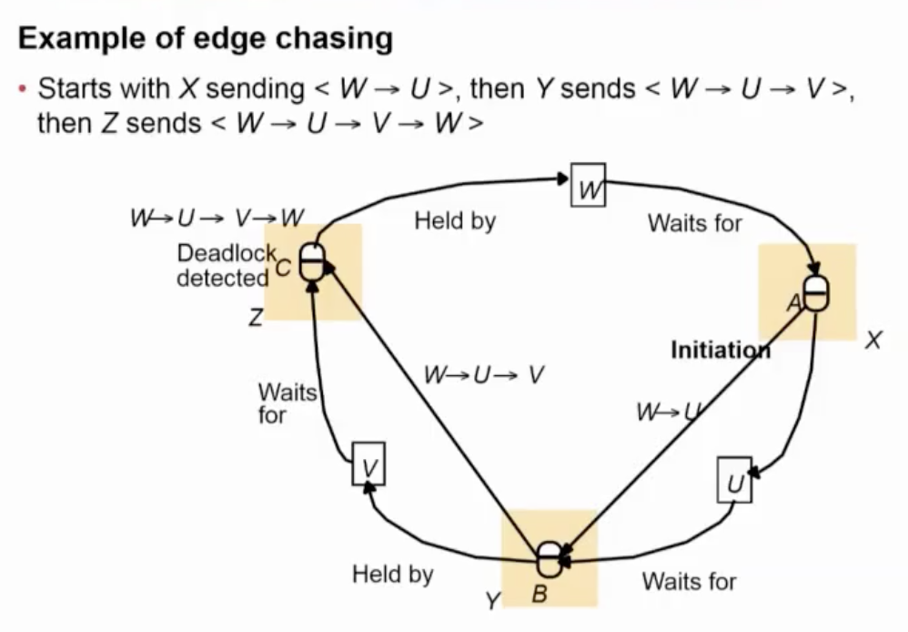

- Problems

  - There may be multiple probe in the system which cause multiple transaction to abort
  - 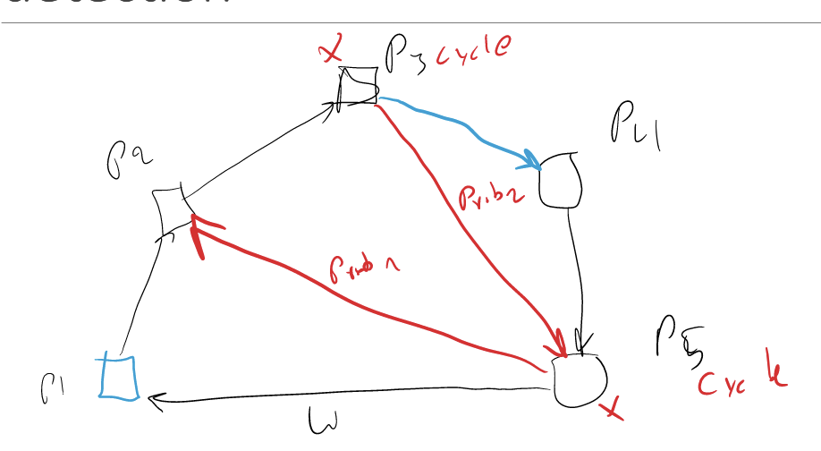
  - P5 sends probe to P2 as P2 are currently waiting for P3, in the meantime, P3, wants to access P1 but currently holding by P5. In this case, two probe message in the system and may cause both P3 and P5 to abort.

- Solution

  - Use timestamp (or something else) to give the transaction a priority.
  - When a deadlock has been detected, the one with lower priority will be abort
  - In this case, multiple probe will always abort the same transaction

  