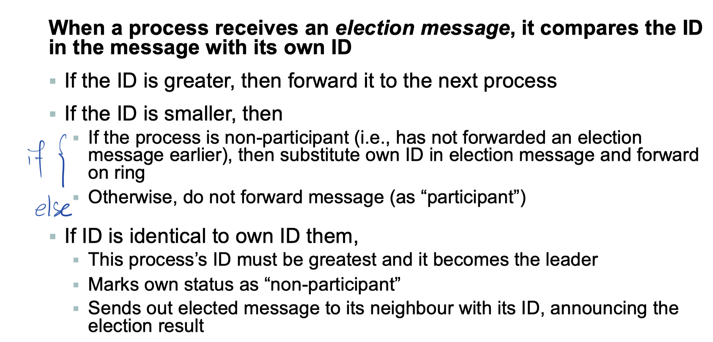
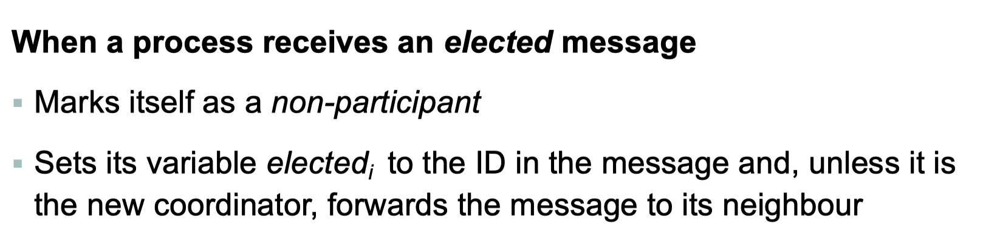
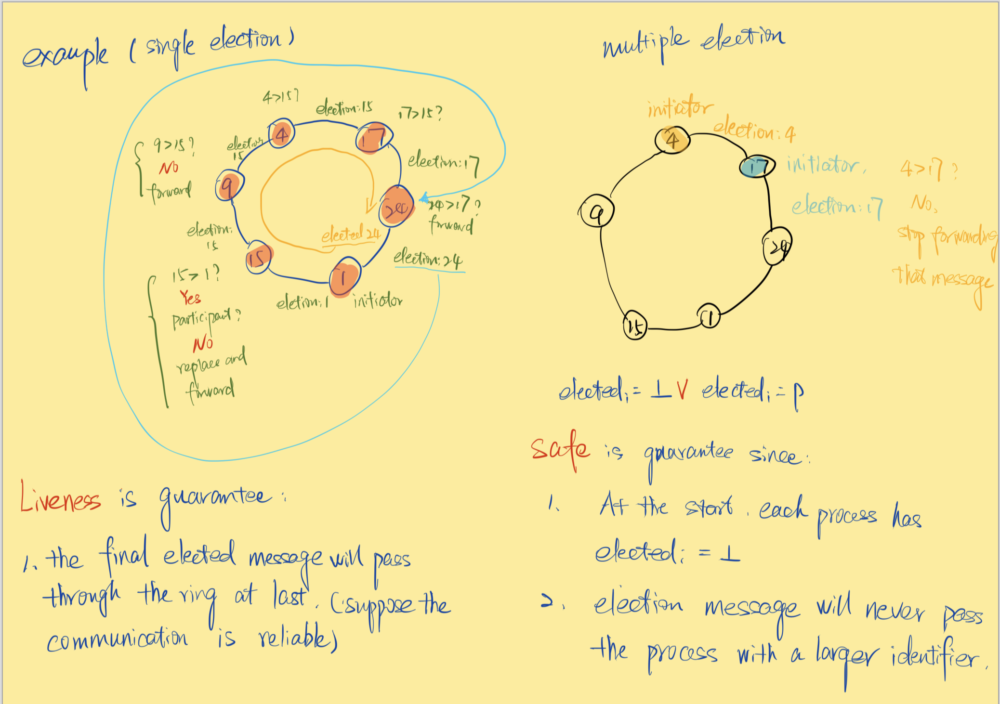
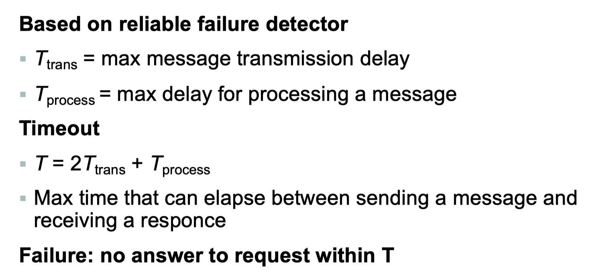
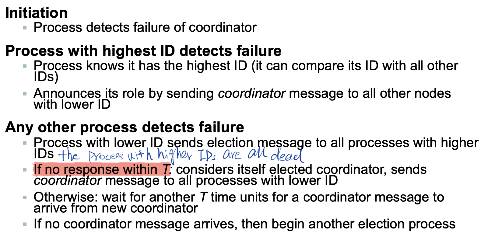
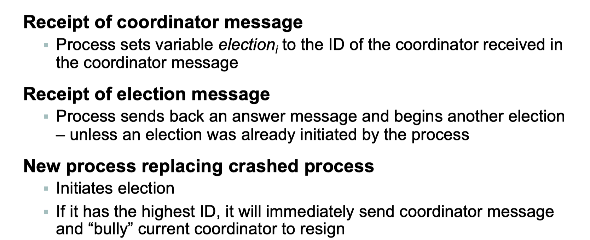
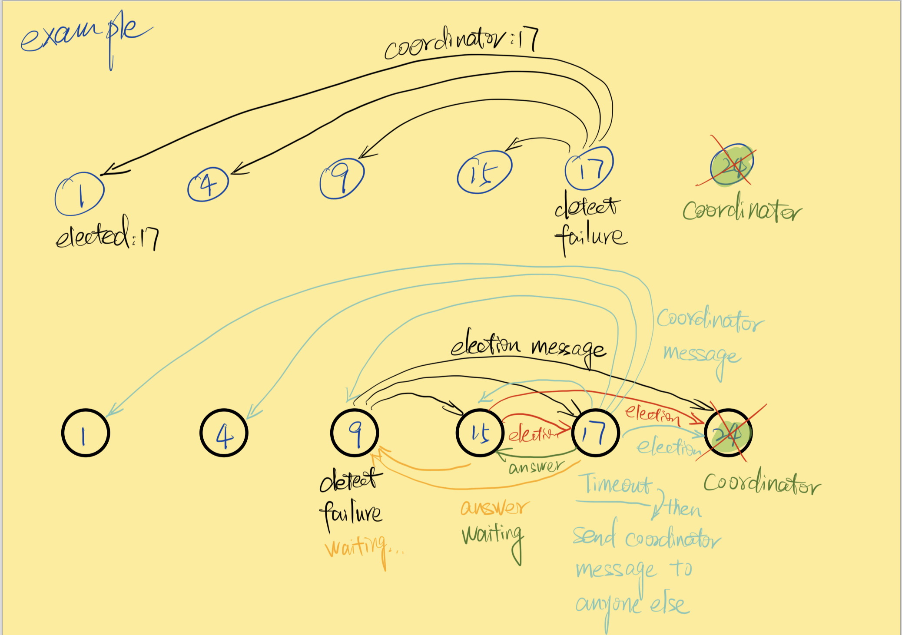
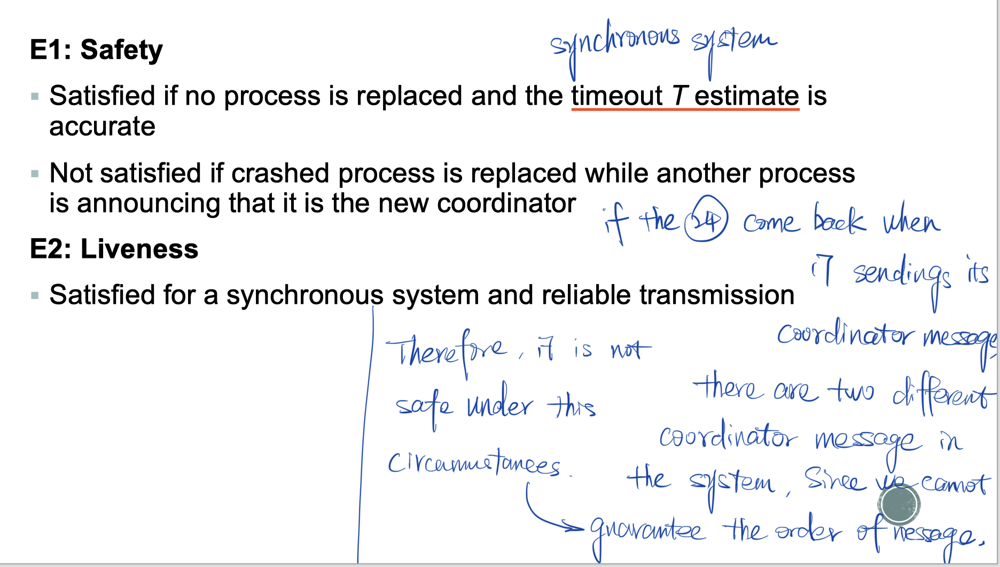
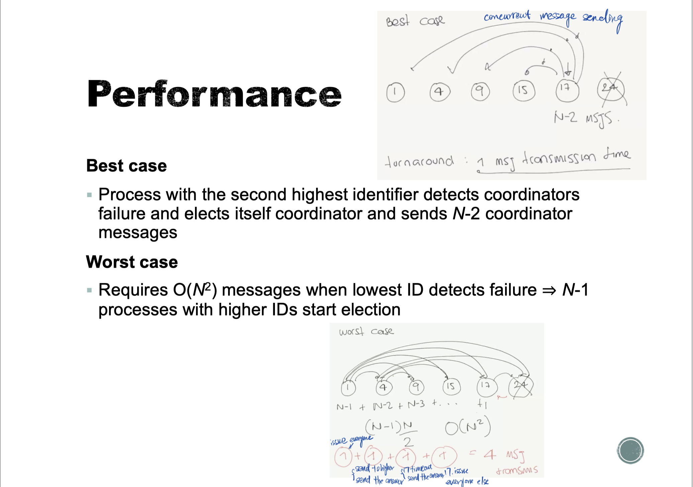

# Election

## Definition

- Choosing a unique process to play the role of leader and undertake special tasks
- Example
  - Berkeley algorithm

 

## Fundamental

- <u>Any</u> process can call for an election
- A process can call for <u>at most one</u> election at a time
  - The result of an election does not depend on which process calls for it
- Elected process should be unique
- Multiple processes are allowed to call an election <u>simultaneously</u>
  - All of them together must yield only a single leader
- Processes have <u>unique identifiers</u>
- At any point in time, a process is
  - A participant
    - Engaged in some run of the election algorithm
  - A non-participant
    - Not currently engaged in any election

## Requirements

- E1 (Safety)
  - A participant process $p_i$ has $elected_i= \bot$ or $elected_i = P$ for some non-crashed process $P$ that will be chosen at the end of the run with the largest identifier.
- E2 (Liveness)
  - All non-crashed processes $p_i$ participate and will eventually set $elected_i \ne \bot$

## Performance

- Bandwidth utilization
  - Proportional to total number of messages sent
- Turnaround
  - Number of serialized message transmission times between <u>initiation</u> and <u>termination</u> of a single run

## Ring-Based Election

- $N$ processes are organized in a logical ring
  - All processes have a unique integer ID
  - All messages are sent clockwise around the ring
  - Each process $p_i$ has a communication channel to the next process in the ring, $p_{(i+1)\ mod\ N}$
- Initiation
  - Initially all processes marked as <u>non-participants</u>
  - Any process can start an election
  - Election start
    - A process marks itself as a participant, places its ID in an election message, and sends it clockwise to the next process.
    - If a message is forwarded, upon any forwarding, mark own state as <u>participant</u>
- Algorithm
  - 
  - 

- Analysis
  - 

- Performance
  - 

- Failure
  - Not tolerated
  - A failure detector can be used to manage crash failures
    - Repair the ring
    - Stop forwarding election message
    - Start new election
  - But failure detector are not perfect

## The Bully Algorithm

### Requirements

- Synchronous sytem
  - Use timeout to detect failure
- Reliable communication channels
- Processes can crash
- Other assumptions
  - Each process knows identifiers of all other process
  - Every process can communicate with every other process
- Message types
  - Election
    - Announce an election
  - Answer
    - Reply to an election message
  - Coordinator
    - Announce identity of elected process

### Failure detection

### Algorithm

### Requirements

### Performance

