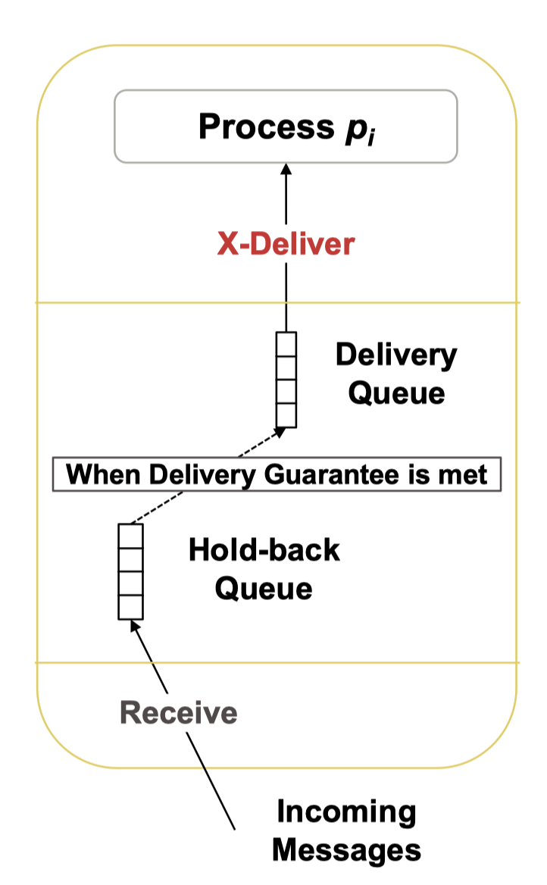
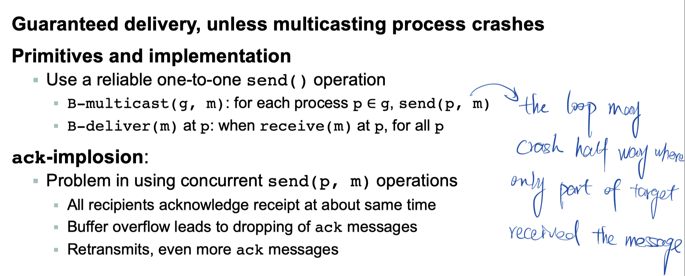
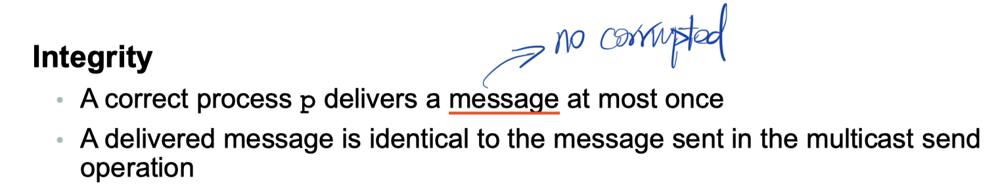
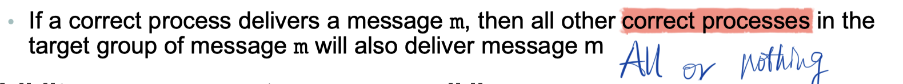
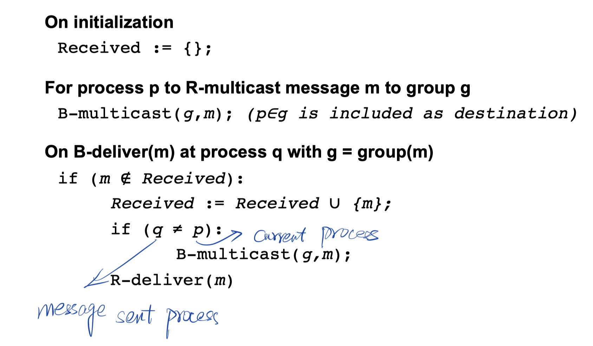
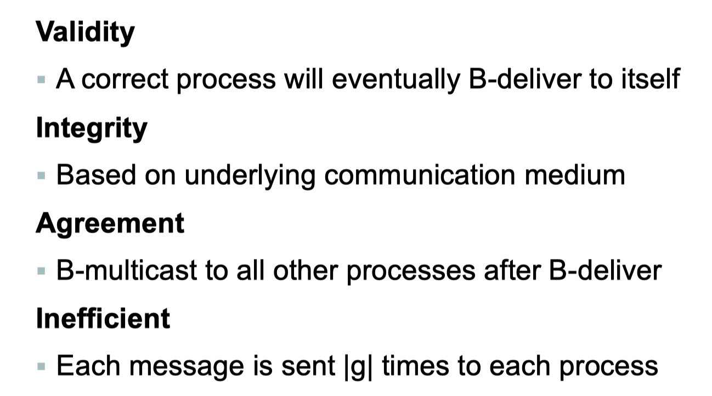
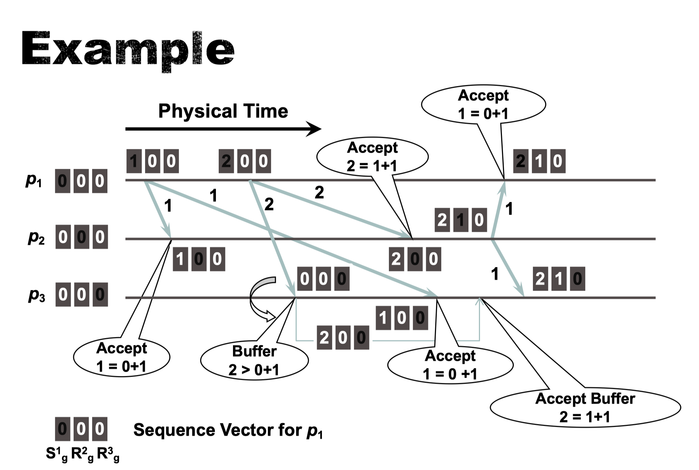
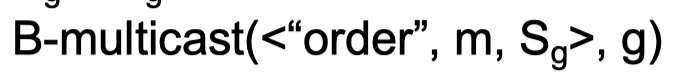

# Multicast

## Types

- Operations
  - X-multicast(g, m)
  - X-deliver(m)
  - X is 
    - B
      - basic
    - R
      - reliable
    - FO
      - FIFO order
    - CO
      - Causal order
    - TO
      - total order
- 

## Basic Multicast (B-multicast)

## Reliable Multicast (R-multicast)

- Analysis
  - Integrity
    - 
  - Validity
    - If a correct process multicasts message m, then it will eventually deliver m (liveness)
  - Agreement
    - 
  - Agreement and validity together ensure overall liveness
    - If one process delivers a message $m$, then $m$ will eventually be delivered to all group members

- Algorithm
  - 

- Compare with B-Multicast
  - 

## FIFO Multicast (FO-Multicast)

- We have some extra ordering message for sequence control
  - $S_g^p$ is # of messages sent by p to g
  - $R_g^q$ is # of messages delivered at p from q, for each process $q \neq p$ 
  - Three process example
    - 

- Sending
  - Increment S by 1
  - Piggyback S with message
  - B-multicast it
- Receiving (process $p$ received $q$ with sequence number S)
  - If S = $R_g^q + 1$
    - Then S is the next message
    - FO-deliver(m)
    - $R_g^q = S$
  - If $S > R_g^q + 1$
    - Then it is not the next message
    - Some message must in-between
    - Hold the message in hold-back queue until intermediate messages have been delivered and S = $R_g^q + 1$
  - Example
    - 

## Causal Order

- Instead of a single number, each process maintains its own vector timestamp $V_i$
- $V_i[j]$
  - The number of messages delivered at $p_i$ from $p_j$
  - Init to 0 at the beginning
- Piggyback the vector with the message when multicasting
- Receiving(from $p_j$ to $p_i$)
  - If $p_j: V_j[j]=V_i[j]+1 \ \and\ \forall\ k\neq j\ V_j[k]\le V_i[k]$
    - Then happened-before could be verified
    - And set $V_i[j] = V_i[j]+1$

## Total Order

- Need a extra sequencer
- Procedure
  - B-multicast message to g and sequencer
  - Sequencer
    - Maintains a global sequence number $S_g$ (initially 0)
    - When a multicast message m is B-delivered to it
      - $S_g=S_g+1$
      - 
  - Receiving
    - p maintains local received sequence number $R_g$
      - Message m is placed in hold back queue until
        - B-deliver(<“order”, m, $S_g$>) from sequencer and $R_g = S_g + 1$
        - Then TO-deliver(m) and $R_g = R_g + 1$