# Time

## Introduction

- Time is important for
  - Auditing
  - Authentication
  - Consistency
- Modern way to measure time is atomic clock

- UTC (Coordinated Universal Time)
  - Based on atomic time

## Clocks

### Types

$t$ Is the absolute frame of reference for time and is commonly different than $C_i(t)$

- Hardware clock
  - Crystal oscillation counters
  - $H_i(t)$
- Software clock
  - Is a scaled and offset added version
  - $C_i(t)=\alpha H_i(t)+\beta$
  - Measures time relative to some reference event
  - Approximation of the real physical time

### Properties

- Skew
  - Difference between the readings of any two clocks
- Drift
  - Difference in the rate at which 2 clocks count time
    - Clock tick at different speed
  - Due to physical difference in crystals, temperatures, humidity, voltage, etc
- Clock Drift Rate
  - Difference in rate between a perfect reference clock and a physical clock
  - Usually 10^-6^ seconds/second
- 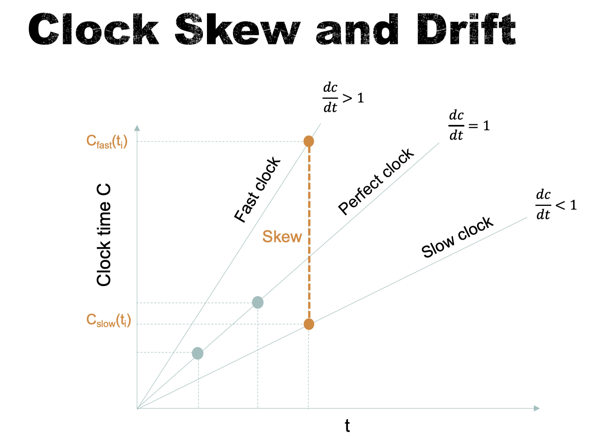

### Faulty Clocks

- A clock is said to have a crash failure if it totally stops running, else it is said to have an arbitrary failure
- A <u>correct clock</u> is not necessarily an <u>accurate clock</u>
- Monotonicity condition
  - A clock always advances
  - $t’ > t \implies C(t’) > C(t)$
- Faulty clock
  - Does not obey the <u>monotonicity condition</u>
  - And/or the <u>bounds</u> on its drift

## Clock Synchronization

### Synchronous System

- Time to execute step of a process has known lower and upper bounds
- Each message transmitted is received within a known bounded time
  - We do not know $T_{trans}$ but we know its $max$ and $min$
- Each process has a local clock whose drift rate has a known bound

### Asynchronous System

- A DS does not hold the above conditions

### External synchronization

- Synchronized process’ clock with an <u>external reference clock</u> $S(t)$
- Limit skew to a bound $D > 0$
- $|S(t) - C_i(t)| < D$ for all $t$
- The clocks $C_i$ are accurate to within the bound $D$

#### Cristian’s Method (External $\rightarrow$ asynchronous system)

- A time server $S$ receives signals from a UTC source
- Process $p$ request time in message $m_r$ and receives time $t$ in message $m_t$ from $S$
  - $p$ measure message round trip $T_{round}$
  - $C_p = t+\frac{T_{round}}{2}$
- 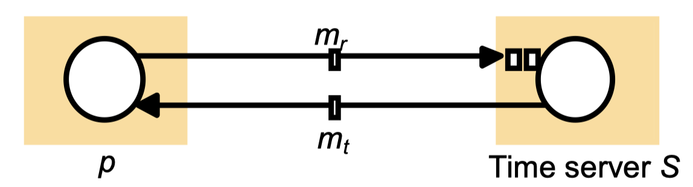
- Assumption
  - We assume the message are delivered through the same network
  - Which is, theoretically, the time for sending a request and receiving a time should be same
- Accuracy is $\pm (\frac{T_{round}}{2} - min)$
  - If we know $min$ delay
    - Earliest arrive time is $t+min$
    - Latest received time is $t+T_{round}-min$
  - Therefore, $p$ can receive $m_t$ between $[t+min, t+T_{round}-min]$
    - With size $T_{round}-2min$
  - 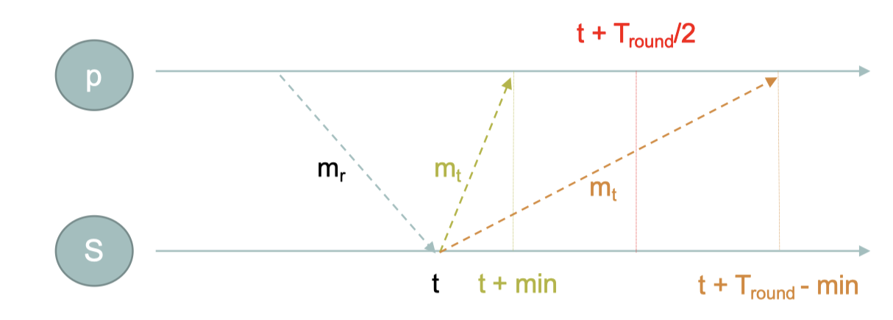
- Problems
  - A single time server might fail
    - Use of a group of synchronized servers
  - It does not deal with faulty clocks
    - ==todo==

### Internal synchronization

- Synchronized the local clocks <u>within a distributed system</u> to disagree by no more than a  bound $D > 0$
- $|C_i(t) - C_j(t)| < D \text{ for all } i,j,t$
- The clocks $C_i$ agree within the bound $D$

#### Assumptions

- A DS of N processes
- Each on a single processor with its own physical clock
- No shared memory
- Each process p has a state s at a given time
- Processes can only communicate via messages
- Events in a process can be ordered
  - $e \rightarrow e'$
- History of a process
  - $h_i=<e^0_i, e^1_i,...>$

#### Internal $\rightarrow$ <u>Synchronous System</u>

- 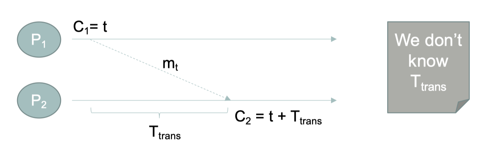

- $u = max-min$
- Good to use $\frac{u}{2}$ to estimate $T_{trans}$
- 2 clocks example
  - Maximum skew is $\frac{u}{2}$ 
- N clocks
  - Optimal bound on clock skew is $u(1-\frac{1}{N})$
- Not work for the internet

#### Berkeley Algorithm (Internal $\rightarrow$ Asynchronous System)

- Procedure
  1. Master server polls to collect clock values from slaves
     - 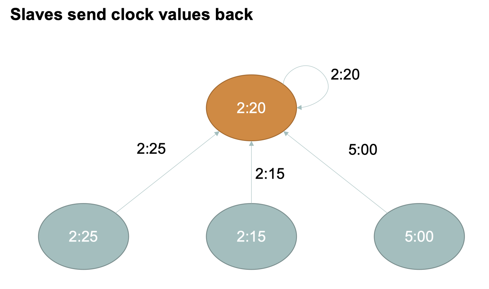
  2. Master observes $T_{round}$ and estimates current clock values
  3. Master averages clock values, including its own
     - Cancels out individual clock’s tendencies to run fast
     - Ignore outliers
     - 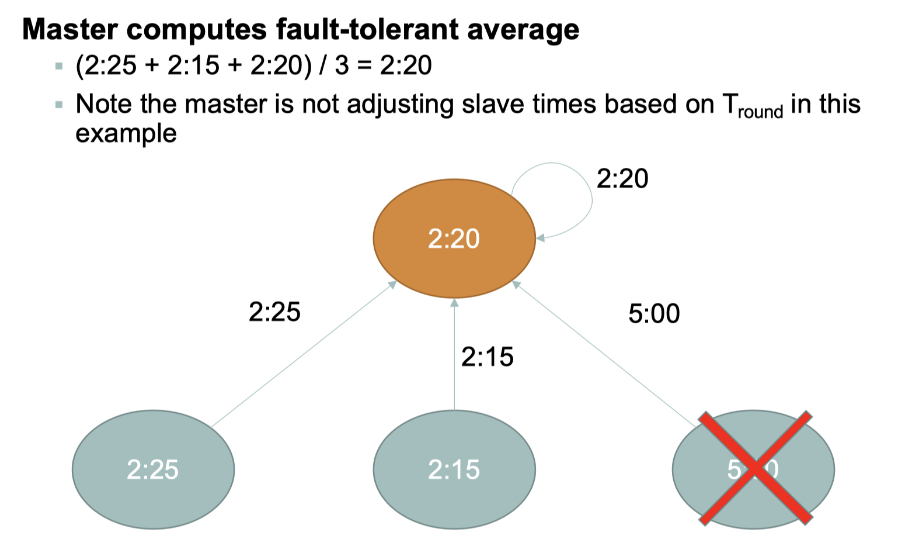
  4. Master sends the amount by which each clock requires adjustment
     - Not update times since it may break the monotonicity condition
     - 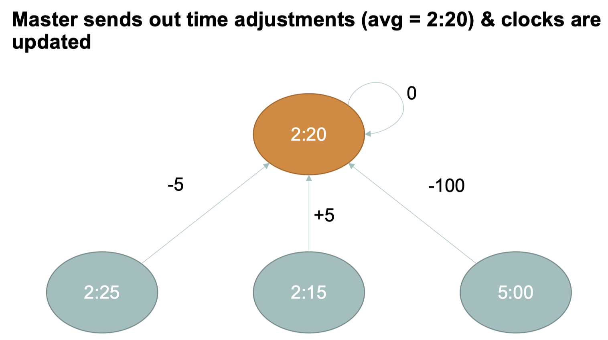
  5. If master failed, use leader election algorithm to select a new leader.

### Compare Internal and External

- Does Internal $\implies$ external
  - No
- Does external $\implies$ external
  - Yes, with an external synchronization bound of $D$
  - The internal synchronization is bounded by $2D$
    - The lowest will be $T-D$, and the maximum will be $T+D$
    - Therefore, $2D$

### Network Time Protocol (NTP)

- Designed to externally synchronize clients via Internet to UTC
  - Hiarachical structure
  - 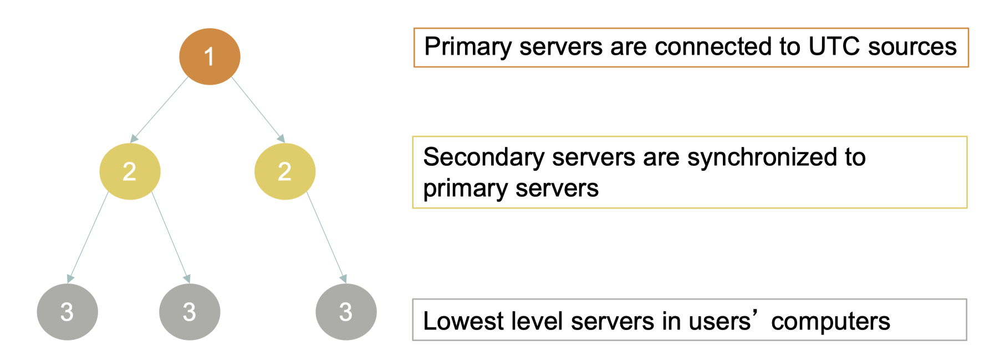 
  - The server on higher level (lower stratum) are more preferable than those on lower level (higher stratum)
- The synchronization subnet can reconfigure if failures occur, if
  - A primary clock that loses its UTC source can become a secondary
  - A secondary that loses its primary can use another primary
- <u>Modes</u> of synchronization
  - Multicast
    - A server within a high speed LAN multicasts time to others which set clocks assuming a small transmission delay
      - Not very accurate
    - Procedure call
      - A server accepts requests from other computers.
      - Like Cristian’s algorithm
      - High accuracy, useful if no hardware multicast
    - Symmetric
      - Pairs of servers exchange messages containing time information
      - Used when very high accuracies are needed

#### Message Exchange Between 2 Servers

- All messages carry history of timing informations
- For each pair of messages exchanged between 2 servers, the algorithm computes the following values at time $T_i$
  - Delay $d_i$
    - True total transmission delay for the 2 messages
  - Offset $o_i$
    - Estimate of the true offset (o) between 2 clocks
  - 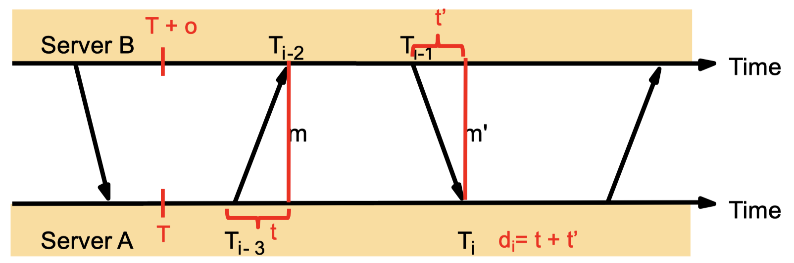

- We can have
  - $T_{i-2}=T_{i-3}+t+o$
  - $T_{i}=T_{i-1}+t'+o$
  - $d_i=t+t’=T_{i-2}-T_{i-3}+T_{I}-T_{i-1}$
  - $o = o_i + (t’-t)/2$ where $o_i=(T_{i-2}-T_{i-3}+T_{i-1}-T_{i})/2$
- Accuracy will be
  - $o_i–d_i/2 \le O \le o_i + d_i/2$
  - Since in worst case, $(t’-t)/2=\pm d_i/2$ if $t’=0$ or $t =0$

## Logical Time

### Assumptions

- If two events occur in the same process, then they occurred in the order in which the process observed them
- Whenever a message is sent between processes, the event of sending the message occurred before the event of receiving the message

### Happened-Before Relation

- Use $\rightarrow$ , happened-before
- Let $a, b, c$ be three events. Then the following global happened-before orders hold
  - HB1 (same process order)
    - If $\exist$ process $p:a\rightarrow _Pb$, then $a \rightarrow b$
  - HB2 (sending before receiving)
    - For any message
    - $m:a=send(m)\rightarrow b=receive(m)$
  - HB3 (transitivity)
    - If $a\rightarrow b$ and $b\rightarrow c$ then $a\rightarrow c$
- $\rightarrow$ Is a partial order
  - If two events $a$ and $b$ happen in different processes which do not exchange messages, then a and b are neither $a\rightarrow b$ nor $b\rightarrow a$
  - We consider them as run in parallel
- 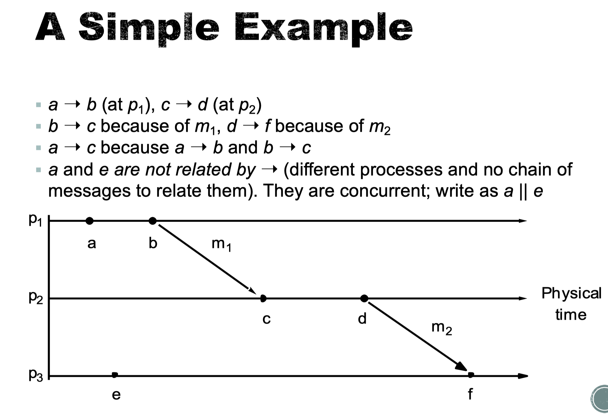

### Lamport’s Logical Clock

- Each process $p_i$ has a logical clock $L_i$ and initialized to 0
- LC1
  - $L_i$ Is incremented by 1 before each event at process $p_i$
- LC2
  - If event $a$ is $send(m)$ by process $p_i$, then message $m$ contains a timestamp $t=L_i(a)$
  - Upon receiving message $m$, process $p_j$ sets $L_j=max(L_j, t)$, then applies LC1 to account for the $receive(m)$ event.
    - max of the current logical clock or the event sending process’ clock
- NOTE
  - $L(a)<L(b)$ **<u>does not</u>** imply $a \rightarrow b$
    - An event occurring earlier does not mean that it’s the cause of a later event

### Vector Clocks

- For a system with N processes, vector clock $V_i$ at process $p_i$ is an array of N integers
- Rules
  - VC1
    - Set $V_i[j]=0$ for $i,j=1..N$
  - VC2
    - Before $p_i$ timestamps an event is sets $V_i[I] \mathrel{+}= 1$
  - VC3
    - $p_i$ carrying $t=V_i$ on every message it sends
  - VC4
    - When $p_i$ receives $t$ in a message, it set $V_i[j]=max(V_i[j], t[j]) \text{ for } j=1..N$

- Comparison
  - $V=V’ \iff V[j]=V’[j] \text{ for } j=1..N$
  - $V\le V’ \iff V[j]\le V’[j] \text{ for } j=1..N$
  - $V < V’ \iff V[j] \leq V’[j] \and V'\neq V' \text{ for } j=1..N$
- $a \rightarrow b \iff V(a) < V(b)$
- $a \text{ }|| \text{ } b$ 
  -  If neither $V(a) \le V(b)$ nor $V(b) \le V(a)$
- 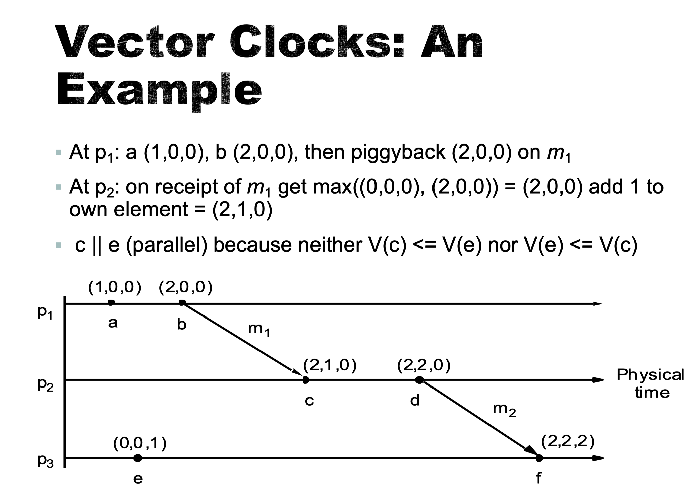

