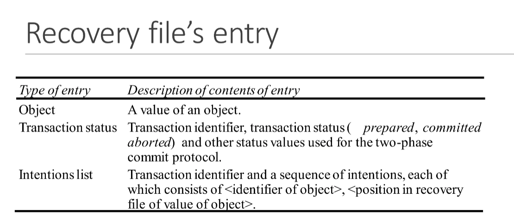
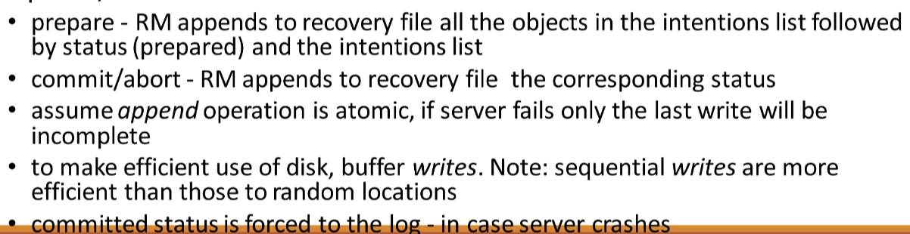
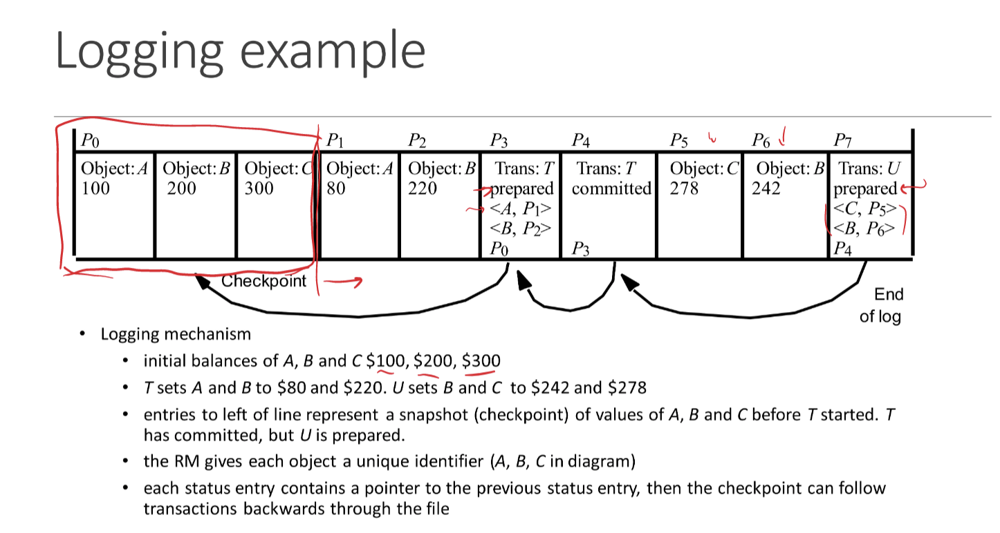
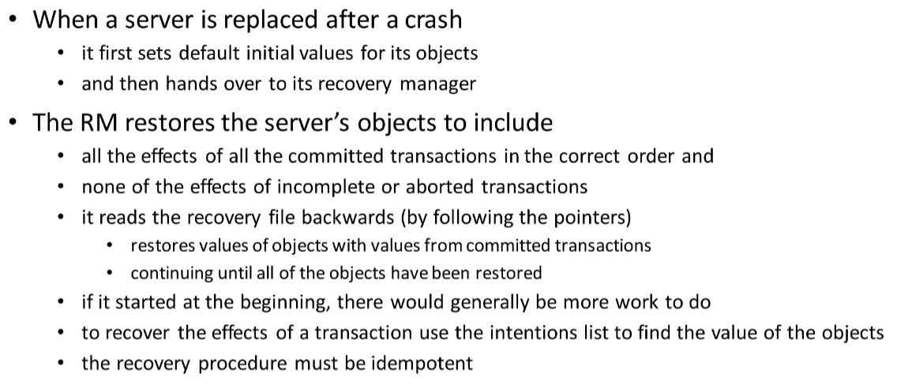
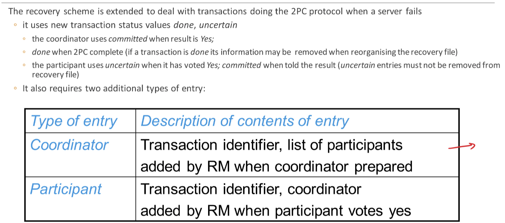
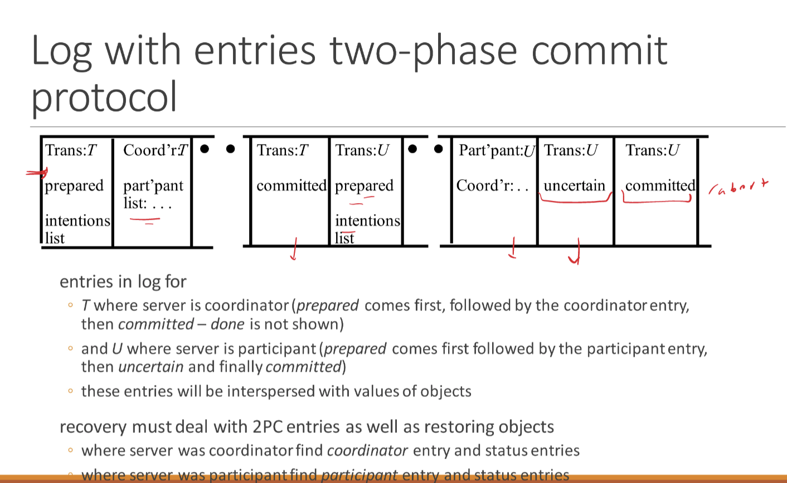
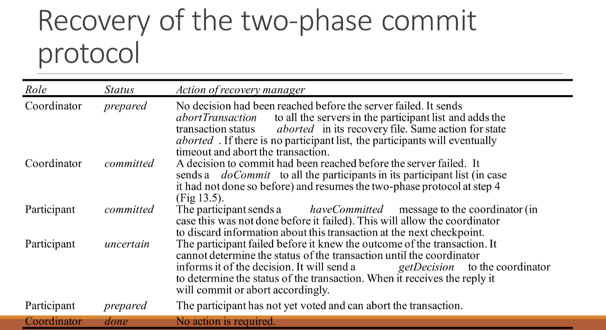

# Transaction Recovery

## Why?

- Ensuring that a server’s objects are durable
- Service provides failure atomicity
  - Which means effects of transactions are atomic even when server crashes
- To simplify
  - We assume all running server store their object in volatile memory
  - All of its committed objects are in a recovery file in permanent storage
- Recovery consists of restoring the server with the latest committed versions of all of its objects from its recovery file

## Recovery manager (RM)

- Tasks
  - To save objects in permanent storage for committed transactions
    - In recovery files
  - To restore the server’s objects after a crash
  - To reorganize the recovery file to improve the performance of recovery
  - To reclaim storage space
    - In the recovery files
- <u>Media failures</u> also need to be covered
  - Disk failures affecting the recovery file
  - Need another copy of the recovery file one an independent disk

### Intention list

- Each server records an intentions list for each of its currently active transactions
- An intentions list contains a list of the object references of all the objects that are altered by the transaction
- When a transaction commits, the intentions list is used to identify the objects affected
  - The committed version of each object is replaced by the tentative one
  - The new value is written to the server’s recovery file
- In 2PC, when a participant says it is ready to commit, its RM must record its intentions list and its objects in the recovery file
  - It will be able to commit later on even if it crashes
  - When a client has been told a transaction has committed, the recovery files of all participating servers must show that the transaction is committed
    - Even if they crash between prepare to commit and commit
- Entry example
  - 

### Logging

- It contains a log of the history of all the transactions at a server

  - Including objects, intentions lists and transaction status
  - In happened order
  - A recent snapshot + a history of transactions after the snapshot
  - During normal operation the RM is called whenever a transaction prepares commits or aborts
    - 

  - Example
    - 
    - In P3
      - First line is status
      - Following by two intentional list
      - The last one is the pointer to the previous transaction before change

- Recovery of <u>objects</u>

  - 

  - Start from end, restores values of objects with values from committed transactions until all of the objects have been restored.
  - Need recovery procedure to be idempotent which we can perform the recovery as many times as we need

- Recovery of <u>two-phase commit</u>
  - 
  - 
  - 

