# Transactions and Concurrent Control

## Goals

- The objects managed by a server must remain in a consistent state
  - When they are accessed by multiple transactions
  - In the presence of server crashes
- Recoverable objects
  - Can be recovered after their server crashes
  - Objects are stored in permanent storage
- Promise
  - The entire transaction is carried out and the results recorded in permanent storage
  - If crash, effects are completely erased
- Failure model
  - Transactions deal with crash failures of processes and omission failures due to communication

- Designed for an asynchronous system
  - Messages may be delayed

## Requirements

- A sequence of client requests to a server has to be atomic
  - They are free from interference by operations being performed on behalf of other concurrent clients
  - Either all of the operations must be completed successfully or they must have no effect at all in the presence of server crashes
- Transactions
  - Originate from database management systems
  - Apply to recoverable objects and are intended to be atomic
- Server recovery
  - They are restarted and get their objects from permanent storage

## ACID

- Atomicity
  - All or nothing
  - Either completes successfully and recorded, or abort
- Consistency
  - A transaction take the database from on consistent state to another consistent state
- Isolation
  - Each transaction is performed without interference from other transactions
  - Ensured by concurrency control
- Durability
  - After a transaction has completed successfully, all its effects are saved in permanent storage
  - Even when the server crashes

## Problems

- Lost update
  - 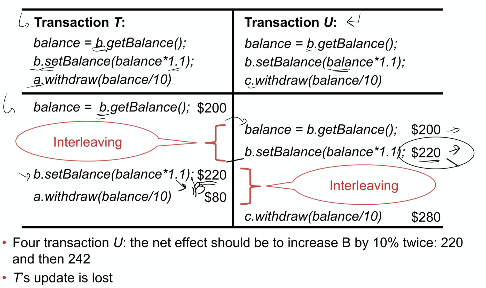
  - The previous update has been over-written by other updates which perform on old values

- Inconsistent Retrieval
  - 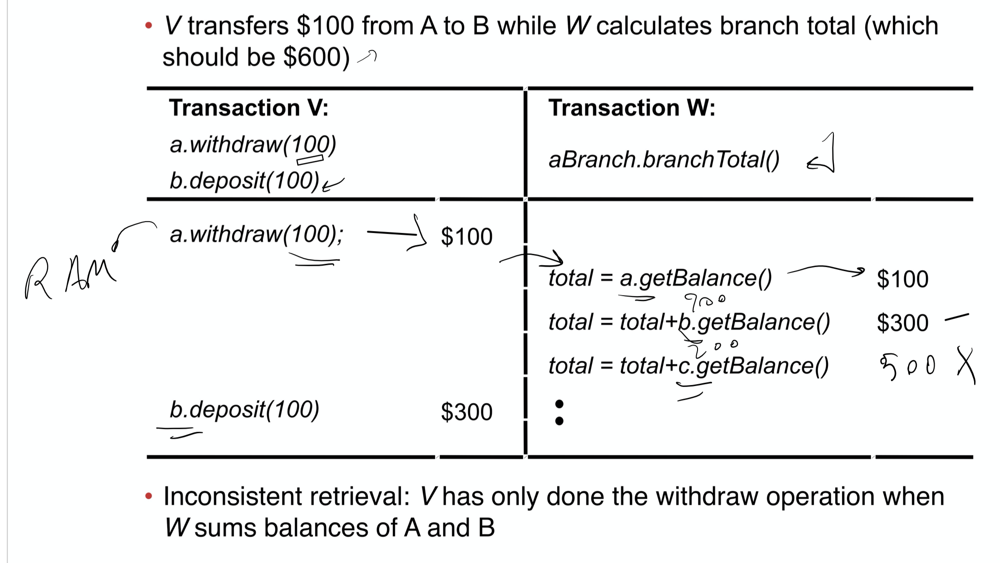
  - The value has been updated when retrieval performed (on tentative value without full operation performed)
  - The database remains consistent but the reading is inconsistent with the record in the database.

## Serial Equivalence

- Two different transactions have the same effect
- Serially equivalent interleaving
  - Interleaving(mixing) of the transactions where the result is equivalent to some sequence of transactions
- Operation conflict rule
  - 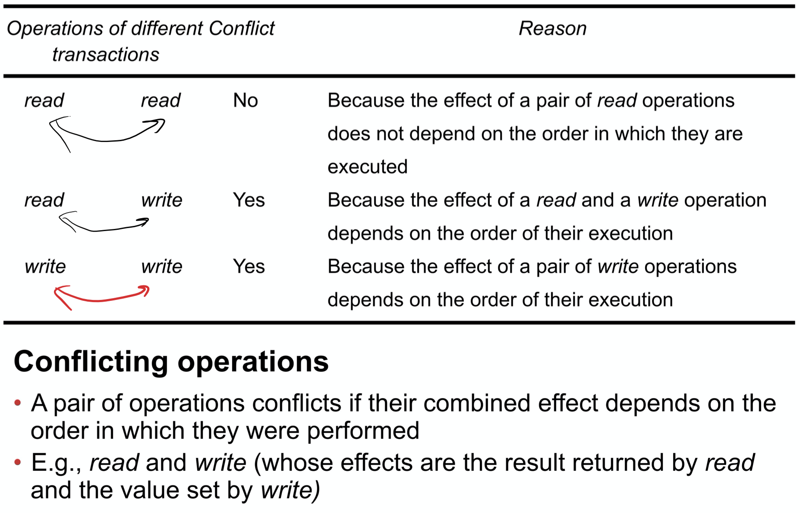

- It is necessary and sufficient
  - All pairs of conflicting operations of the two transactions be executed in the same order at all of the objects they both access.
- Example
  - 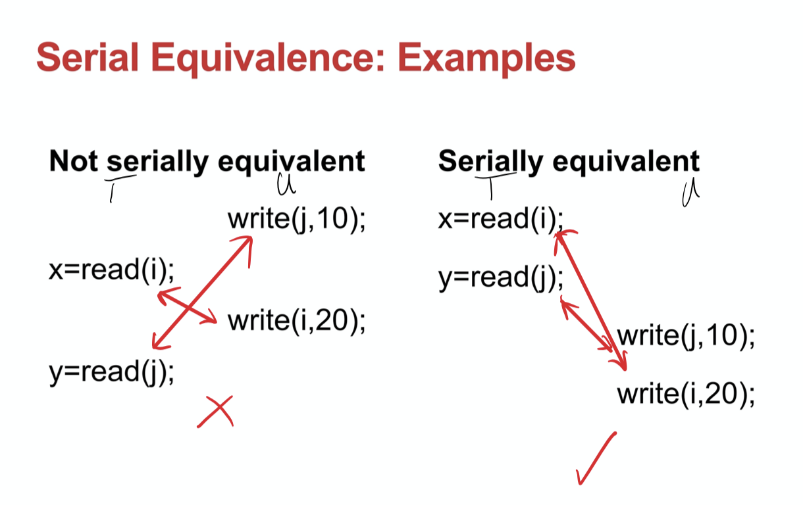

## Recoverability from aborts

### Dirty Read

- Interaction between a read operation in one transaction and an earlier write operation on the same object
  - read (and modify) a tentative value
- Transaction that committed with a dirty read is not recoverable
- 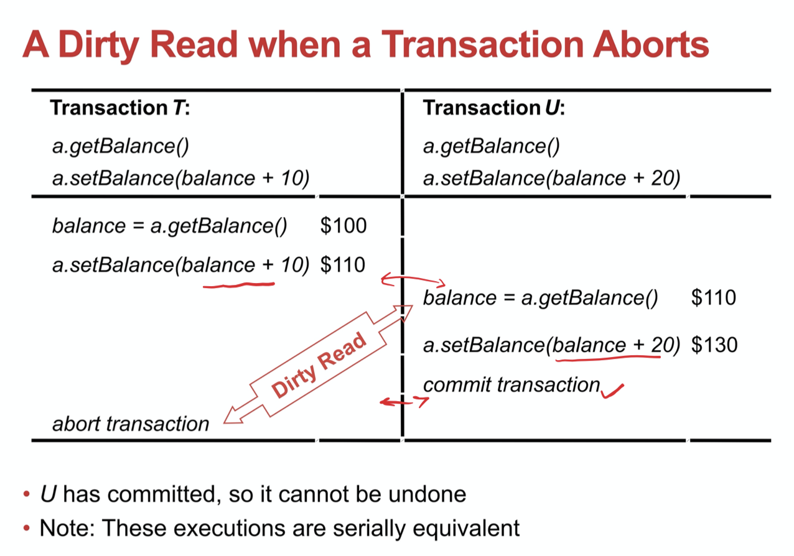

- How to resolve
  - A commit is delayed until after the commitment of any other transaction whose state has been observed
  - U waits T commits or abort
    - If T aborts then U must also abort
    - However, this may cause a cascading aborts
    - 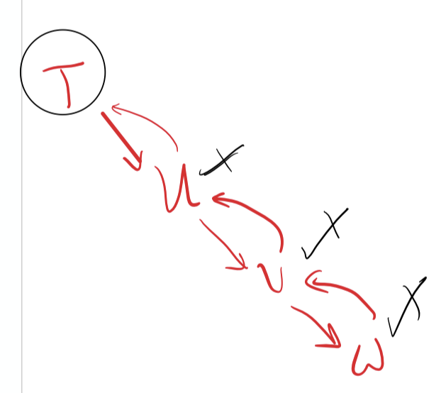
  - Avoid Cascading Aborts
    - Transactions are only allowed to <u>read</u> objects written by committed transactions
    - Any read operation must be delayed until other transactions that applied a <u>write</u> operation to the same object have <u>committed</u> or <u>aborted</u>.

### Premature writes

- Overwriting uncommitted values
  - Mainly caused by using a “before image” to rollback
  - Example
  - 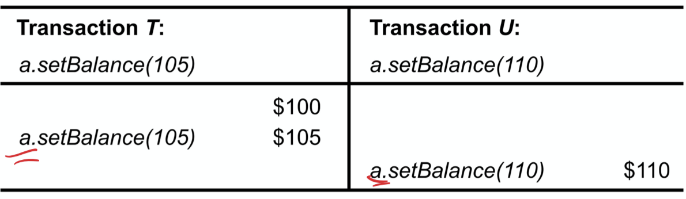
  - If T abort later, the U setBalance(110) will be covered by the “before image”
- Cure
  - If a recovery scheme uses before image
    - Write operations must be delayed until earlier transactions that updated the same objects have either *committed* or *abort*
  - Strict executions of transactions
    - Delay both <u>read</u> and <u>write</u> operations until all transactions that previously wrote that object have either committed or aborted
    - to avoid both dirty reads an premature writes
  - Tentative versions are used during progress of a transaction
    - Objects in tentative versions are stored in volatile memory

## Nested Transactions

- Transactions may be composed of other transactions
- 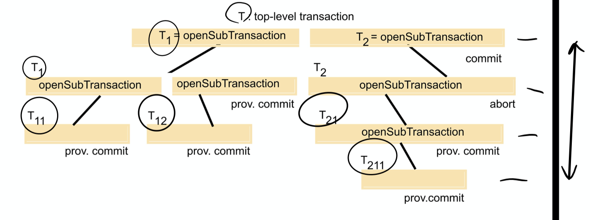

- Features

  - Parent
    - Sub-transaction is atomic with respect to failures and concurrent access
  - Transactions at the same level
    - Can run concurrently but access to common objects is serialised
  - Sub-transaction
    - Can fail independently of its parent and other sub-transactions
    - When it aborts, its parent decides what to go
      - Start another sub-transaction
      - Or give-up
  - Summary
    - Allow concurrent execution of sub-transactions
    - Allow independent recovery of sub-transactions

- Advantages (Comparison to flat transactions)

  - Sub-transactions may run concurrently with other sub-transactions at the same level
    - Enables additional concurrency in a transaction

  - Sub-transactions can commit or abort independently
    - Potentially more robust
    -  A parent can decide on different actions according to whether a sub-transaction has aborted or not.

- Commitments

  - Transaction
    - May commit or abort only after its child transactions have completed
  - Sub-transaction
    - Decides independently to commit provisionally or to abort
    - Its decision to abort is final
  - Parent
    - When a parent aborts, 
      - all of its sub-transactions are aborted
    - When a sub-transaction aborts, 
      - the parent can decide whether to abort or not
  - Top-level transaction
    - All of the sub-transactions that have provisionally committed can commit too, provided that none of their ancestors has aborted.

## Locking

- Idea
  - A transaction must be scheduled so that their effect on shared data is serially equivalent
  - A server can achieve serial equivalence of transactions by serial equivalence of transactions by serializing access to the object
- Simple example, the use of exclusive locks
  - Only one object can read or write at a time
  - Can be more refined allow separate locks for reading and writing
- If cannot lock the data, just wait
- Two-phase locking
  - Growing phase
    - New locks are acquired
  - Shrinking phase
    - Locks are released

### Strict two-phase locking

- Two phase locking
  - Transaction is not allowed any new locks after it has released a lock
- Properties
  - Prevent <u>dirty reads</u> and <u>premature writes</u>
  - Any locks applied during the progress of a transactions are held until the transaction commits or aborts
    - Block others to read and write
  - For recovery purposes
    - Locks are held until updated objects have been written to permanent storage
- Granularity
  - Apply locks to small things
    - Bank balances
  - There are no assumptions as to granularity in presented schemes

### Read-write conflict rules

- Concurrency control protocols
  - Are designed to deal with conflicts between operations in different transactions on the same object
  - Protocols are described in terms of <u>read</u> and <u>write</u> operations, which we assume are atomic
- Many reader/single writer scheme
  - Allows several transactions to <u>read</u> an object
  - Or a single transaction to <u>write</u> it, but not both
  - Use read locks (shared locks) and write locks
    - 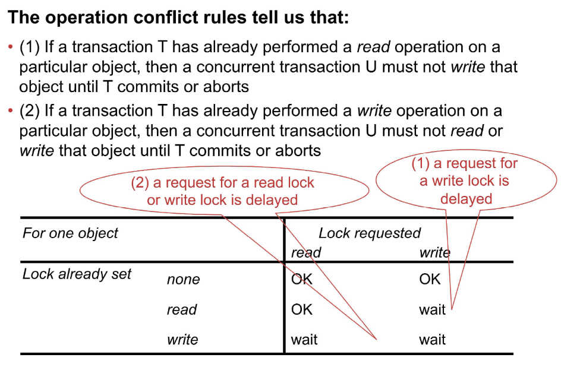

- Lock promotion
  - The conversion of a lock to a stronger lock
    - Read lock to write lock
  - Demotion of locks is not allowed

- Use of lock
  - 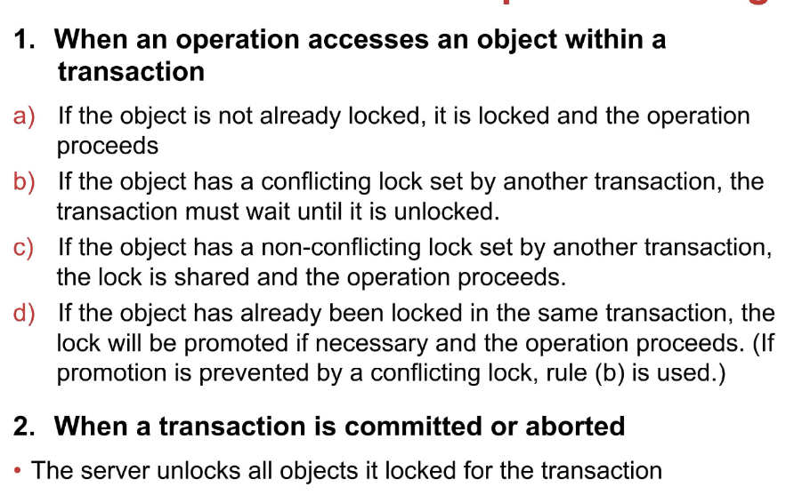

### Deadlock

- Definition
  - State in which each member of a group of transactions is waiting for some other member to release a lock
  - A lock manager must be designed to deal with deadlocks

### Wait-for Graph

- Used to represent the waiting relationships between current transactions
- Nodes represent transactions and the edges represent wait-fro relationships between transactions
- Object can be omitted
- Example
  - 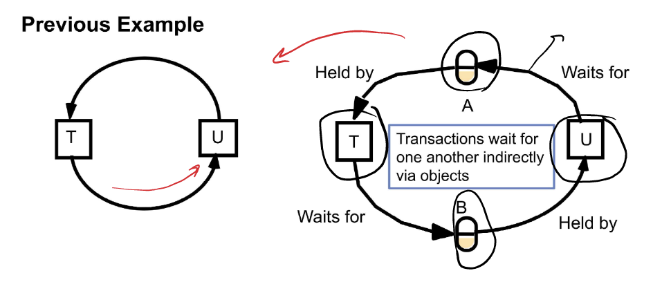

- A cycle represents a deadlock
  - If one transaction is aborted, then its locks are released and that cycle is broken

### Resolve Deadlock

#### Deadlock Detection

- Find cycle in the wait-fro graph
- Deadlock detection can be part of the lock manager
- When a cycle is detected, choose a transaction to be aborted and then remove from the graph all the edges belonging to it
  - Which transaction to abort?
    - The oldest
    - The one in the most cycle

#### Timeout on Locks

- Use of lock timeout to resolve deadlocks
  - Each lock is given a limited period in which it is invulnerable
  - After this time, a lock becomes vulnerable
    - Only break the lock if any other transaction is waiting to access the object protected by a <u>vulnerable lock</u>
    - Normally the transaction whose lock has been broken is aborted
- Problems
  - Locks may be broken by a waiting transaction when there is no deadlock
  - If the system is overloaded, lock timeouts will happen more often and long transactions will be penalised
  - Difficult to select a suitable length for a timeout

### Increasing concurrency

#### Two-version locking

- Allow writing of tentative versions with reading of committed versions
- <u>Read</u> operations only wait if another transaction is currently <u>committing</u> the same object
- Wariting transactions risk waiting or even rejection when attempt to commit
- Transactions cannot commit their write operations immediately if other uncompleted transactions have read the same objects
- <u>Deadlocks may occur</u> when transactions are waiting to commit
- Uses three types of lock
  - Read lock
  - Write lock
  - Commit lock
- Lock compatibility
  - 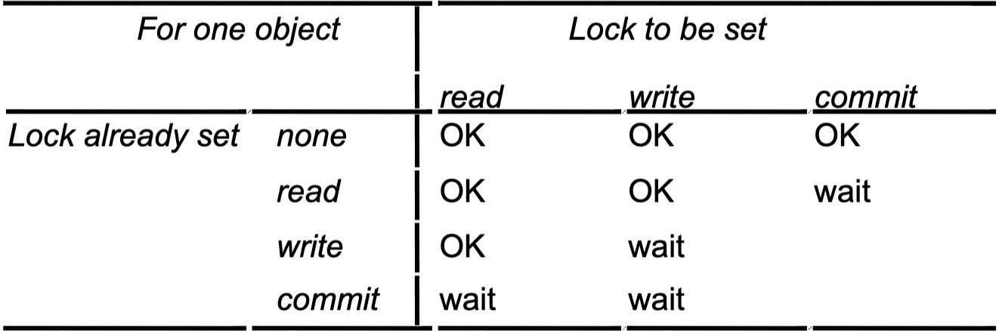

#### Hierarchic locks

- Main idea
  - To reduce locking overhead, allowing a hierarchy of locks with different granularities

- Example
  - the branchTotal operation locks all the accounts with one lock whereas the other operations lock individual accounts 
- Setting of a parent lock has the same effect as setting all the equivalent child lock 

- Lock compatibility
  - Intention locks
    - Before a child node is granted a read-write lock, and intention to read-write lock is set on the parent node and its ancestors
    - 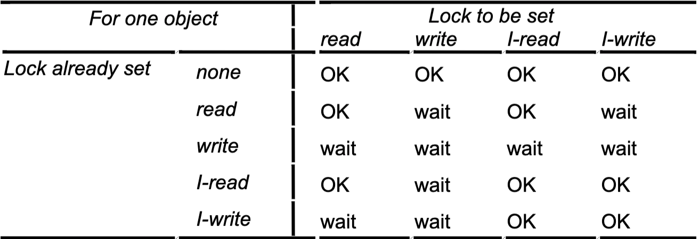

### Drawbacks of locking

- Lock maintenance overhead
- Even read-only transactions use locking
- deadlock may occur
  - Deadlock prevention reduce concurrency
  - (Timeout or dead lock detection) does not completely satisfactory for use in interactive programs
- To avoid cascading aborts, locks cannot be released until the end of the transaction which may reduce significantly the potential for concurrency

## Optimistic Concurrency Control

### Main Ideas

- The likelihood of two transactions conflicting is low
- Transaction proceeds without restriction until closeTransaction
- Then check if current transaction conflicts with other transactions
- If a conflict arises, abort transaction and restart transaction 

### 3 phases

- Working phase
  - Transaction uses a tentative version of the objects it accesses
  - <u>read</u> operations are performed immediately
  - Keep two records of objects
    - The <u>read</u> and <u>write</u> set of each transaction
- Validation phase
  - At <u>closeTransaction</u> the coordinator validates the transaction
  - If the validation is successful, the transaction can commit
  - Otherwise, either the current transaction or conflict transaction need to abort
- Update phase
  - If validated, the changes in its tentative versions are made permanent
  - Read-only transactions can commit immediately after validation

### Read-Write Conflict Rules

- Ensure a particular transaction is serially equivalent w.r.t. all other overlapping transactions
- Each transaction gets a transaction number when it starts validation, 
  - issues closeTransaction (the number is kept if it commits)
- Transaction number defines its position in time and a transaction finishes its working phase after all transactions with lower numbers 

- 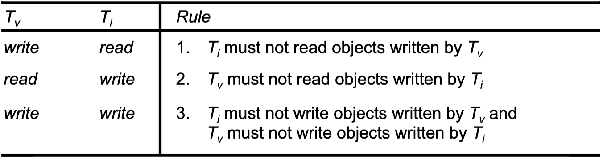

### Validation

- Simplification
  - Only one transaction may be in the validation and update phase at one time
    - Could implement as critical section
  - Rule 3 satisfied here
  - Produces strict executions

- Transaction number
  - Current transaction number act like a pseudo-clock that ticks whenever a transaction completes successfully
- Approach
  - backward
  - forward

#### Backward Validation

- Compare <u>current read set</u> with <u>previous overlapping write set</u>
  - If intersection set is non empty
    - Abort the current transaction
  - else
    - Pass validation
- Properties
  - Rule 1 (previous read check)
    - Auto-satisfied as previous read already done before current validation
  - Rule 2 (previous write check)
    - This is what we check above, if not satisfy we abort
    - Therefore, in update phase transaction should fulfill this already
  - Write-only transaction could pass without checking

#### Forward Validation

- Compare <u>current write set</u> with currently <u>active transaction read set</u>
- Properties
  - Rule 1
    - This is what we examine above
  - Rule 2
    - Auto-satisfied as active transactions do not write until after current validating transaction has complete
  - Read-only transaction could pass without checking

#### Compare Backward and Forward

|                                     | Backward Validation                                          | Forward Validation                                           |
| ----------------------------------- | ------------------------------------------------------------ | ------------------------------------------------------------ |
| conflict                            | Transaction being validated has to abort                     | More flexible. We could: 1. Defer the validation until a later time 2. Abort all the conflicting active transactions and commit the transaction being validated 3. Abort the transaction being validated |
| In general: read sets >> write sets | 1. Compares a possibly large read set against the old write sets 2. Overhead of storing old write sets | 1. Checks a small write set against the read sets of active transactions 2. Need to allow for new transactions starting during validation |

#### Validation

- Starvation
  - Prevention of transaction ever being able to commit
  - After a transaction is aborted, the client must restart it, but there is no guarantee it will ever succeed 
  - Solution
    - Should be given exclusive access by the use of a critical section protected by a semaphore if the same transaction is aborted repeatedly

## Timestamp Ordering Concurrency Control

- Idea

  - Each operation in a transaction is validated when it is carried out 
  - If an operation cannot be validated, the transaction is aborted
  - Each transaction is given a unique timestamp when it starts
    - Timestamp defines its position in the time sequence of transactions
    - Timestamp represents a total order 

- Validation rules (called <u>ordering rule</u> in slides)

  - Write operation 
    - Only valid if that object was last <u>read</u> and <u>written</u> by earlier transactions

  - Read operation
    - Only if last object was last <u>written</u> by an earlier transaction
  - Assumes only one version of each object and restricts access to one transaction at a time

- Rule Refinement (to enable tentative version)

  - Enables concurrent access by transactions to objects
  - Might require transaction waiting

- Refined rule

  - Tentative versions are committed in the order of their timestamps
    - Wait if necessary
  - Read operations wait for earlier transactions to finish their writes
  - Only wait for earlier ones
    - No deadlock
  - Each read or write operation is checked with the conflict rules
  - As usual write operations are in tentative objects
  - ==Note:Have greater timestamp means later==
  - 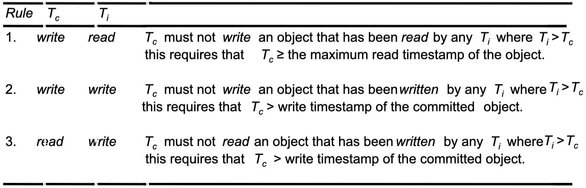
    - Must **<u>not write</u>** if 
      - Some later transaction performed **<u>read</u>** operation to that object
      - Some later transaction already committed its **<u>write</u>**
      - 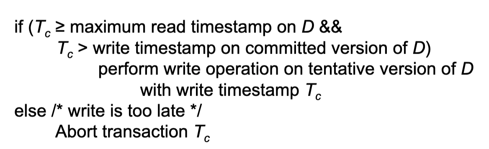
      - 
    - Must <u>not read</u> if
      - Abort
        - Some later transaction committed **<u>write</u>** operation already to that object
      - Wait until commit/about of
        - the version of D with the maximum write timestamp which smaller than current timestamp
      - 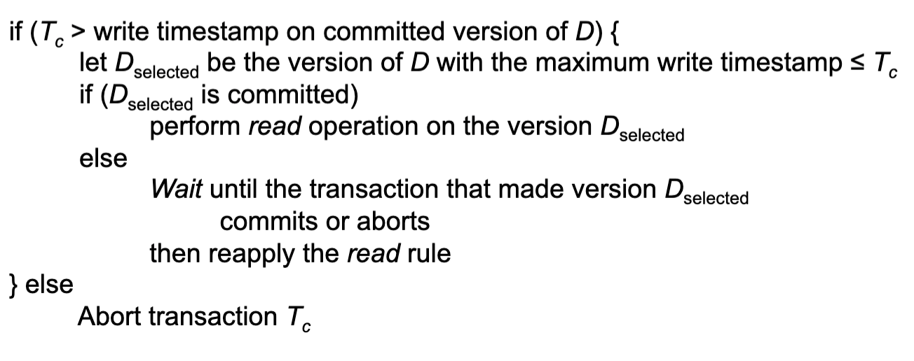
      - 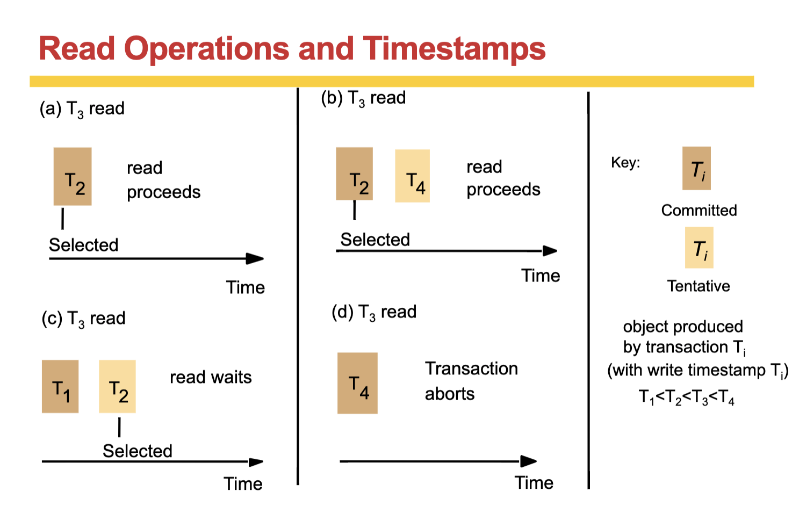

- When coordinator receives a commit request

  - Carries it out 
    - because all operations have been checked for consistency with earlier transactions
  - Committed versions of an object must be created in timestamp order
  - The server may sometimes need to wait, but the client need not wait 
  - To ensure recoverability, the server will save the waiting to be committed versions in permanent storage 
  - In this case, it is strict
    - The read rule delays each read operation until previous transactions that had written the object had committed or aborted 
    - Writing the committed versions in order ensures that the write operation is delayed until previous transactions that had written the object have committed or aborted

### Analysis

- Avoid deadlocks, but is likely to suffer from restarts
- ‘ignore obsolete write’ rule is an improvement 
  - If a write is too late it can be ignored instead of aborting the transaction, because if it had arrived in time its effects would have been overwritten anyway 
  - However, if another transaction has read the object, the transaction with the late write fails due to the read timestamp on the item

## Comparison of Concurrency Control Methods

- Pessimistic approach (detect conflicts as they arise) 
  - Timestamp ordering
    - Serialisation order decided statically
    - Better if reads >> writes
    - Abort immediately
  - Locking
    - Serilisation order decided dynamically
    - Better if writes >> reads
    - Waits but can get deadlock
- Optimistic method
  - All transactions proceed, but may need to abort at the end
  - Efficient operations when there are few conflicts, but aborts lead to repeated work

