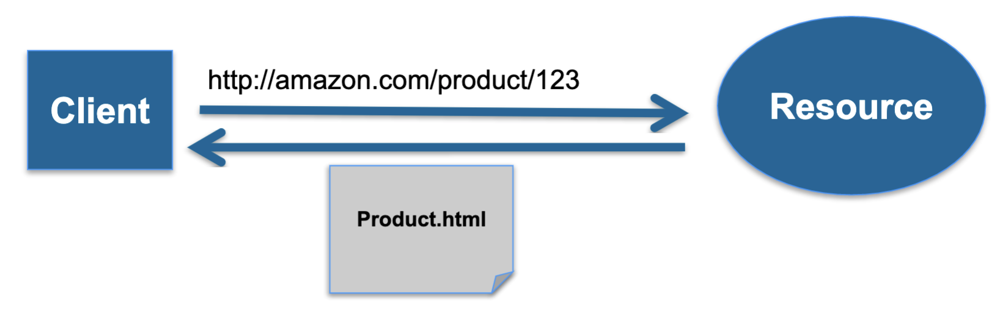
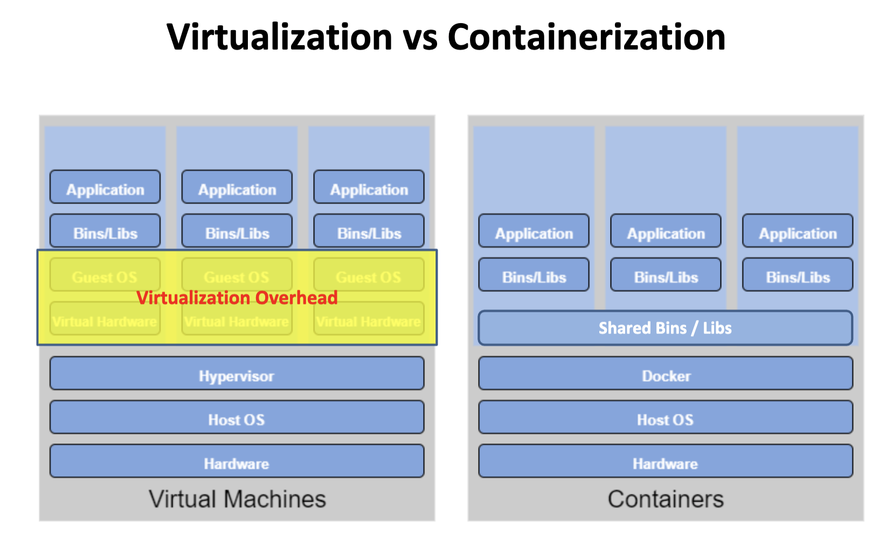
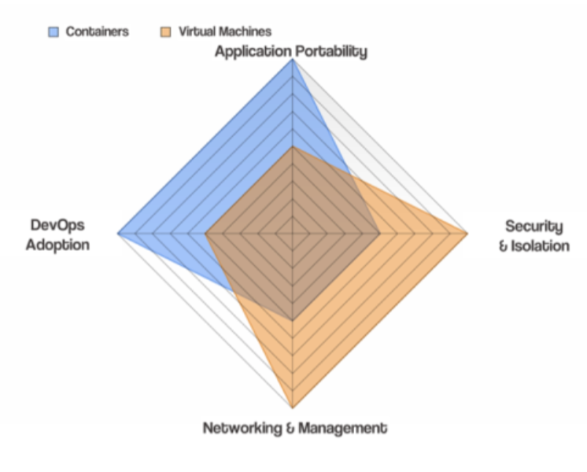

# Week 6 - Service-oriented Architectures, Web Services and Containerization

## Service-oriented Architectures

### Service-oriented Architectures(SoA)

- A architecture is just the way different software components are distributed on computers, and the way in which they interact with each other.
- When an architecture is completely contained within the same machine. Components can communicate directly. However, when components are distributed such a direct approach typically can not be used.
- <u>**Service**</u>(combination and commonality) are often used to form a <u>**Service-oriented Architecture(SoA)**</u>.

### Service-oriented Architecture(SoA) Core Goals

- A set of externally facing services that a business wants to provide to external collaborators
- An architectural pattern based on service providers, one of more brokers, and service requestors based on agreed service descriptions.
- A set of architectural principles, patterns and criteria that support modularity, encapsulation, loose coupling, separation of concerns, reuse and composability.
- A programming model complete with standards, tools and technologies that supports development and support of services
- A middleware solution optimized for service assembly, orchestration, monitoring and management.

### Past Exam

- [2016 Q1 B] How has the evolution of service-oriented architectures supported Cloud computing?
  - SoA is a set of architectural principles that support modularity, encapsulation, loose coupling, separation of concerns, reuse and composability which just suit cloud computing and can server as a design principle for breaking down the large services into small pieces and deploy on different computer but working as an integrity.
  - you have standardized interface for the service-oriented architectures
    - it offers the autonomy
    - you are providing interface that people/software can interact with
  - Where it is helping cloud computing is every single cloud provider at the builder of the interface using different technologies i.e. you have to learn the programming language to do that and this can be a major bottleneck. 
    - Adopting SOA like ReST can help to solve this problem. We have apis provided by openstack where you can interact with the cloud with the help of set of libraries for doing that.

### SoA Design Principle (Lectures notes, then my paraphrase)

- Standardized service contract
  - Service adhere to a communications agreement, as defined collectively by one or more service-description documents.
  - Service define a common agreement/protocol for communication
- Service loose coupling
  - Services maintain a relationship that minimizes dependencies and only requires that they maintain an awareness of each other.
  - Services try to decoupling as much as possible
- Service abstraction
  - Beyond descriptions in the service contract, services hide logic from the outside world.
  - Only provide interface, but hide complex login
- Service reusability
  - Logic is divided into services with the intention of promoting reuse
  - Breaking big logic into small service that good for reuse
- Service autonomy
  - Services have control over the logic the encapsulate
- Service statelessness
  - Services minimize resource consumption by deferring the management of stat information when necessary
  - Do not maintain state information if possible
- Service discoverability
  - Services are supplemented with communicative meta data by which they can be effectively discovered and interpreted.
  - Provided meaningful metadata for discovered and interpreted
- Service composability
  - Services are effective composition participants, regardless of the size and complexity of the composition
  - Can effective become a participant in the system

- Service granularity
  - Design consideration to provide optimal scope at the right granular level of the business functionality in a service operation.
  - Provide proper granularity
- Service normalization
  - Services are decomposed and/or consolidated to a level that minimizes redundancy, for performance optimization, access, and aggregation.
  - Decompose big service into small unit
- Service optimization
  - High-quality services that serve specific functions are generally preferable to general purpose low-quality ones.
  - Service and server both high or low quality
- Service relevance
  - Functionality is presented at a level of granularity recognized by the user as a meaningful service.
- Service encapsulation
  - Many services are consolidated for use under a SoA and their inner workings hidden.
  - Many service are only visible within a SoA, their logic are hidden.
- Service location transparency
  - The ability of a service consumer to invoke a service regardless of its actual location in the network.
  - Can use the service anywhere in the network

## Web Services

### SoA for Web

- Web services implement SoA with two main flavours
  - SOAP-based Web Services
  - ReST-based Web Services
  - Both flavours to call  services over HTTP
- There are many other flavours of web service
  - Geospatial service (WFS, WMS, WPS)
  - Health services (HL7)
  - SDMX (Statistical Data Markup eXchange)

### SOAP/WS vs ReST

|                             ReST                             | SOAP/WS                                                      |
| :----------------------------------------------------------: | ------------------------------------------------------------ |
| Centered around resources, and the way they can be manipulated (added, deleted, etc.) remotely | Built upon the Remote Procedure Call(RPC) paradigm (a language independent function call that spans another system) |
| Actually ReST is more of a style to use HTTP than a separate protocol | While SOAP/WS is a stack of protocols that covers every aspect of using a remote service, from service discovery, to service description, to the actual request/response. Can use HTTP or other protocols. |

### Past Exam

- [2013 Q4] A) Compare and contrast Representational State Transfer (ReST) based web services and Simple Object Access Protocol (SOAP)-based web services for implementing service-oriented architectures(SoA). [8]
  - They are different flavors of web services
  - Complexity of SOAP
    - Have <u>namespace</u> and <u>standardization</u> around us to do with the operation names of parameters
    - SOAP uses WSDL which is an XML-based interface description language that describes the functionality offered by a web service. WSDL provides a machine-readable description of how the service can be called, what parameters it expects, and what results/data structures are.
    - While ReST doesn't deal with complex WSDL. You can mix/match service models
    - While ReST has no need to understand what methods mean. There is a very small subset of methods that are available in operation where you can do PUT, POST, GET, etc. This very limited vocabulary can greatly simplify understanding from developers who are implementing system to make client to interact with it.
    - Too much standards compared to ReST
  - SOAP is built upon the RPC while ReST is centered around resources, and the way they can be manipulated (add, delete, etc) remotely.

### ReST-based Web Service

> **ReST(Representation State Transfer)** is intended to evoke an image of how a well-designed Web app behaves. A network for web pages, where the user progresses through an application by selecting links and resulting in next page then being transferred to the user and rendered for their use.

- ReST leverages less bandwidth, making it more suitable for internet usage.

#### How it works

1. Clients requests Resource through Identifier (URL)
2. Server/proxy sends representation of Resource
3. This puts the client in a certain state
4. Representation contains URLs allowing navigation
5. Client follows URL to fetch another resource
6. This transitions client into yet another state
7. **Re**presentational **S**tate **T**ransfer

## Resource-Oriented Architecture (ROA)

- A ROA is a way of turning a problem into a RESTful web service

  - an arrangement of URIs, HTTP, and XML that works like the rest of the Web

- A resource is anything that’s important enough to be referenced as a thing in itself.

  - If your users might
    - want to create a hypertext link to it
    - make or refute assertions about it
    - retrieve or cache a representation of it
    - include all or part of it by reference into another representation
    - annotate it
    - or perform other operations on it

- |      Action       |               HTTP METHOD                |
  | :---------------: | :--------------------------------------: |
  |  Create Resource  | PUT to a new URI POST to an existing URI |
  | Retrieve Resource |                   GET                    |
  |  Update Resource  |         POST to an existing URI          |
  |  Delete Resource  |                  DELETE                  |

- **PUT** should be used when target resource URL is known by the client

- **POST** should be used when target resource URL is server generated

### ReST - Uniform Interface

- Uniform Interface has four more constrains
  - Identification of Resources
    - All important resources are identified by one (uniform) resource identifier mechanism (e.g. HTTP URL)
  - Manipulation of Resources through representations
    - Each resource can have one or more representations. Such as application/xml, application/json, text/html, etc. Clients and servers negotiate to select representation.
  - Self-descriptive messages
    - Requests and responses contain not only data but additional headers describing how the content should be handled.
  - HATEOAS
    - Hyper Media as the Engine of Application State
    - Resource representations contain links to identified resources
    - Resources and state can be used by navigating links
      - links make interconnected resources navigable
      - without navigation, identifying new resources is service-specific
    - RESTful applications **<u>navigate</u>** instead of **<u>calling</u>**
      - Representations contain information about possible traversals
      - application navigates to the next resource depending on link semantics
      - navigation can be delegated since all links use identifiers
    - Making resources navigable is essential for HATEOAS
      - RPC-oriented systems need to expose the available functions
        - functions are essential for interacting with a service
        - introspection or interface descriptions make functions discoverable
      - ReSTful systems use a Uniform Interface
        - no need to learn about functions
        - To find resources
          - find them by following links from other resources
          - learn about them by using URI Templates
          - understand them by recognizing representations

- HTTP Methods can be 
  - **Safe**
    - Do not change, repeating a call is equivalent to not making a call at all 
    - GET , OPTION, HEAD
  - **Idempotent**
    - Effect of repeating a call is equivalent to making a single call
    - *PUT*, *DELETE*
  - **Neither**
    - POST

## Containerization

### Virtualization vs Containerization

- Virtualization

  - Pros
    - Application containment
    - Horizontal scalability
  - Cons
    - The guest OS and binaries can give rise to duplications between VMs wasting server processors, memory and disk space and limiting the number of VMs each server can support

- Containerization

  - Pros
    - It allows virtual instances to share a single host OS (and associated drivers, binaries, libraries) to reduce these wasted resources since each container only holds the application and related binaries. The rest are shared among the containers.

- 

- |               | Virtual Machines                                             | Container                                     |
  | ------------- | ------------------------------------------------------------ | --------------------------------------------- |
  | Guest OS      | Run on virtual Hardware, have their own OS kernels           | Share same OS kernel                          |
  | Communication | Through Ethernet devices                                     | IPC mechanisms (pipes, sockets)               |
  | Security      | Depends on the Hypervisor                                    | Requires close scrutiny                       |
  | Performance   | Small overhead incurs when instructions are translated from guest to host OS | Near native performance                       |
  | Isolation     | File systems and libraries are not shared between guest and host OS | File systems can be shared, and libraries are |
  | Startup time  | Slow (minutes)                                               | Fast (a few seconds)                          |
  | Storage       | Large                                                        | Small (most are reusable)                     |

- In real world they can, however, co-exist

  - When deploying applications on the cloud, the base computation unit is a Virtual Machine. Usually Docker containers are deployed on top of VMs.

- Containers not always better

  - 

### What is Container?

- Similar concept of resources isolation and allocation as a virtual machine

- Without bundling the entire hardware environment and full OS

- Runtimes

  - Docker
    - The leading software container platform
  - Containerd
  - cri-o

  

### What are Orchestration Tools?

- Container orchestration technologies provides a framework for integrating and managing containers **<u>at scale</u>**
- Goals
  - Simplify container management process
  - Help to manage availability and scaling of containers
- Features
  - Networking
  - Scaling
  - Service discovery and load balancing
  - Health check and self-healing
  - Security
  - Rolling update
- Tools
  - Kubernetes and Hosted Kubernetes
  - Docker SWARM / Docker Compose
  - OpenShift

### Docker SWARM

- Features
  - Raft consensus group
    - consists of internal distributed state store and all manager nodes. 
  - Internal Distributed State Store
    - built-in key-value store of Docker Swarm mode.
  - Manager Node 
    - It conducts orchestration and management tasks. Docker Swarm mode allows multiple manager nodes in a cluster. However, only one of the manager nodes can be selected as a leader. 
  - Worker Node 
    - receives and executes tasks directly from the manager node
  - Node Availability
    - In Docker Swarm mode, all nodes with ACTIVE availability can be assigned new tasks, even the manager node can assign itself new tasks (unless it is in DRAIN mode)
  - Service 
    - consists of one or more replica tasks which are specified by users when first creating the service.
  - Task
    - A task in Docker Swarm mode refers to the combination of a single docker container and commands of how it will be run. 
  - More parallel equipment available, larger problems can be solved in the similar time