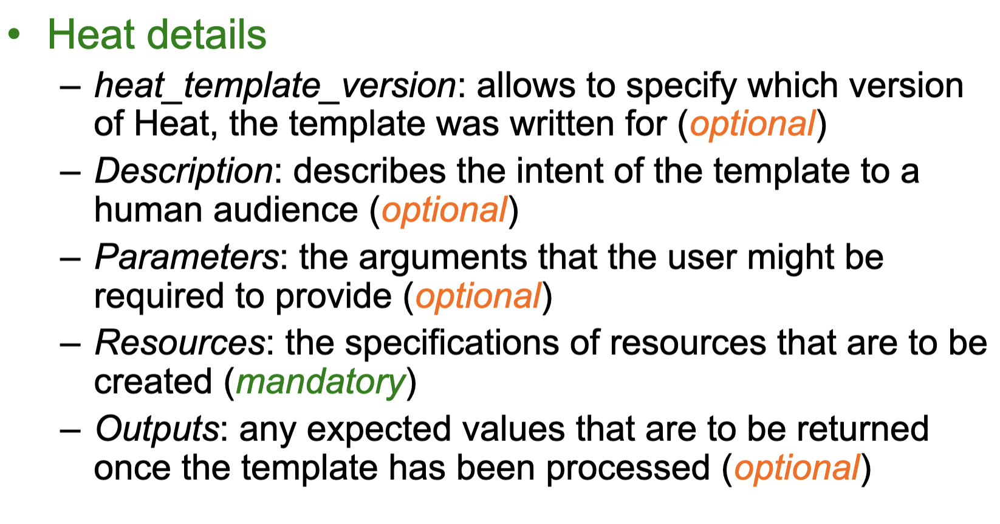

# Week 8.2 OpenStack & Comparing and Contrasting AWS with NeCTAR Cloud

## Key Services

### Keystone -- Identity Service

- Provides an authentication and authorization service fro OpenStack services
  - Tracks users/permissions
- Provides a catalog of endpoints for all OpenStack services
  - Each service registered during install
    - Know where they are and who can do what with them
  - Project membership
  - firewall rules
- Generic authorization system
  - More refer to week10 ==TODO==

### Nova -- Compute Service

- Manages the lifecycle of compute instances in an OpenStack environment
- Responsibilities for virtual machines on demand, include 
  - spawning
  - scheduling
  - Decommissioning
- Virtualisation agnostic
  - Key point of success as it allows openStack works with **<u>any kind</u>** of virtualisation solution, including
    - XenAPI, Hyper-V, VMWare ESX
    - Docker
  - You are not binding with any specific solution
- ==(The following not covered in detail in the lecture)==
- API
  - Nova-api
    - Accepts/responds to end user API calls
    - Supports openStack Compute & EC2 & admin APIs
  - Compute Core
    - Nova-computer
      - Daemon that creates/terminates VMs through hypervisor APIs
    - Nova-scheduler
      - schedules VM instance requests from queue and determines which server host to run
    - Nova-conductor
      - Mediates interactions between compute services and other components, e.g. image database
  - Networking
    - Nova-network
      - Accepts network tasks from queue and manipulates network, e.g. changing IP table rules

### Swift - Object Storage

- Stores and retrieves arbitrary unstructured data objects via ReSTful API
  - VM images and data
  - This service can be used to access arbitrary unstructured data
- Fault tolerant with data replication and scale-out architecture
  - Available from anywhere; persists until deleted
  - Allows to write objects and files to multiple drives, ensuring the data is replicated across a server cluster
- Can be used with/without **<u>Nova</u>**
- Client/admin support
  - Swift client allows users to submit commands to ReST API through command line clients to configure/connect object storage to VMs

### Cinder -- Block Storage

- Provides persistent block storage to virtual machines (instances) and supports creation and management of block storage devices
- Cinder access associated with a VM
  - Cinder-api
    - routes requests to cinder-volume
  - Cinder-volume
    - interacts with block storage service and scheduler to read/write requests; can interact with multiple flavours of storage (flexible driver architecture)
  - Cinder-scheduler
    - selects optimal storage provider node to create volumes (ala nova-scheduler)
  - Cinder-backup
    - provides backup to any types of volume to backup storage provider

### Glance -- Image Service

- Accepts requests for disk or server images and their associated metadata (from **<u>Swift</u>**) and retrieves / installs (through **<u>Nova</u>**)
  - Find the image at **<u>Swift</u>**, but getting the image at **<u>Glance</u>**
- API
  - Glance-api
    - Image discovery, retrieval and storage requests
  - Glance-registry
    - Stores, processes and retrieves metadata about images, e.g. size and type
      - Ubuntu 14.04
      - My last good snapshot
        - I (the owner) can control who can access the snapshot using **<u>Keystone</u>**

### Neutron -- Networking Services

- Supports networking of OpenStack services
  - subnet
  - Network in and out
  - Network security group
- Offers an API for users to define networks and the attachments into them,
  - switches
  - routers
- Pluggable architecture that supports multiple networking vendors and technologies
- Neutron-server
  - accepts and routes API requests to appropriate plug-ins for action
  - Port management, e.g. default SSH, VM-specific rules, ...
  - More broadly configuration of availability zone networking, e.g. subnets, DHCP, ...

### Horizon -- Dashboard Service

- Provides a web-based self-service portal to interact with underlying OpenStack services, such as 
  1. launching an instance
  2. assigning IP addresses
  3. configuring access controls
- Based on Python/Django web application
- Requires Nova, Keystone, Glance, Neutron
- Other services optional...

### Trove -- Database Service

- Provides scalable and reliable Cloud database (DBaaS) functionality for both <u>relational</u> and <u>non-relational</u> database engines
- Benefits
  - Resource isolation
  - high performance
  - automates deployment
  - config
  - patching
  - backups
  - restores
  - monitoring
  - ...
- Use image service for each DB type and trove-manage to offer them to tenants/user communities

### Sahara -- Data Processing Service

- Provides capabilities to provision and scale Hadoop clusters in OpenStack by specifying parameters such as Hadoop version, cluster topology and node hardware details
- User fills in details and Sahara supports the automated deployment of infrastructure with support for addition/removal of worker nodes on demand

### Heat -- Orchestration Service

- Template-driven service to manage lifecycle of applications deployed on Openstack
- Stack
  - Another name for the template and procedure behind creating infrastructure and the required resources from the template file
- Can be integrated with automation tools such as Chef
  - Puppet
  - Ansible
- 