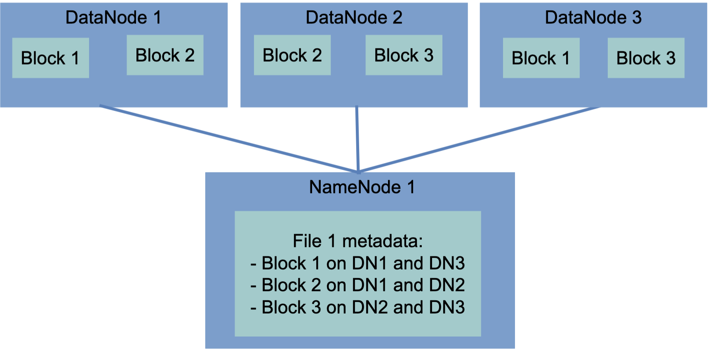
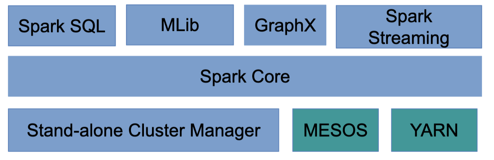
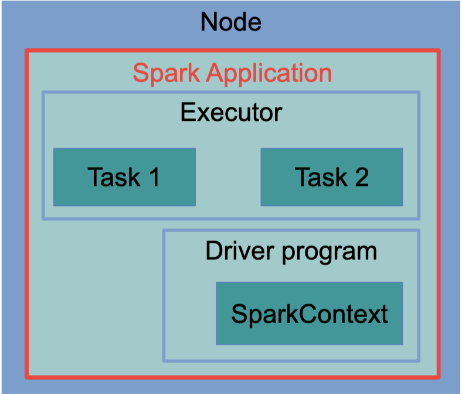
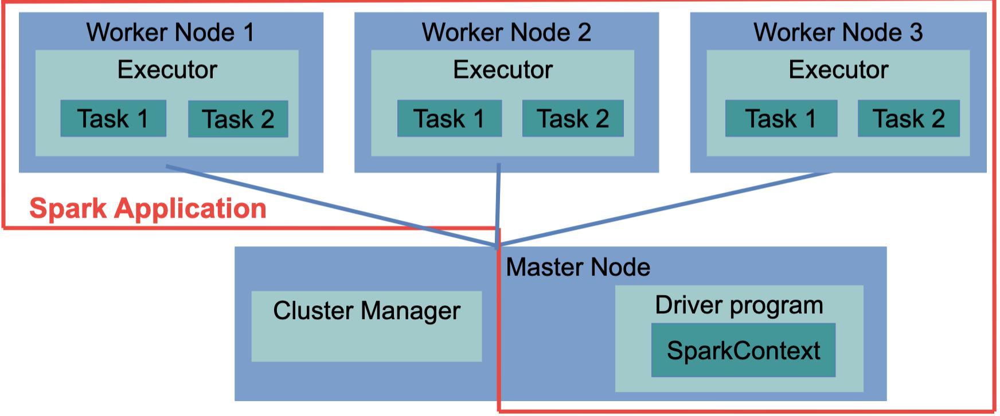
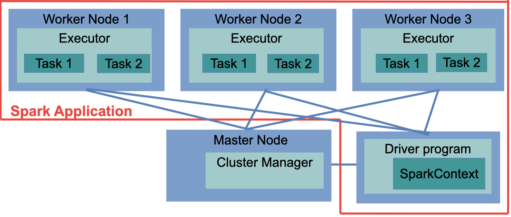

# Week9 - Big Data Analytics

## Introduction

### Why?

- There would not be much point in amassing vast amount of data without being able to analyse it,  hence the blossoming of **<u>large-scale</u>** business intelligence and more complex machine learning algorithms

- Overlapping among business intelligence, machine learning, statistics and data mining.
  - Just use big data analytics

### Examples / Usage

- Full-text search
  - Google search engine
- Aggregation of data
  - Summing up the number of hits by web-pages
- Clustering
  - Grouping customer into classes based on their spending habits
- Sentiment analysis
  - Deciding whether a tweet on a given topic express a positive or negative sentiment
- Recommendations
  - Suggesting additional products to a client during checkout based on the choices made by other clients who bought a similar product

### Challenges

- Need a framework for analysing big data has to distribute both data and processing over many nodes
  - Reading and writing distributed datasets
  - Preserving data in the presence of failing data nodes
  - Support MapReduce
  - fault-tolerant
  - Working in a cluster

### Available Tools

- There are many tools that can perform data analytics
  - stats
    - R, SAS, SPSS
  - Business intelligence tools
    - Tableau
    - Business Objects
  - Information retrieval tools
    - ElasticSearch
- When it comes to big data, the majority of applications are built on top of an open-source framework
  - Apache Hadoop

## Apache Hadoop

### HDFS (Hadoop Distributed File System)

- Core is fault tolerant file system that is designed to span many node
- HDFS has much larger blocks since
  - Reduce metadata size
    - Reduced need for memory to store information about the where the blocks are
  - More efficient use of the network
    - With a large block, a reduced number network connections needs to be kept open
  - Reduced need for seek operations on big files
  - Efficient when most data of a block have to be processed
- Structure
  - 

### Resource Manager -- YARN

- YARN deals with Executing MapReduce jobs on a cluster
  - It is composed of a central ***Resource Manager***
  - Many ***Node Managers*** that reside on slave machines
- Every time a MapReduce job is scheduled for execution on a Hadoop cluster, YARN starts an **<u>Application Master</u>** that negotiates resources with the **<u>Resource Manager</u>** and starts Containers on the slave nodes
  - Containers are the processes where the actual processing is done

## Apache Spark

### Why Spark (if we have Hadoop already)

- While Hadoop MapReduce works well, it is geared towards performing relatively simple jobs on large datasets.
- However, when complex jobs are performed, we would like
  - Caching data in memory
  - Having finer-grained control on the execution of the jobs
- Apache Spark was designed to 
  - reduce the latency inherent in the Hadoop approach for the execution of MapReduce job
- Spark can operate within the Hadoop architecture, using YARN and Zookeeper to 
  - Manage computing resources
  - Storing data on HDFS

### Architecture

- 

- Tightly-coupled nature of its main components
- Spark ships with a cluster manager of its own but can also work with others
  - MESOS
  - YARN

### Spark Runtime

- Applications in Spark are composed of different components including
  - Job
    - The data processing that has to be performed on a dataset
  - Task
    - A single operation on a dataset
  - Stage
    - Set of task operating on a single partition
    - A job is composed of more than one stage when data are to be transferred across node
  - Executors
    - The processes in which tasks are executed
  - Cluster Manager
    - The process assigning tasks to executors
  - Driver program
    - The main logic of the application
  - Spark application
    - Driver program + Executor
  - Spark Context
    - The general configuration of the job
- These different components can be arranged in **<u>three</u>** different deployment modes across the cluster

#### Local Mode

- In local mode, every Spark component runs within the same JVM. However, the Spark application can still run in parallel, as there may be more than on executor active
- Good for developing and debugging

#### Cluster Mode

- In cluster mode, every component, including the driver program, is executed on the cluster. Upon launching, the job can run autonomously. 
- This is the common way of running non-interactive Spark jobs.

#### Client Mode

- The driver program talks directly to the executors on the worker nodes. Therefore, the machine hosting the driver program has to be connected to the cluster until job completion.
- Client mode must be used when the applications are interactive, as happens in the Python or Scala Spark shells.

## Resilient Distributed Dataset(RDD)

### What is?

- RDDs are the way data are stored in Spark during computation
- RDD for
  - R $\rightarrow$ Resilient
    - Data are stored redundantly, hence, a failing node would not affect their integrity
  - D $\rightarrow$ Distributed
    - Data are split into chunks, and these chunks are sent to different nodes
  - D $\rightarrow$ Dataset
    - A dataset is just a collection of objects, hence very generic

### Properties

- <u>**Immutable**</u>, once defined, they cannot be changed
  - Greatly simplified parallel computations, and consistent with functional programming paradigm
- **<u>Transient</u>**, they meant to be used only once, then discarded
  - But they can be cached, if it improves performance
- **<u>Lazily-evaluated</u>**
  - Evaluation happens only when data cannot be kept in an RDD
    - When number of objects in an RDD has to be computed
    - When RDD has to be written to a file
    - **Not** during transformations

## Past Exam

- [2016 Q3 A]  Big data is often associated with data having a range of properties including high volume, high velocity and high variety (heterogeneity). Discuss the advantages, disadvantages and suitability more generally of the following data solutions with regards to these big data properties:

  a. CouchDB [3]

  b. Apache Hadoop Distributed File System (HDFS) [3]

  c. Apache Spark [3] 

  Your answer should include the way in which these solutions implement MapReduce.

- CouchDB
  - Advantages
    - NoSQL document-based database, suitable for high variety big data
    - Can use shards and replicates to prevent single point of failure.
    - Support unique index which helps to improve storage space when there is data duplication for high volume challenge
    - The use of MapReduce in couchDB parallelise data processing from huge amount into a small amount way which can also helps to solve the high volume challenge
  - Disadvantages
    - MapReduce is used to generate view of data, not suitable for heavily data processing and analysis.
- Hadoop
  - Advantages
    - It allows for the distributed processing of large data sets across clusters of computers using simple programming models which can easily process large amount of data.
    - Apart from parallelism, Hadoop can quickly locate the place where data store and usually process the data at where it store. In this case, it could greatly reducing network traffic and suit for high velocity data which no single server bottleneck.
  - Disadvantages
    - It does not have fine-grained control for each job and not good for complicated job such as big data machine learning
    - Variety needs programming to tackle
- Spark
  - Advantages
    - Can perform complicated job using MapReduce which suit the need of big data analysis
    - Reduce the latency inherent in the Hadoop approach for the execution of MapReduce job
    - Lazy evaluated RDD during computation where could reduce cost of the job dramatically.
    - Can have fine-grained control of the job perform comparing to the MapReduce in Hadoop.
    - Supports large in memory analysis
    - Typically used with HDFS to benefit from above two
  - Disadvantages
    - Not good for permanently storing the data, maintaining data consistency when the data are modified rapidly.

