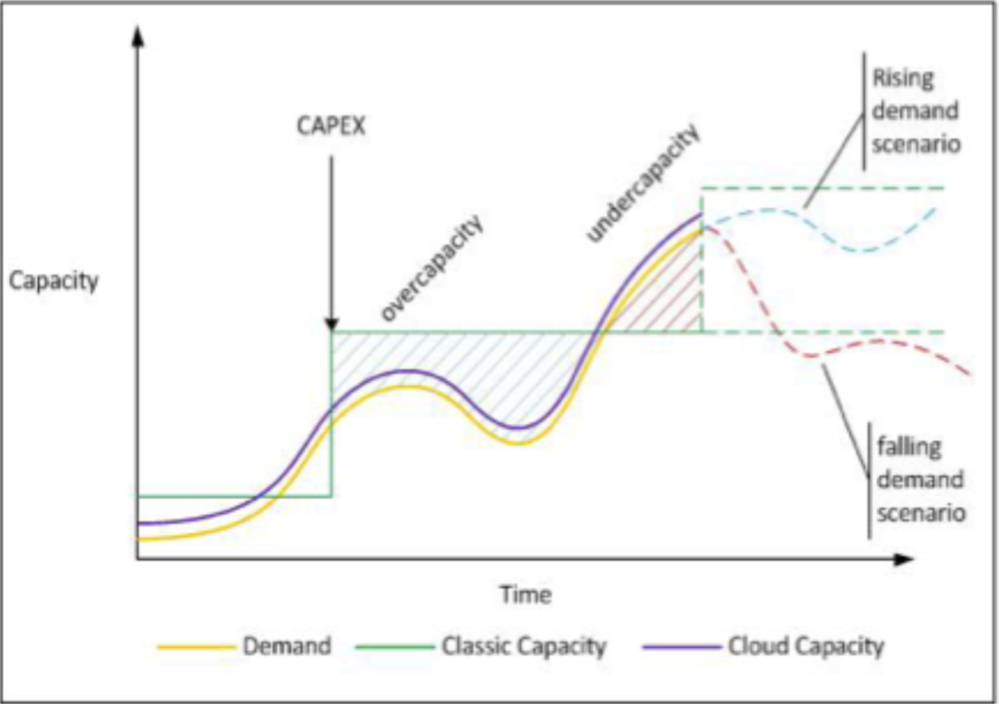
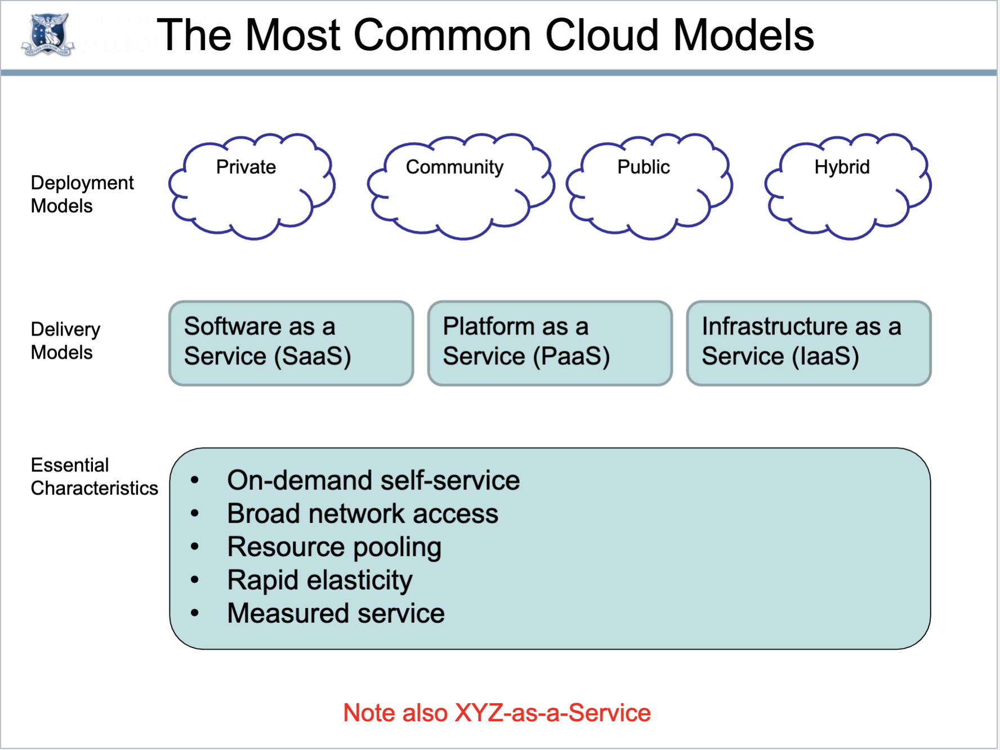
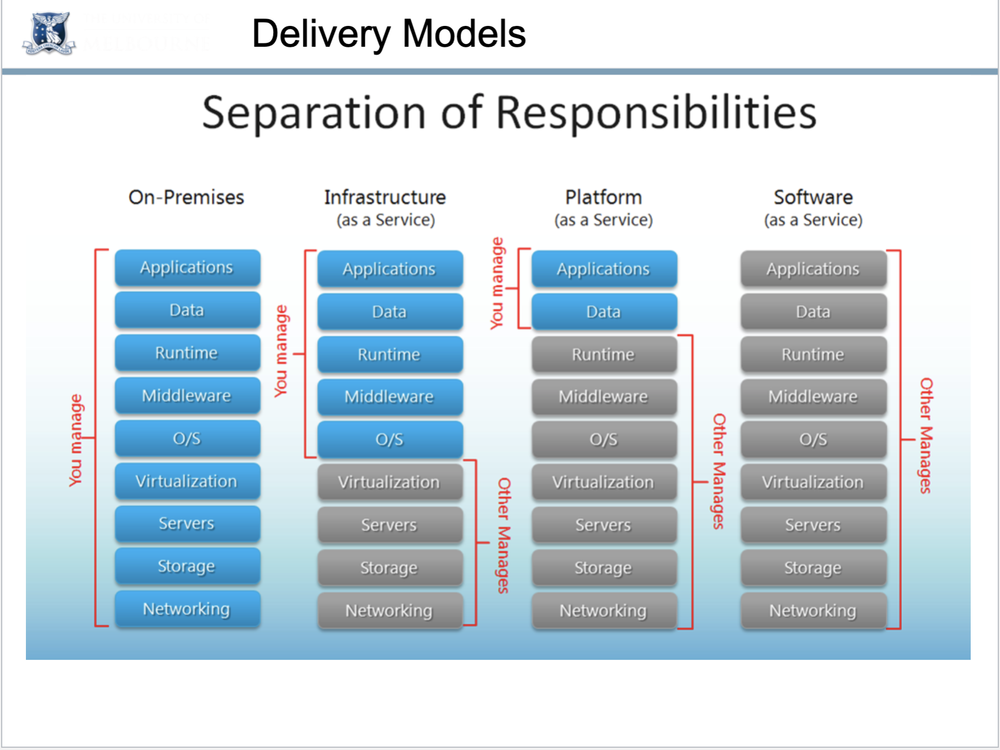
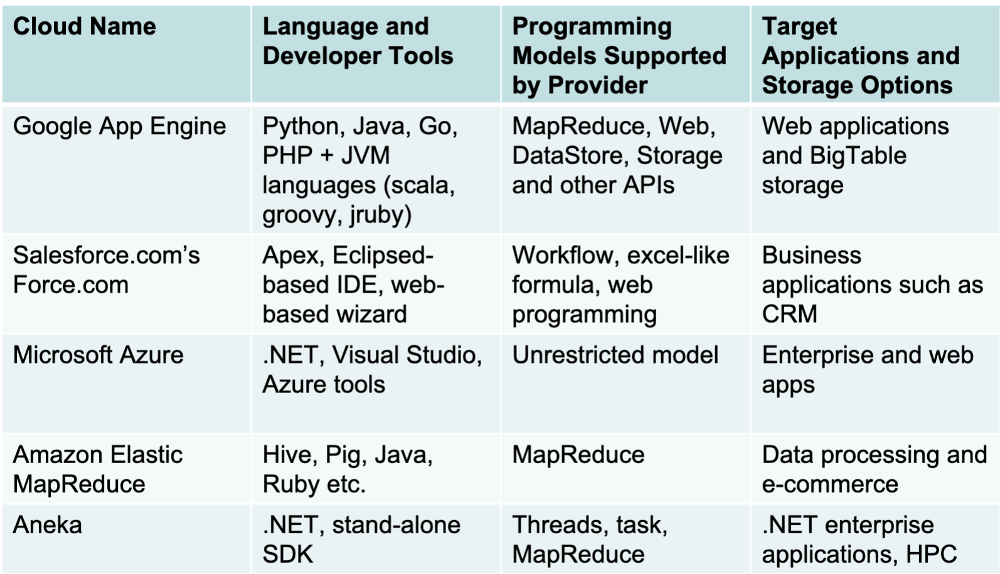

# Week 5 - Cloud Computing

## Concepts

- Problem
  - Before cloud computing, the main issue is that capacity and utilization could not tightly meet.
  - 
  - Even if peak load can be correctly anticipated, without elasticity we waste resources during non-peak times.
- Cloud computing is a model for enabling ubiquitous, convenient, on-demand network access to a shared pool of configurable computing resources(networks, servers, storage, applications, services) that can be rapidly provisioned and released with minimal management effort or service provider interaction.

## Deploy Models

### Overview

 

### Public Clouds

- Pros
  - Utility computing 
  - Can focus on core business
  - cost-effective
  - Right-sizing
  - Democratisation of computing
- Cons
  - Security
  - Loss of control
  - Possible lock-in
  - Dependency of Cloud provider continued existence

### Private Clouds

- Pros
  - Control
  - Consolidation of resources
  - Easier to secure
  - Most trust
- Cons
  - Relevance to core business?
    - Netflix to Amazon
  - Staff/management overheads
  - Hardware obsolescence
  - Over/under utilization challenges

### Hybrid Cloud

- Example
  - Eucalyptus
  - VMWare vCloud Hybrid Service
- Pros
  - Cloud-bursting
    - Use private cloud, but burst into public cloud when needed
- Cons
  - How do you move data/resources when needed?
  - How to decide what data can go to public cloud?
  - Is the public cloud compliant with PCI-DSS? (Payment Card Industry - Data Security Standard)

## Delivery Model

### Overview

### SaaS

- Example
  - Gmail
  - MS Office 365

### PaaS

- Example
  - 

### IaaS

- Example
  - Amazon Web Services
  - Oracle Public Cloud
  - NeCTAR/Openstack Research Cloud

## Auto-Deployment -- Ansible

- Reason for auto-deployment
  - We are easy to forget what software we installed, and what steps we took to configure the system
  - Manual process is error-prone, can be non-repeatable
  - Snapshots are monolithic
  - Manual deployment provides no record of what has changed
- Automation provides
  - A record of what you did
  - Knowledge about the system in code
  - Making the process repeatable
  - Making the process programmable
  - Infrastructure as Code
- Features about ansible (Pros)
  - Easy to learn
    - Playbooks in YAML, templates in Jinja2
    - Sequential execution
  - Minimal requirements
    - No need for centralized management servers/daemons
    - Single command to install
    - Using SSH to connect to target machine
  - Idempotent
    - Executing N times no different to executing once
    - Prevents side-effects from re-running scripts
  - Extensible
    - Write you own modules
  - Rolling updates
    - Useful for continuous deployment/zero downtime deployment
  - Inventory management
    - Dynamic inventory from external data sources
    - Execute tasks against host patterns
  - Ansible Vault for encryption

