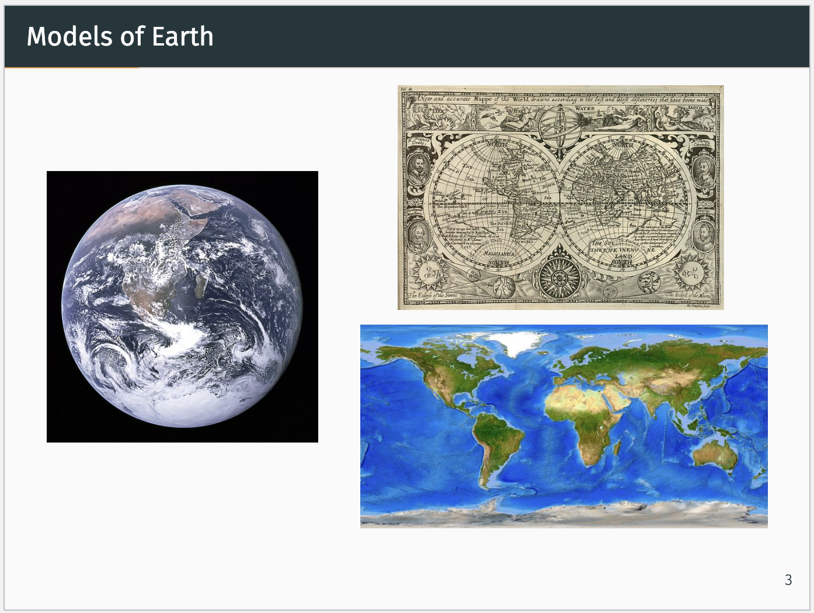
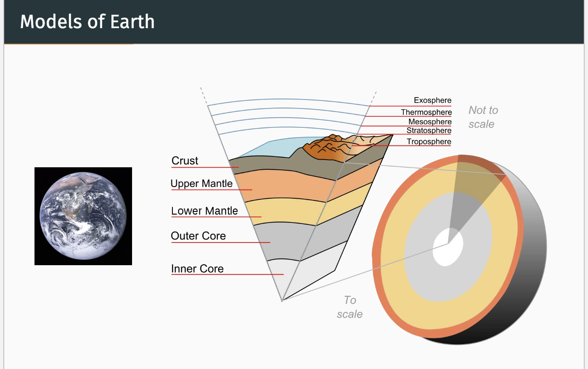
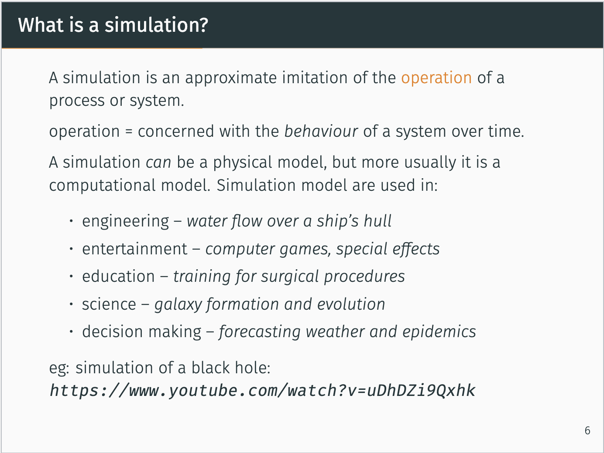
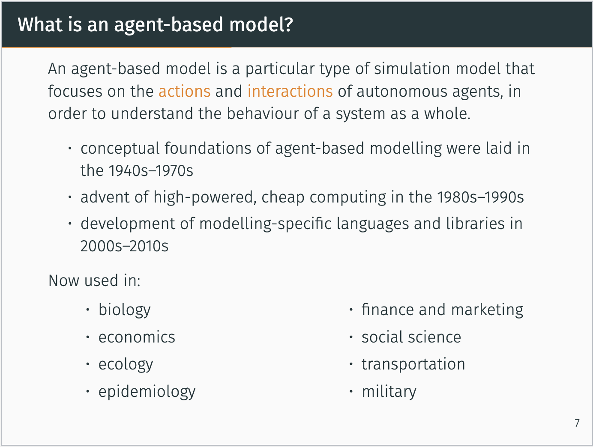
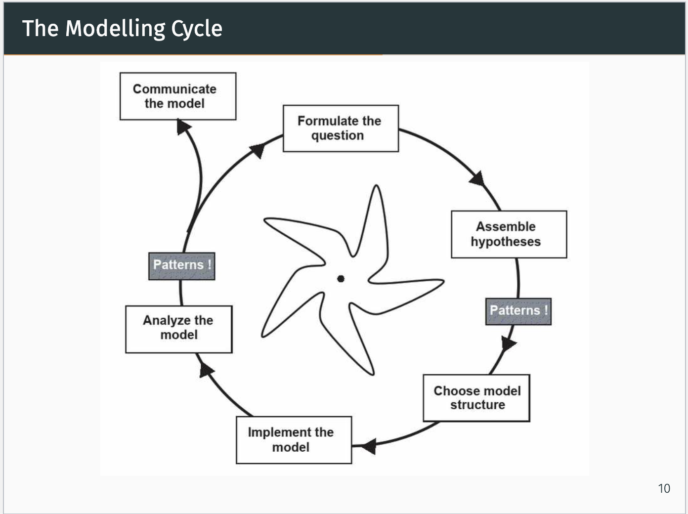
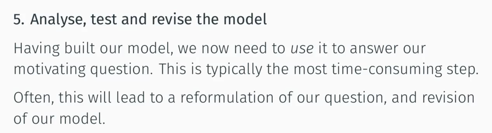

# Introduction

## Aim of this subject

- A new language of thinking about and describing models
- The software skills to implement, observe, test, control and analyse models
- Strategies for designing and analysing models
- We will explore an approach to simulation model known as agent-based models, which focusing on representing the components of a system and their interactions.

## Definitions

### Agent

- An autonomous individual element of computer simulation

### Model

- Model
  - A representation of the real world system for some <u>specific purposes</u>
    - The purpose define what we should include in the model in order to make it useful
  - Normally the model is **<u>simpler</u>** than the real system
    - An abstracted description of a process, object or event (from the reading).
  - Even for a same thing people may build a model from different perspective
    - Some models of the earth
    - 
    - 
    - 

- Type of model
  - Physical model
    - Force taken model of a bridge
  - Visual or verbal description
    - A very detailed, verbal description of what a man need to do to get food
    - Use diagram to represent a structure of a system
      - e.g. UML
  - Mathematical equations
    - Model of motion
  - Computer program
    - Netlog

### Simulation

- Simulation
  - Not only concern the behaviour of the system, but also interested in how that system change over time.
  - Simulation is dynamic
  - A subset of model (specific type of model)
    - Focusing on specific aspect of a model, specifically, the behaviour.
- Computational model
  - We design the implementation as a computer-based simulation to store and implement its behaviour.
  - Is a model that takes certain input values, manipulates those inputs in an algorithmic way, and generates outputs.

### Agent-based model

- The subject focusing on a specific type of simulation model, which is agent-based simulation model
- We are focusing on the agent (component) of the system, and see how they behave and interact between the agent operating together generate the behavior of the system as a whole.
- In contrast, we could write down a mathematical equation of the shape of those birds, however, we can hardly obtain how each individual’s behavior operate as a whole system. 
- Another example is we could build a very simple statistical model about the weather-forecasting, however, we might not know the lower-level factors that cause the weather to generate what we observed.

- Be able to explain how system behavior emerged from lower level (agent level)
- However, by introducing those low-level agent, we need much more extra computational powers.

- | ML Model                                                     | Agent-Based Model                                            |
  | ------------------------------------------------------------ | ------------------------------------------------------------ |
  | Focusing on the data, ant try to recognize a pattern within the data. | Looks the underlined system, including components, structure and behaviour of the system which trying to find how the behaviour that generate the observed data is produced. |

## The modelling cycle

### Formulate the question

- A clear research question will provide the focus for our model, and help us decide what to include and what to leave out
- Specifying a clear research question can be challenging

### Assemble hypotheses for essential processes and structures

- We can research and brainstorm what needs to go into our model based on our question that found from the previous step
- Use agile development idea to start from a very simple model and gradually refine the model.

### Choose model structure

- Choose scales, entities, state variables, processes and parameters
- Describe our model in more detail, translating our hypotheses into equations, rules or algorithms
- Typically produce 
  1. a written outline of the model
  2. detailing the entities in the model and their characteristics
  3. The environment they occupy
  4. Their behaviours
  5. etc..
- This make sure that we are clear about the ingredient before typing our code.

### Implement the model

- The technical phase of translating our written model into a simulation that can be run on computer
- This phase will reveal the consequences of our assumptions about the system

### Analyse the model

- If we fond something goes wrong, or new things happened since our understanding of the question & model has progressed. We may need to start the loop again.

### Communicate the model

