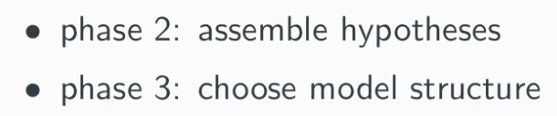
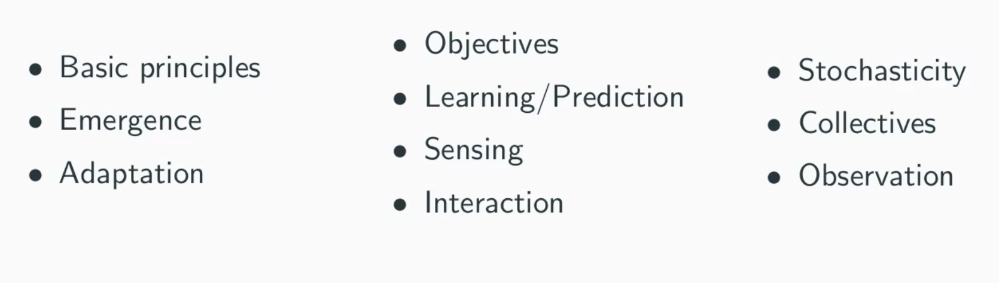

# Describing models

## Definitions

- ODD

  - Overview
  - Design concepts
  - Details

- What is

  - A framework to describe agent base model
  - More flexibility than math equation

  - 

  - Provide a standardized framework for taking a set of idea and translate into more formal documents

   

## ODD

### Overview

#### Purpose

- The purpose serves as a guide to what needs to be included in a model
- A model is not just a model for particular system, it is also a model for specific purpose
  - Knowing what problem are addressed by the model is important

#### Components

- Entities

  - Things represented in the model and their characteristics. Typically, agents and the environment (local and global). Entities are characterised by static variables.

- State variable

  - Characteristics or attributes that define agents, environmental units, and the global environment
  - To characterize things normally vary between agents

- Scales

  - Temporal scales
    - The way to represent the time in a model
    - The **<u>temporal extent</u>** of a simulation
      - How long it runs for
      - Are we simulating galaxy over millions of year?
    - The **<u>temporal resolution</u>**
      - How time passes
      - Continuously/discrete steps of specified size

  - Spatial scales
    - The representation of space in our simulation
    - Whether a model is spatially explicit or not
    - Whether space is represented continuously, or in discrete patches of a specified size
      - Discrete grid
      - Continuous like we walk on the road

#### Process and scheduling

- Process
  - What behaviours do the agents exhibit as time passes? How does their state change? How does the environment change?
- Schedule
  - Represent the ordering of which things happen.
  - Useful to use a pseudocode to represent what sequence of actions execute by each agent.

### Design Concepts

- How a model implements a set of basic agent-based model design principles
- 

- Emergence
  - How system level behaviour occur from interaction between interaction between elements of the system or between agent in the model.
- Adaptation
  - How agent adapt its behaviour overtime based on set of rules.
- Objectives
  - The guideline/function by which these agent adapt their behaviour
- Learning/Prediction
  - How agent gather information around them, and learn to make decision to achieve objectives
- Sensing
  - The information of the world that available to agents.
- interaction
  - How agent interact with each other
- Stochasticity
  - Are there any randomness?
  - More specifically, does the behaviour each time a bit different
- Collectives
  - Different class of agents in the model
- Observation
  - As a user of the model, how we gather information about how that model is behaving, so that we can use these data to answer the question motivating our model.

### Detail

#### Initialisation

- The state of a model at the beginning of a simulation
- Some modes are not sensitive to initial state
  - Their long term behaviour will converge
- Some mode are sensitive to initial state
  - Where the long term behaviour can vary depending on their initial conditions
  - To reproduce the result of this kind, we need to set initial state carefully.

#### Input data

- Some model depends on the initial data to run, others may need external data.

#### Submodels

- Describe the logical rule, actions and algorithms that high level things occur.
- Can be think as technical description to the model.

