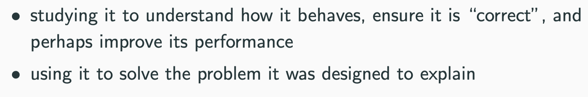
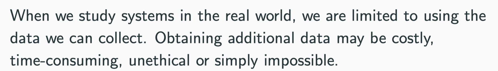
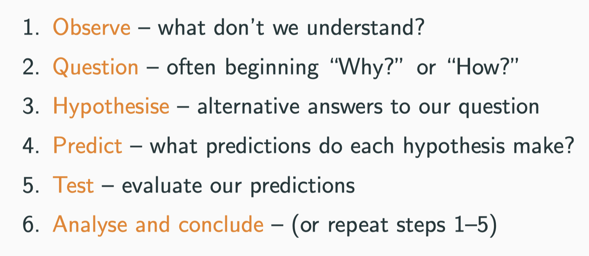
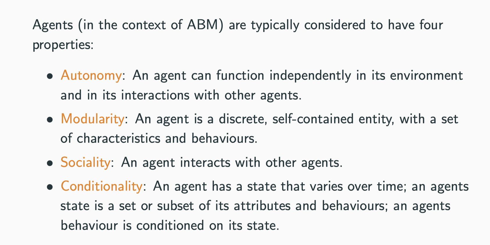

# Analysing models

## Definition

### What does it mean by analyse?

- 

- To examine how valid our model is as representation of that pattern of behaviour that we expect to see in the real world.
- We may need to improve
  - Performance 
  - User interface that allowed easier changing on variables

### Why model, but not real world?

- 
  - It is unethical to spread a disease to explore how it spread in the whole population.
- 
  - We can re-run our model many times we like to collect the data.
- We could analyse the data in different level by using the model
  1. In terms of the whole system
  2. In terms of the individuals.

## Modelling for science

> Use the model to find how the real world works

## Definition of agents

