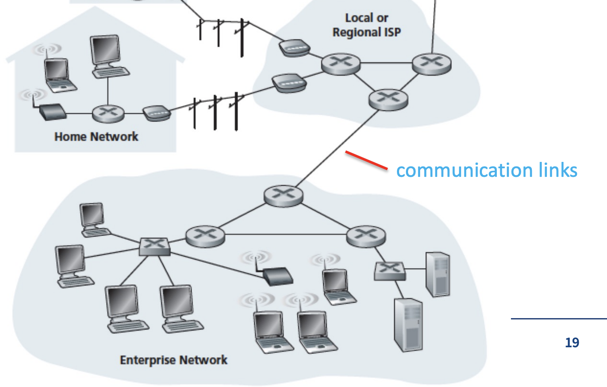

- Internet
  - a computer network that connect billions of computers and some devices throughout the world
  - devices $\rightarrow​$ end systems, hosts
  - end system are connected  by  **communication link** 
  - some devices are packet switches (routers, link-layer switches)
  - protocol
    -  the rule that control the sending and receiving of packets, it defines the **format** and the **order** of messages exchange.
    - Also define the **actions** taken on the transmission and/or receipt of a message or other event.
      
  - **Layers** are organize protocols, each layer offers its services to the layer directly above it by
    - performing certain actions
    - use the services that provided by the layer directly blow it.
    - pros
      - structural abstraction
      - only focusing on their own jobs
      - only need to know the API's of the lower layer
    - cons
      - introduces overheads
      - inefficient and has delays
      - increases the chance of making errors

### TCP/IP Model

- 5 layers in total
- <u>Application layer</u>
  - network applications and application-layer protocols lives in.
  - Main protocols
    - HTTP
    - SMTP for email
    - FTP
  - protocols define
    - type of message exchanged
    - syntax of the various message types
    - semantics of the fields
  - The protocol of this layer is **distributed over multiple end systems**, which can be used to **exchange packets of information** between different end system.
- <u>Transport Layer</u>
  - provides a reliable byte stream between two nodes on a network
  - congestion control (week 5)
  - flow control (week 5)
  - two main protocols
    - piece the packet into segments and add TCP or UDP header.
    - TCP (Transmission Control Protocol)
      - connection-oriented
      - reliable
      - e.g. like a phone call, need two side to be involved.
    - UDP (User Datagram Protocol)
      - connectionless
      - unreliable
      - e.g. publishing something to LED board that does not need responds.
- <u>Network Layer</u>
  - provides **routing** (using IP address).
  - find a best way from source to destination.
  - IP protocol
    - the field in the packet
    - how the end systems and routers act on these fields
    - all network layer runs on IP protocol
  - Routing protocol
    - determine a series of routes that packets take between sources and destination
- <u>Link layer</u>
  - pack data segments into frames
  - focusing on transfer data from one node to another node.
  - protocol to chose depends on how the two nodes are connected
    - Ethernet
    - WIFI
  - link dependent
- <u>Physical layer</u>
  - in charge of transform the byte stream into electrical signal and pulse depends on the media.  
- <u>application layer and  transport layer</u> are end-to-end, which means they don’t care about how the information has delivered. They only focus on the source and destination.
- <u>network layer</u> is a **mix** of end-to-end and point-to-point. 
  - From the IP address perspective, it is from one IP to another, thus, it is an end-to-end. 
  - From routing perspective, it has to decide transfer from which route to which node, thus, it is point-to-point.
- <u>Link and Physical</u> are point to point, since they are link dependent. For example, using WIFI will use the different protocol comparing with using Ethernet.

### OSI Model

- Extra two layers directly under Application layer
- <u>Presentation layer</u>
  - focusing on interpreting the meaning of data exchanged
    - compression
    - encryption
    - description
  - make the application layer care less about the data form
- <u>Session layer</u>
  - build checkpoint and do the recovery scheme

- TCP/IP v.s. OSI
  - the extra two layers can be also implemented in application layer if the developer thinks they are important
- Socket
  - An API that transport layer provides to application layer

### Application-Layer Protocols

- HTTP
  - need a client and a server
    - <u>Web browsers</u> are clients, <u>web servers</u> are servers.
  - <u>Web page</u>
    - document consisting of objects
  - <u>Object</u>
    - a file that is addressable by URL, such as a image
  - <u>URL (Uniform Resource Locator)</u>
    - Hostname
    - path name
      
  - **TCP** is the transport protocol for HTTP
    - Non-persistent connections
      - each request/response is sent over a separate TCP connection
      - For each object, it requires a request time + file transmission time
      - memory consuming
        -  since the TCP variable must be kept in buffer during the transmission
      - browser often open <u>parallel</u> TCP connections to fetch referenced objects.
    - Persistent connections **(default option)**
      - All the requests and their responses are sent over the same TCP connection.
      - Server leaves connection open after sending response. The connection closes if it is not used for a certain time.
      - sending subsequent HTTP message for the same client/server pair will use this open connection
      - client can send requests at anytime without need to wait the pending requests (**pipelining**)
    - example are refer to the lecture slides
  - HTTP Request Message
    - Format and info
      - Host
      - User-agent
      - Connection
      - Accept-language
    - different method
    - different response code
  - HTTP Response Message
    - Format and info
      - Connection
      - <u>Date</u> of today with time
      - <u>Server</u> type
      - <u>Last-modified</u> date
      - Connection-length and type
  - Cookies
    - For allowing Web servers to identify users
