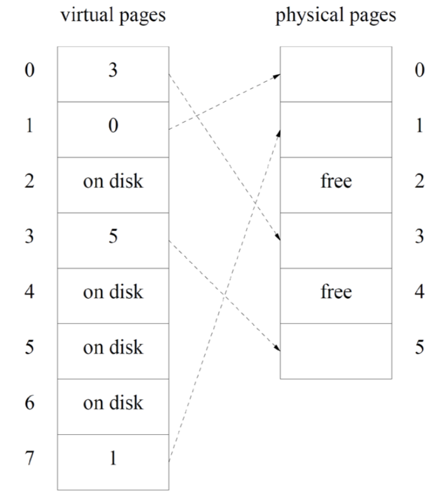
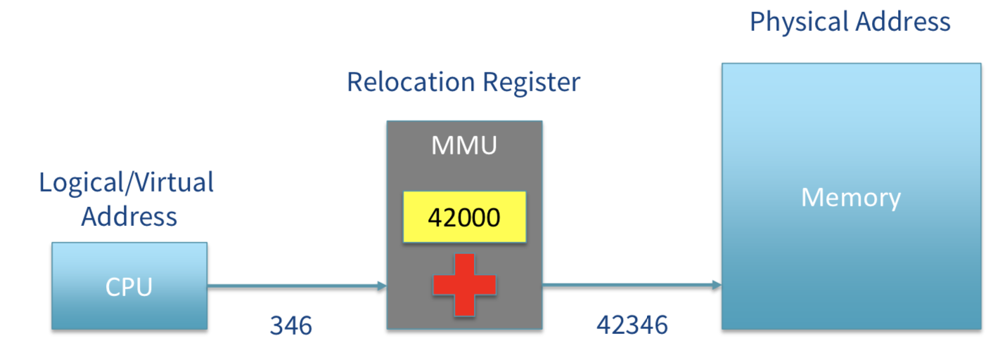
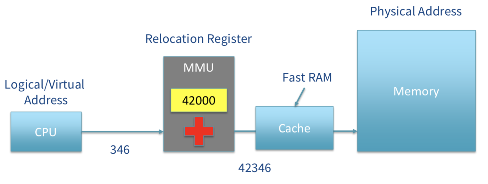
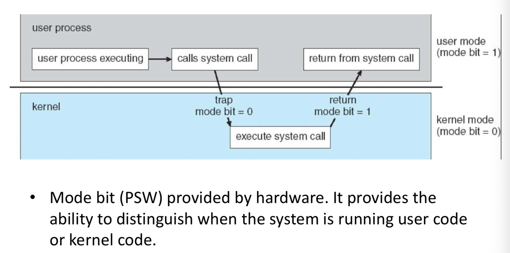

### Memory management

- Main function

  - OS
    - Keeping track of which parts of memory are free and which parts are allocated to which process
    - Allocate memory to processes when they require it
  - Hardware
    - To simulate larger main memory by moving data between memory and disk
    - To simplify addressing when processes swap in and out
    - To protect memory against unauthorized accesses.

- Swapping

  - The total size of all process may exceed the size of main memory. Therefore, the kernel keep swap out a process to swap space.
    - it allows another process to be swapped in
  - Requires “position independent” code
    - Setup a base register point to the program pointer, it will shift with the program in memory
  - Causes **external fragmentation**
    - Assumption of external fragmentation
      - All the code and data of a program has to be in main memory when the program is running.
      - This code and data has to be stored in contiguous locations.

- Explicit memory management

  - Programmers began to write code to swap out only portions of their code and data
  - When they need a function or data structure that is not in memory, they evict one that they don't currently need and load the one they do
  - pros
    - The program knows what it needs and what it doesn't
  
  - cons
    - Extra complexity, replicated in every large program

### Virtual Memory

- It allows programs to assume the program and data is always in fixed locations in memory and contiguous, but actually not
  
  - Provide a clean interface to a complex subsystem
- “Virtual” because programs used address are different from physical address.
- Only the parts needed by the program now are in main memory without the program having to be aware of this.
- Different parts of the program can be loaded into different parts of memory
  
  - Therefore, size of a program including its data **can exceed** the amount of available main memory.
  
  

### Paging

- Memory is divided into small pages of contiguous memory
  - Each page is either all in RAM or not in RAM.
  - Contents are contiguous in RAM
- Paging relies on
  - Virtual address (seen by program) -  has two parts:
    - A virtual page number 
    - Offset within the page
    - 
  - Physical address (used by wires connecting CPU to RAM) - has two parts
    - Physical page number
    - Offset within the page
- A piece of hardware called a <u>memory management unit</u> (**MMU**), translates virtual addresses to physical addresses at run-time
  - Mapping only needs to convert page address
  - Low order bits unchanged
- Whenever the CPU accesses memory, the MMU transforms the addresses according to the mapping
  - 

- Address Spaces
  - Physical address space of a machine contains one address for each memory cell.
    - It store bits per cell
  - Virtual address space of a machine is the set of addresses that programs on that machine may generate
    - Instead of storing byte, it storing page.
    - Each process has its **own** virtual address space and page table.
    - Same number in different virtual address does not map to the same place.
  - The virtual address space may be bigger than its physical address space.
  - The number of bits in virtual address is virtually always a power of two
    - Most PCs now use 64 bit virtual addresses
- Implementing
  - Both virtual and physical address spaces split into fixed size pages
    - MMU can map any virtual page onto any physical page
    - Physical pages are also called **page frames**
  - Pages may move between disk and memory any number of times during the life of a process.
    - Pages notionally all start out on disk
    - It may be put in a **different page frame** after move back from memory.
  - Each process is always allocated a whole number of pages
  - However, the amount of memory a process needs is rarely an exact multiple of the page size
    - Paging wastes a fraction of a page for each process
    - **Internal fragmentation**
      - Little chuck of space inside the process's address space that does not been filled in data.
      - When malloc, for example, 8 bytes, we need a page but does not fill it up.
        - If malloc could fit in a page which are not full occupied, it will fill in that one first.
- Page table
  - Page table has one entry for each virtual page number used by the process. A page table entry (PTE) contains:
    - A physical page number
      - Hold the location of the page on disk when the page is not in memory
    - A valid bit
      - In main memory or not
    - A referenced bit
      - May be pre-fetch, but haven't used.
        - Will be free first if we need more space.
    - A modified bit
    - Read, write, and execute permission bits
- Operation
  - When checking
    - The MMU must check that the selected PTE has the valid bit set to one 
    - the permissions permit the requested memory access.
  - If both conditions are met,
    -  it will construct the physical address using the physical page number field of the PTE
    - It will then set the referenced bit,
    -  if the access was a write,
      - it will also set the modified bit
  - If either condition isn't met
    - MMU will case an exception called a **page fault** and handled by the kernel.

- Page Fault Handling
  - Permission deny
    - Usually terminate the process
  - Otherwise, when valid bit is zero (which the data are not load into physical page)
    - Suspend the process
    - Free up a page frame (if there are none available now)
    - Load the required virtual page from the swap space into a free page frame
    - Cause the MMU to map the virtual page onto the physical page
    - Restart the process at same instruction.
      

### Cache

- Main RAM is slow
  - Hundred CPU instructions can be performed while reading one byte
  - Setup delay
    - There is a delay for every access to RAM
- Cache site in-between MMU (relocation register) and main memory
  - 
- It keeps a copy of recently access RAM locations
  - It could be read in a small number of cycle
- Cache location stores (address, value) pairs
- Memory locality
  - Data access is not uniform throughout memory
- Cache line
  - At a given time, access is clustered around certain areas
    - Consecutive locations of code
    - Within a data structure
    - A single stack frame
  - When cache stores one address
    - It stores a whole “cache line”
    - Instead of single byte as physical memory
  - CPU/RAM transfer set-up cost only paid once
- Associative cache
  - Each cache line has a fixed set of RAM locations it can hold
    - In order to be fast
  - If the CPU uses data from both regions, the cache line will need to keep being refilled
  - Solution
    - Each RAM location can be stored by multiple cache locations
    - Hardware gets to choose which line to evict when new data is to be loaded.
- 3 layers of cache
  - L1 cache
    - Really fast
    - Close to where they used
    - 0.25MB relatively small
    - On chip
    - Not von Neuman
  - L2 cache
    - Larger on-chip cache
    - Bigger but slower
      - Longer distance to chip
  - L3 cache
    - Off chip
    - Larger size 8MB
    - On wire
- RAM is optimize for size, cache is optimize for speed.

---

### Processes

- A program in execution
- A program is static, but process is dynamic
- Each program could have multiple process
- Process consists of
  - Text
    - Program, usually read only
  - Data
    - Constant data strings, global vars
    - Heap if <u>malloc</u> or <u>new</u> are used
  - Stack
    - Local variable
  
  - Handles to system objects
    - File descriptors
    - Sockets
  - Security context
    - User
    - Group
  - Current directory
  - Environment variable
  - Priority
    - What fraction of time we are running which process

### Multiprogramming

- Multiple process will share a CPU, each running for a small period of time in turn. This is called multiprogramming
- Time-sharing is multiprogramming with simultaneous terminal access to the machine by several users
- It could increase system efficiency. When one process needs to wait for IO, another process can make use of CPU
- Useful even with multiple CPU since # of processes usually exceed # of CPUs

### Treads

- A process also has one or more threads
- Like different process share a CPU, multiple thread could share a same process.
- Each thread has its own 
  - set of registers
    - Notably the program counter
  - Stack 
    - Including local variables
  - Priorities
  - Those features depend on <u>implementation of OS</u>
- But share other resources
  -  the address space
  - file descriptors
  - current directory
- Threads are often used in event-driven programs
  - When a GUI element is activated (clicked) a new thread is created to process the event
- Advantages over processes
  - Threads are much “lighter” than processes, since
    - No need to copy the address space
    - Cheap to create,  discard when finished job
  - Different threads can operate on same objects
    - ez cooperation
    - Processes require explicit communication, or a specially-allocated block of shared memory
  - Multi-threading is a natural way to exploit multiple cores or CPUs to achieve a single task.
    

### Hyperthreading (Simultaneous Multi-Threading)

- Each CPU core pretends to be two cores
- When on pseudo-code is waiting for RAM or data dependency, the other pseudo-core executes
  - Better utilization of the pipeline and multiple execution units
- The degree of benefit depends on the application
  - Often slower than without hyperthreading
    

### User, Root, System

- Most processes that a typical user deals with it own data (user processes)
- Some services provided by the OS may also be implemented as separate processes which are **system processes**
  - Print daemon
  - GUI components
  - logging
- Root
  - Powerful privilege 
  - Write to files that are “read only for root”
  - Change ownership and access permissions of other users' files
  - Kill other users' processes
  - Still a user
- Sandbox user < regular user < root < kernel < hypervisor
  - A sandbox is a restricted environment for running untrusted code, like js in a browser.
  - A hypervisor is what controls VMs. To it, a VM is like a process.
    

### Kernel

- If several processes are to be active at the “same” time, kernel has to ensure that they do not get in each other's way.
- It also provides services such as “read N bytes from this file”.
  
  - These services are used by **application programs**, **utilities**, and by the **non-privileged parts of the operating system**.
- The kernel is not itself a process
- User-Kernel Distinction
  - Two CPU mode record by program status word (PSW) register
    - **User mode** 
      - cannot issue privileged instructions
        - Instructions and memory locations whose use could interfere with other processes (e.g. by accessing I/O devices) are privileged. 
      - can access only the parts of memory allowed it by kernel mode code.
    - **Kernel mode (System mode, supervisor mode)**
      - Can issue all instructions
      - Can access all memory
    
  - The user mode / kernel mode distinction is the foundation needed by kernel for the building of its security mechanisms.
  
  - 
  
    

### System Call

- user programs $\to $ kernel 
  - execute privileged instructions
  - access privileged memory on their behalf.
- OS check before run those requests to preserve system integrity and security
- This is one of the things that spectre tries to break
- System call will normally do several privileged things in carrying out one logical operation
  - For convenience
- example
  - Open, read, write, close, pipe
  - Fork, exec, exit,  wait

- list
  - Process control
    - Load/execute
  - File management
    - Create/delete
  - Device management
    - Request/release a device
  - Information maintenance
    - Get/set time or date
  - communication
    - Create/delete communication connections