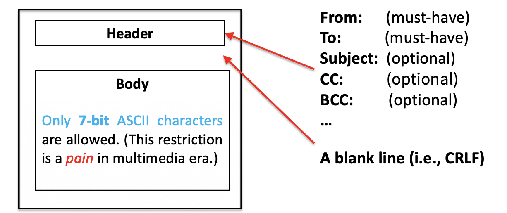
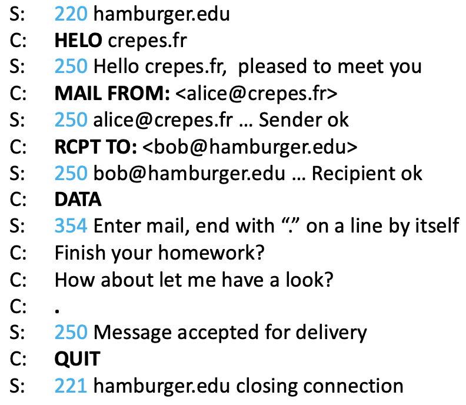

## lecture 1 (Application layer Protocols)
1. The File Transfer Protocol (FTP)
  - like a client accessing a folder in a remote server
  - using **TWO** parallel TCP connection
    - Control Connection
      - for sending control information, such as user identification, password, command, etc.
    - Data Connection
      - for file transformation
  - Procedures
    1. Client side initiates a ~TCP control connection~ to the server on port **21**
      *  it is a **persistent** connection since the command and user identification will be sent during the entire session.
    2. When a file transformation command has been received by the server, it will initiates a ~TCP data connection~ to the client side at port **20**
      * After exactly on file has been sent, the connection will be closed for saving resources purpose, so it is a **Non-Persistent** connection.

  * The command are transfer over control connection in <u>7-bit ASCII format</u>, each command consists of 4 uppercase ASCII characters. The replies are three-digit numbers
2. Email
  * SMTP (simple mail transfer Protocols)
    * response for transferring messages from the senders’ mail servers to the recipients’ mail servers
    * format
      
  - Procedures
    1. Sender specify the recipient email address
    2. User agent send this email to sender’s mail server
    3. Sender server opens a **persistent** TCP connection to an SMTP server at port **25** on the recipient’s mail server
    4. The recipient’s mail server receives the message and places it in the recipient’s mailbox
    5. Recipient invokes his user agent to obtain the message
  * Communication between server and client
    * 
    * before the connection closed, the client can send another email to the server
  - Compare with HTTP
    - Similar
      - Both of them are used to transfer files from one host to another
      - Both of them use persistent TCP connections to transfer file
    - Difference
      - one
        - HTTP is mainly a ~pull protocol~
          - the TCP connection is initiated by the machine that wants to receive the file
        - SMTP is primarily a ~push protocol~
          - the TCP connection is initiated by the machine that wants to send the file
      - two
        - SMTP requires each message, including the body of each message to be in ~7-bit ASCII format~
        - HTTP does not have that kind of restriction
      - three
        - HTTP encapsulates each object in its own HTTP response message
        - SMTP places all of the message’s objects into on message (all in one)
    - Mail Access Protocols
      - Post Office Protocol — version 3 (POP3)
        - very simple, can download all the mail or either delete the message
      - Internet Mail Access Protocol (IMAP)
        - very wild used, allow us to download only part of the mail
      - HTTP
3. DNS (Domain Name System)
  - A host can be identified in two ways
    - By a <u>hostname</u>
      - www.google.com
      - easy for human to memorize but hard to process for routers
    - By an <u>IP address</u>
      - 121.7.106.83
      - Fixed-length, four bytes in total
      - has a rigid hierarchical structure
  - DNS is an application-layer protocol to translate user-supplied hostnames to IP addresses
    - DNS adds an additional delay
    - All DNS query and reply messages are sent with UDP datagrams through port 53, to minimize the server overhead.
  - Additional Service
    - Host aliasing
      - map google.com to www.google.com
    - Email address aliasing
      - map bob@hotmail.com to bob@relay1.west-coast.hotmail.com
      - load distribution
        - perform load distribution among replicated servers.
  - The DNS are distributed and hierarchically database of mapping
    - Root DNS Servers (13 in total)
    - Top-Level Domain
      - handle different top-level domain such as com, org, net, edu
      - handle country top-level domain such as au, uk, an, jp
    - Authoritative DNS
      - every public accessible organization must provide a recode map the names of those host to a IP address
    - Local DNS server (<u>not strictly part of the DNS architecture</u> )
      - Each ISP  such as uni may hold a local DNS server call default name server, it act as a proxy
      - The query first go to the local DNS server. If the local DNS server does not have the record, it will send the query to root DNS servers to do the job.
## Lecture 2
1. Version Control
  * It is a system that records changes to a file or a set of files over time, so we can roll back at any time.
  * <u>local version control</u>
    * basically using duplication
  * <u>Centralized Version Control system (CVCS)</u>
    * A single server contains all the versioned file, and number of clients that check out files from that central
      * CVS
      * SVN
      * perforce
  * <u>Distributed Version Control System (DVCS)</u>
    * clients don’t just check out the latest snapshot of the files, rather, they fully mirror the repository, including its fully history
      * Git
2. Git
  * other VCS using delta-based VC which only record the changes, however, git using snapshot-based VC which using pointer to the previous file.
  * compare the checksums to know whether the  files has been changes
    * checksums is 40 byte string of SHA-1 hash of content of the file or directory structure
  * Tree states of file
    * modified 
      * the file is changed but have not been committed to the database
    * staged
      * the current version of the modified file is marked to be put into the next commit snapshot
    * committed
      * the file is safely stored in the local database