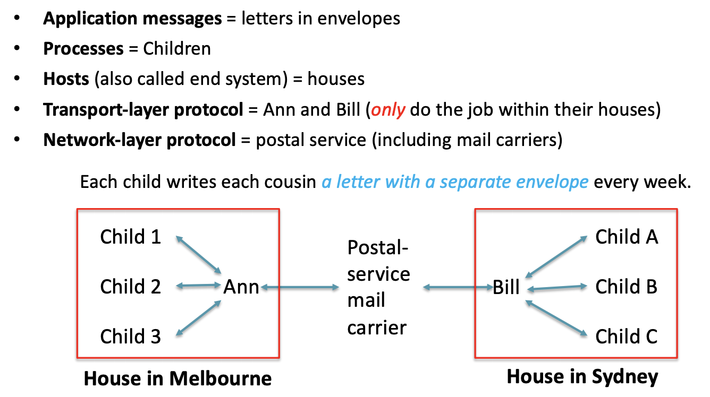
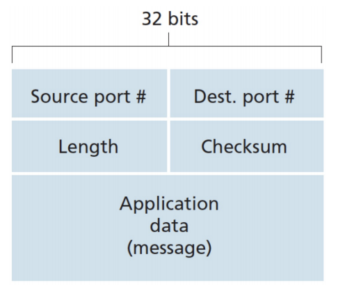
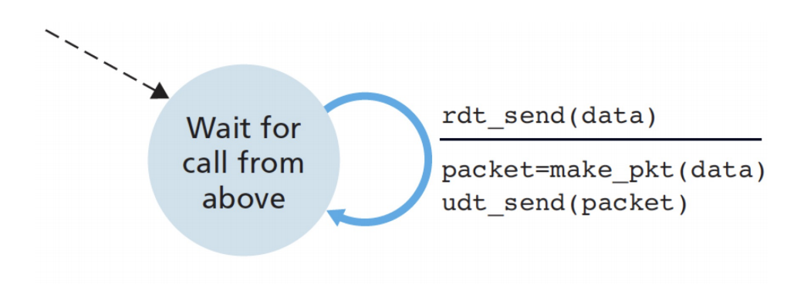
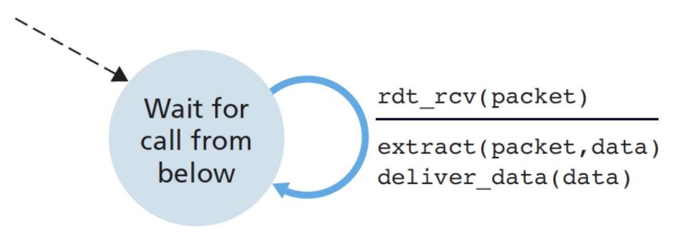
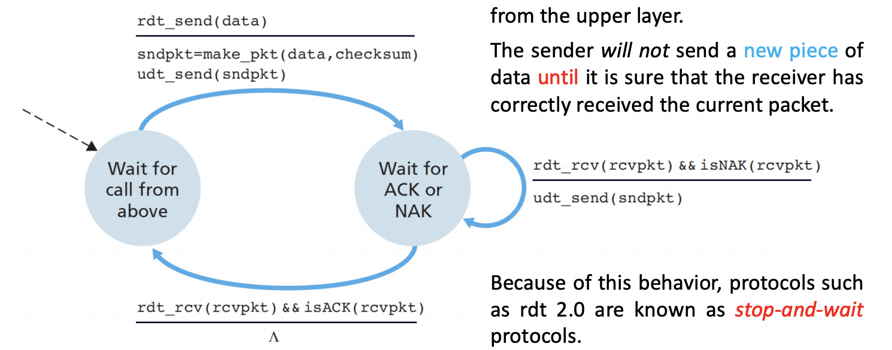

### How does information go through end-to-end layers

- Application Layer

  - the message is sent as a whole, only one header will be added.

- Transport Layer 

  - provide logical communication between <u>process</u> on different hosts, but actually you need to go through the socket, so it is a <u>process-to-process/socket-to-socket</u> delivery
  - the message is split into chunks, each chunks called a **segment**.
  - Each **segment** will be added a header contains information about transport layer

- Network Layer

  -  provide logical communication between <u>hosts</u>, therefore, it is a host-to-host delivery
  - This will add another header to the segment, and now it called datagram

- Compare transport layer and network layer

  

### Services

- **Network layer** (Host-to-host)
  - IP provide <u>logical communication</u> between hosts. 
  - However, IP is an **unreliable service**
    - Does not guarantee segment <u>delivery</u>
      - may lost half way
    - Does not preserve the <u>order</u> of the segment
    - Does not guarantee the <u>integrity</u> of the data in segment
      - The content might be altered
- **Transport layer** (process-to-process)
  - Demultiplexing (analogous to  Bill's job)
    - At the <u>receiving end</u>, the <u>transport layer</u> examines the fields in the segment to identify the receiving socket and then directs the segment to the socket.
  - Multiplexing (analogous to Ann's job)
    - <u>Gather</u> data chunks at the source host from different sockets
    - <u>Encapsulate</u> each data chunk with header to create segments
    - <u>Pass</u> the segments to the network layer
  - each socket has a **unique identifier** 
    - and each segment has a set of fields for identifying socket in their header
    - The **format** of the identifier depends on what transport-layer protocol is used.

### Transport Layer UDP 

- UDP
  - It almost add nothing to the original data
  - Multiplexing and demultiplexing (format of identifier)
    - In UDP, sockets are identified by **port numbers**.
  - Some light error checking
    - checksum
  - 
    - Source port and dest. Port (from … to ...)
    - Length is the total size of the segment, including the header
    - Use checksum to check whether the segment has changed
  - UDP is <u>connectionless</u> and <u>unreliable</u>
    - Inheriting from IP: No guarantees on <u>delivery</u>, <u>order</u>, and <u>integrity</u>
  - Why we still need UDP?
    - No **congestion-control**, data is sent immediately
      - quick
    - Real-time application often:
      - Requires a minimum sending rate,
      - Less delay
      - Can tolerate some data loss
    - No connection establishment and no connection state.
      - Low system overhead (no buffer, no parameters)
    - Small packet header overhead
      - UDP using 8, while TCP using 20
  - UDP checksum
    - Used to determine whether bits within the UDP segment have been altered.
    - Procedures
      - Divide the message into 16 bit words
      - Add them up
        - If there is a overflow bit, warp the overflow bit to the lowest bit of the sum
      - And then send the complement of the code we have
      - When receiving the code, we should simply those 16-bit number with the checksum, if all bits turns to 1, that's good.
    - We still cannot guarantee that there is no error.
      - 110111011010111<u>0</u> and 110111011010111<u>1</u>
      - Becomes 110111011010111<u>1</u> and 110111011010111<u>0</u>
      - The result are all 1, but the message actually changed.

### Principles of Reliable Data Transfer (RDT)

- Problem encountered
  - IP provided by <u>network layer</u> is a unreliable service
  - We want a <u>reliable data transfer</u> building on transport layer (on the top of the <u>unreliable IP</u>)

### RDT 1.0 (over a perfect reliable channel)

- <u>perfect reliable channel</u> underneath assumption

- RDT only needs to care sending/receiving and making/extracting packets.

- Sending side

  

- Receiving side

  

### RDT 2.0 (stop and wait protocols over a channel only has bit error)

- Sending side

  

- Receiving side

  

- Bits in a packet may be corrupted

- The <u>sequence of file</u> must be kept, otherwise error may occur.

- When received a message, ACK or NAK will be feedbacks.

- This retransmission are know as <u>ARQ (Automatic Repeat reQuest)</u>
  - Error detection
    - Allow receiver to detect bit error (checksum)
  - Receiver feedback
    - ACK and NAK
    - One bit for each, 1 = ACK, 0 = NAK
  - Retransmission
    - The sender retransmit a packet when it is received in errors
    - When the sender is in the <u>wait-for-ACK-or-NAK state</u>, it cannot get more data from the upper layer

- Bit error
  - Fatal flaw about RDT 2.0
    -  the ACK or NAK packet could be corrupted
  - How to fix this?
    - checksum
  - How protocol should handle the errors
    - Retrainsmit the garbled ACK/NAK packet
      - However, the retransmission can also corrupted, and  the system may failed after that.
    - Use enough checksum so that the receiver can also recover from bit errors.
      - But it couldn't handle if the packets were lost
    - Resends the current data packet when it receives a garbled ACK or NAK packet
      - Add a <u>sequence number</u> so that the receiver knows whether the message is a old message or new one
        - In stop-and-wait protocol, a 1-bit sequence number will suffice. The sender keep alternates the 1-bit sequence number between 0 and 1.

