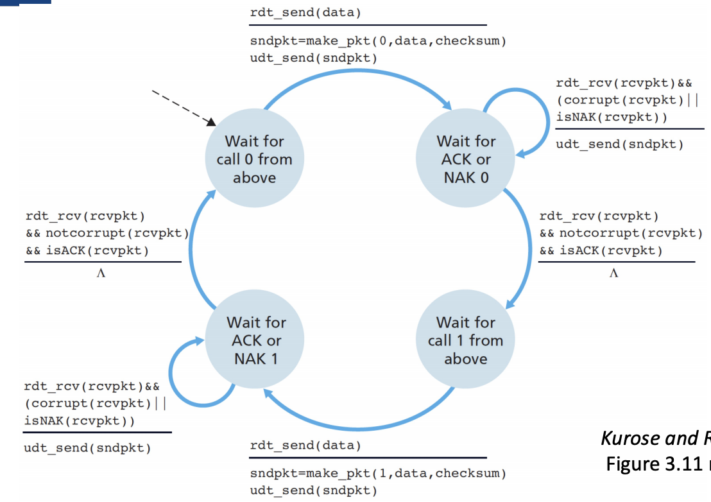
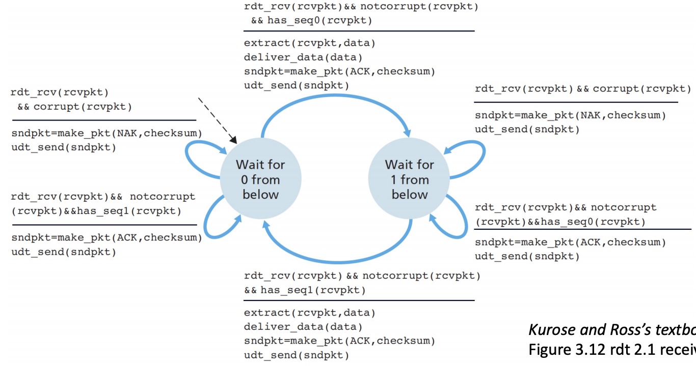
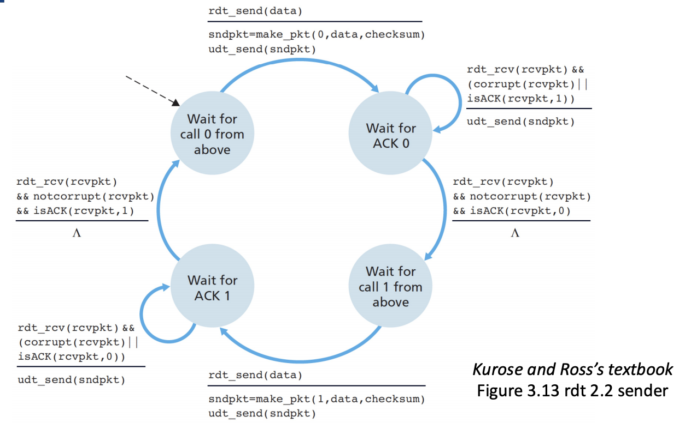
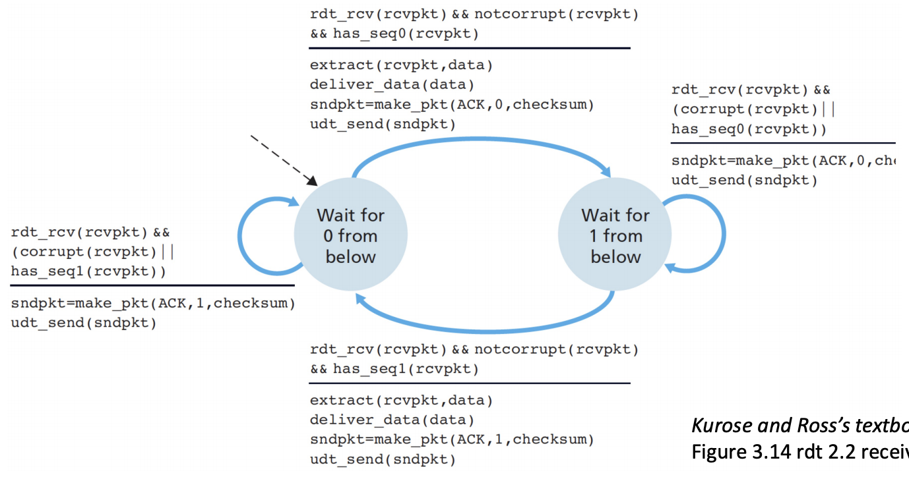
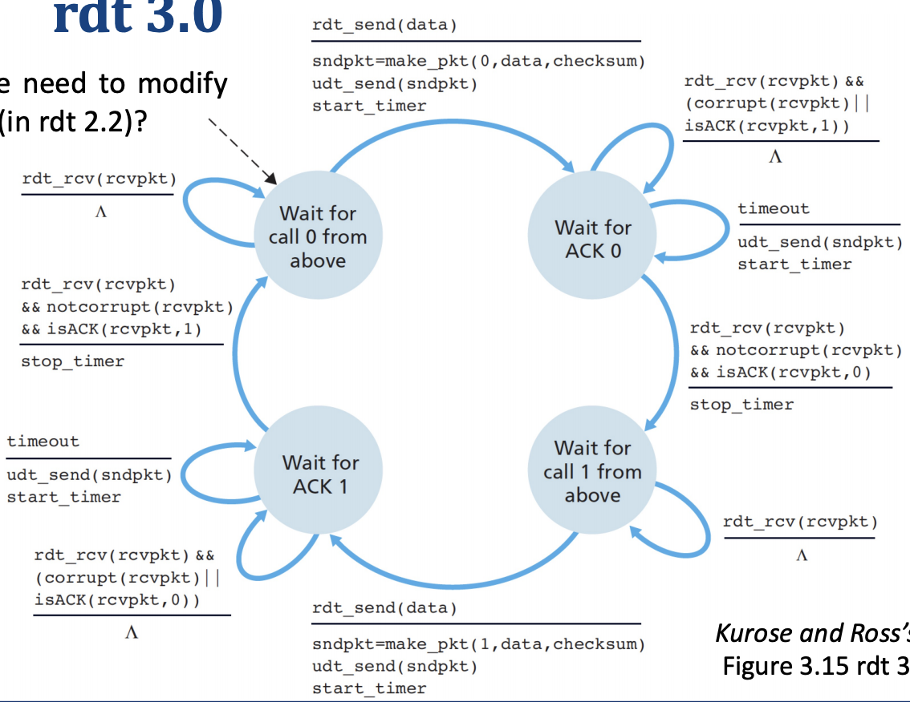
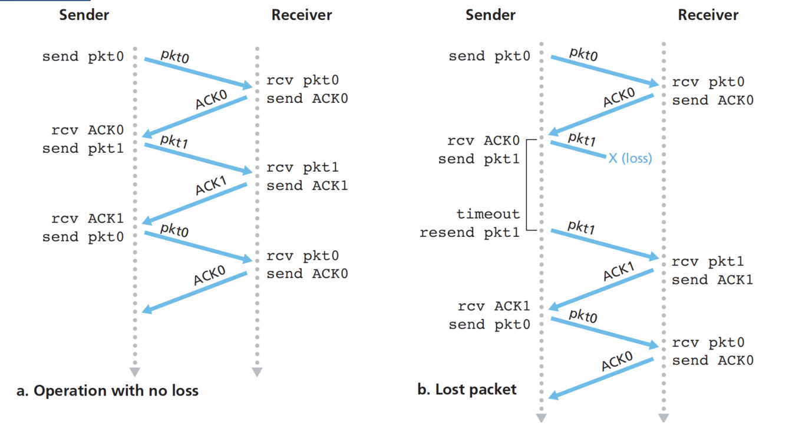
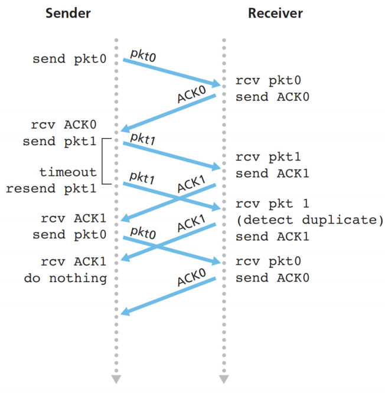
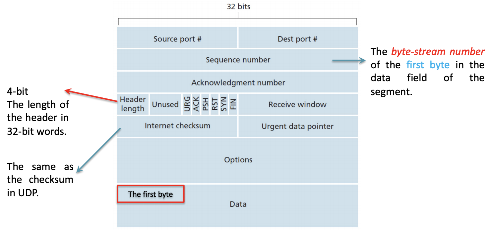
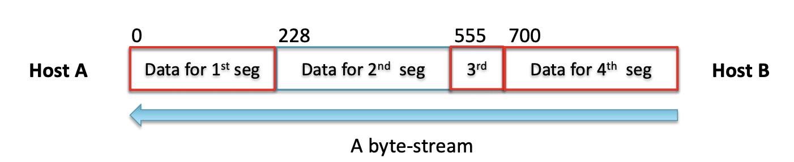
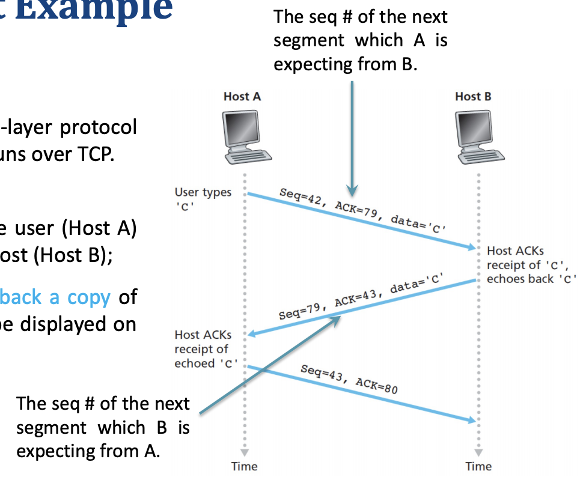

### RDT 2.1 (checksums for ACK, 1-bit sequence number)

-  Sender
  - 

- Receiver
  - 

### RDT 2.2 (duplicate ACK for the last correctly received packet)

- Instead of sending NAK packets, we can simply sends an ACK packet for the last correctly received packet
- If the last received file has sequence number of 1
  - In RDT 2.1, it needs to send a NAK packet
  - IN RDT 2.2, it sends a ACK packet indicating 1
- sender
  - 
- receiver
  - 

### RDT 3.0

- The underlying channel can lost packets as well

- Sender and Receiver

  - 

- How to detect packet lost?

  - Timers can help, if timeout, we just start the retransmission.

- What to do?

  - The techniques of RDT 2.2 can handle the job
  - Retransmission is a panacea

- Sequence diagram

  - 

  - Replies multiple times

    

- However, this is not a good choice for practice

  - Since when the distance is long between two host, the waiting time will be really long.

### Pipelined RDT Protocols

- Send multiple packets without waiting for acknowledgements
  -  1-bit sequence is no longer sufficient, it needs <u>unique sequence number</u>
  - <u>Buffer</u> now is important to keep the keep the transmitted but not yet acknowledged.
- TCP
  - Coneection-oriented

    - Handshake is needed

  - Buffers and variable

    - To keep info during three-way handshake

  - Full-duplex

    - Both sides can send <u>a stream of data</u> to each other (mutual communication)

  - Two type of socket on server side

    - Welcoming socket
      - Initiate a connection
    - Connection socket
      - After the connection has been built, the connection socket dedicate for a particular client process

  - How to transmit? 

    - Grab data chunks from the send buffer, creates TCP segments and passes the segments to the system.

  - Socket identifier

    - Four section tuple

      - (source IP, source port number, destination IP address, destination port number)

      - Why need port number this time?

        - Since the connection requests are primarily handled by <u>welcome socket</u>. However, when building a dedicated connection socket, it must to identify which socket is working for who.

      - Structure (the IP info has been send by the underlying operating system automatically)

        

      - Sequence number

        - Normally using the first bit of a sequence 
          - since TCP does not restrict that each message must in same length
        - Use in <u>Acknowledgement</u> for identifying missing packets

      - Acknowledgement Number

        - sequence number of the next segment that Host A is expecting from Host B
        - Only acknowledges bytes up to the first missing byte in the stream. (cumulative acknowledgements)
        - 
          - In this case Host a will put 228

      - TCP combines an acknowledgement and a data packet together in a single segment

        - Example

          - Talnet

            

  - Out-of-order segments

    - Discard the segments, very easy to implement
    - Buffer the segments and waits for the missing bytes to fill the gap (what we normally used in practice)
      - More efficient in terms of network bandwidth
