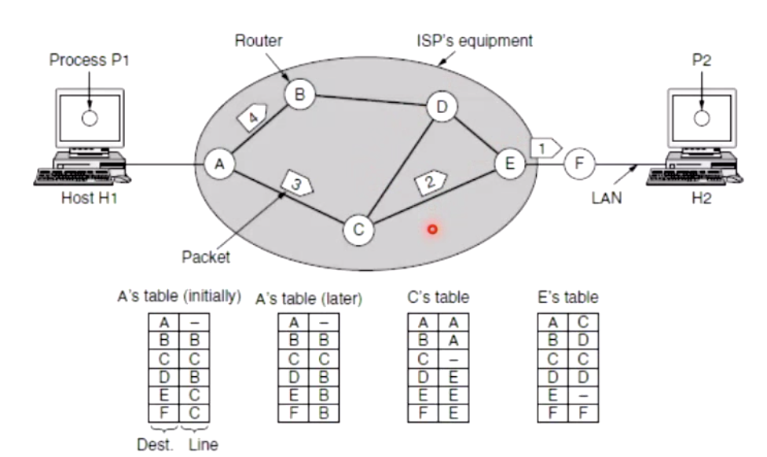
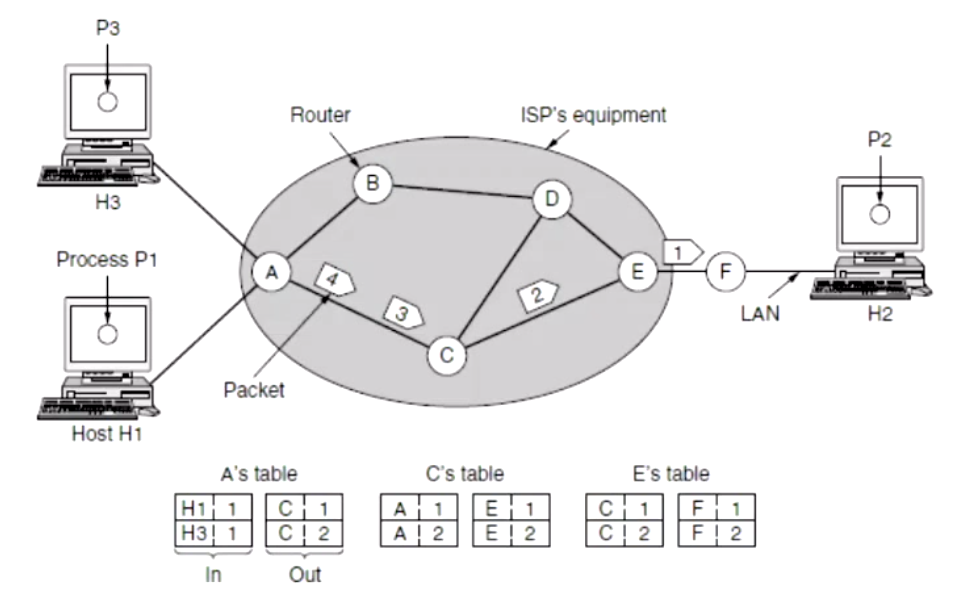
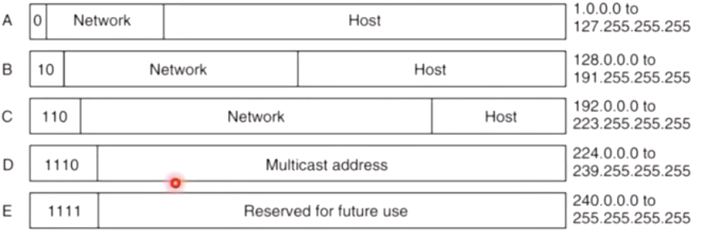
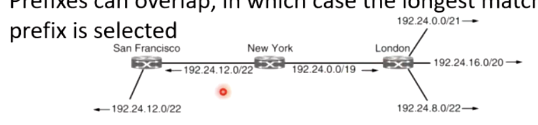
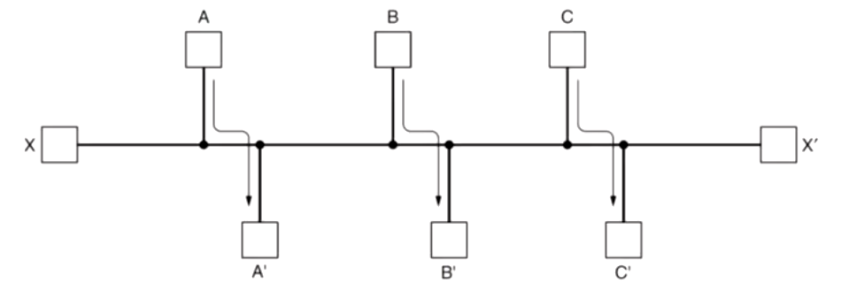
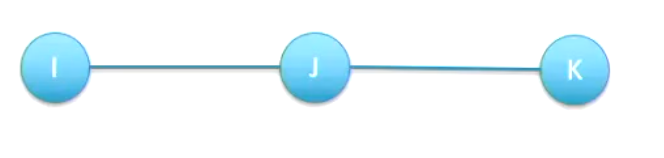
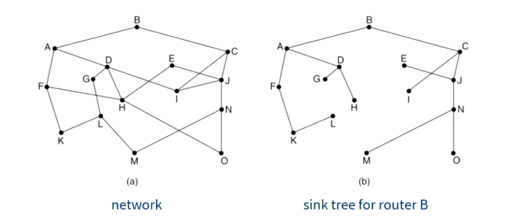

## Internet (network) layer

- Why we need it?
  
  - Get data from the source all the way to the destination (routing)
  
- Traffic must be routed efficiently

- Each node on the internet must have a name (addressing)

- In an internet, the source and destination may be in different network

- Internet is a network of networks

- Services

  - Connectionless (<u>Datagram network</u>)

    - Packet switching (by using IP)
    - Including sending and receiving packets
    - We sending each packet (if we have a stream of packets) based on the the routing table**s** (since it might go through multiple routing tables)
    - 

  - Connection-oriented (Virtual circuit network)

    - Circuit switching (set up a continuous connection from one point to another)
      - ATM (Old one)
      - MPLS (New one)
    - Instead of sending a packet directly, they will send a set up request
      -  Use one digit to represent the circuit #
      - ==Same set up request will results in same same circuit route but different source==
      - 
      - It may run out of the one bit

  - Why two types?

    - | issue              | Datagram Network                                             | Virtual Circuit                                    |
      | ------------------ | ------------------------------------------------------------ | -------------------------------------------------- |
      | Addressing         | Full source and dest for each packet                         | Only short VC number                               |
      | State              | No need to hold state info                                   | Each VC requires router table space per connection |
      | Routing            | Each packet independently, only depends on route table. <u>The main advantage</u>, which do not care about the route is going down during sending packets. | Defined a set-up                                   |
      | Quality of Service | Difficult to provide good QoS                                | (Main advantage) Ez if enough resources            |
      | Congestion Control | Difficult to control                                         | (Main advantage) Ez if enough resources            |

- QoS (Quality of Service)

  - Not all service are equally important
    - When you downloading a bulk of file, you don't care what comes first and what comes after that.
    - When you watching a video, you do care about the sequence, since most of the people don't like delay.
  - It easy to prioritise the the services on your own ISP
  - ==In the case of explicit prioritisation, the differentiated services header can be used to define classes of traffic==
  - Useful in an office building with a network that carries both internet and telephony traffic

- MultiProtocol Label switching

  - Widely deployed virtual circuit network layer protocol below the internet sublayer
  - Primary purpose is quality of service
  - Popular with businesses that want to connect multiple sites and phone companies carrying voice traffic
  - But expensive

## IP

- Things in header
  - version
    - Normally ipv4 or ipv6
  - IHL
    - Lenght of the header
  - Differentiated services
    - 6 bits for service class, 2 bits for congestion control
  - Total length
    - Including the payload
  - Identification, DF, MF, fragment offset
    - Used for fragmenting packets too long for a link layer protocol
  - Time to live
    - Countdown of hops, discard the packet when reach 0
  - Protocol
    - Transport layer service (TCP/UDP/SCTP/DCCP)
  - Source and destination
  - optional

### IPv4

- 32-bit number
- Expressed in decimal notation, separated by a period
- Start from 0.0.0.0, to 255.255.255.255
- Allocation sequence: Central $\to$ locally $\to$ ISP $\to$ customer
- It named interfaces not hosts, if a host with multiple network cards will have multiple IP address.
- Supply of IPv4 address has basically been exhausted.
- Types of address
  - Unicast: One destination
    - Normal address
  - Broadcast: send to everyone
  - Muticast: send to a particular set of nodes
    - Used for streaming video of live events
  - Anycast: Send to any one of a set of address
    - Used for database queries, like DNS, NTP
    - Don't care which server we connect to, only the data is important
  - Geocast: Send to all users in a geographic area
    - “Location aware” services
    - Send ad to those in store
    - Send warning to those near a hazard
- IP addresses
  - Classes
    - IP addresses were allocated based on classes
    - Routing was performed based on the class, which could be derived from the first part of the address
      - 
      - Different host could be identify by the first part of the class (0,10,110,1110,1111)
    - Size of “network” field is implicit in the address
    - drawback
      - Wasteful, network with 260 nodes must be class B with 16,384 address
  - CIDR (classless InterDomain Routing)
    - Each interface/route explicitly specifies which bits are the “network” field.
    - Network with 260 nodes only needs 9 bits
    - Hwo it works?
      - Encodes the network and host number
        - Network in top bits (usually)
        - Host in bottom bits
      - Assigned to networks in blocks, the network part will be the same for all hosts on the network
        - As such, a network corresponds to a contiguous block of IP address space, call prefix
        - Prefixes are written as the lowest IP address followed by a slash and the size of the network portion 
        - 192.0.2.0/24 
    - Why pre-fixing?
      - Make the routing much more efficient
        - Since networks are assigned in blocks, intermediary routers need only maintain routes for the prefixes, not every individual host
      - Only when the packet arrives at the destination network does the host portion need to be read

### IPv6

- Designed over 20 years ago to address the problem of exhausting the IPv4 address space
- While solving that problem some other changes were made
  - Simpler header
    - Allows faster processing
  - Improved security
    - Now back-ported to IPv4
  - Better support for QoS
  - 128 bits
    - Unlikely ever to run out
    - Unless new wasteful allocation schemes are used
- Header
  - version
  - Differentiated services
  - Flow label
    - Pseudo-virtual circuit identifier
    - Help to use VC in IP, no need for extra overhead
  - Payload length
    - Bytes after the 30 byte header
  - Next header
    - Type of additional headers, or protocol number
  - Hop limit
    - After limit the packets will be discarded (TTL-time to live)
  - Source and destination
    - 16 bytes IPv6 address
  - 8 groups of 4 hex digits
    - 8000:0000:0000:0000:0123:4567:89AB:CDEF
  - Can be optimised by stripping one group of consecutive 0's
    - 8000::123:4567:89AB:CDEF
  - Backwards compatibility with IPv4 is achieved with
    - ::ffff:192.31.2.46
    - Mix hex with decimal
  - Still not widely deployed
  - Fairly widely supported

## Packet forwarding

- Each router has a forwarding table (or routing table)

- This maps destination address to outgoing interfaces.

- Repeat until reach the destination: 

  1. the destination IP address in the header

  2. Index into the table

  3. Determine the outgoing interface

  4. Forward the packet out that interface

- Routing tables

  - 

  - Inputs
    - Destination IP address (base)
      - 203.32.8.0
    - Subnet mask
      - 255.255.255.0

  - Output
    - Outgoing line (either physical or virtual)
      - Eth 0

  - Problems
    1. size of the routing table grows too big, it requires a lot of RAM during look up.
    2. It quite hard to do a table exchange
  - Solution
    - Using route aggregation
      - Use multiple prefixed in to a large prefix
      - At the start we only need to know how to transfer the packets to the center, they know how to get to everywhere
      - For those centers, they don't need to know how to get to individual everywhere, they only need to know a bunch of packets goes to somewhere
      -  Currently if roughly halves the routing table
      - Prefixes can overlap, in which case the longest matching prefix is selected
        - 

### Routing Algorithm

- Fairness vs. Efficiency

  - 
  - If we block x to x' let A B C send, we will get the best efficiency. However, it is not fair for x. We should allow x send something as well.

- Delay vs. Bandwidth

  - Minimise the number of hops a packet has to make

    - Trends to reduce per packet bandwidth and improve delay
    - Hopefully also reduces the distance travelled, but not guaranteed, since crossing the pacific is on IP hop

  - Actual algorithms give a cost to each link

    - More flexible, but still cannot express all routing preferences.

      

- Adaptivity

  - Non-adaptive (<u>static routing</u>)
    - Does not adapt to the network topology
    - Calculate once and upload to the router
    - If something goes down, it won't find a new route
    - Reasonalbe where there is a clear or implicit choice
      - In home router, a static route out of your network is perfectly reasonable
  - Adaptive (Dynamic routing)
    - Adapts to changes in topology and potentially even traffic levels
    - Optimise the path (minimize the cost)
    - May get information from adjacent routers, or all routers in the network

- Flooding (simplest approach)

  - It make copy of the packets for each output router
  - Why we use it?
    - Useful when there is a blackout
      - Where most of the router are down
    - Guarantees shortest distance and minimal delay
    - Useful as benchmark
    - Extremely robust
      - If there is a path, it will find it.
    - Hightly inefficient
      - Generates many duplicate packets
    - Need somewhere to discarding packets (TTL)
      - If unknown can be set to diameter of network

- Adaptive routing

  - A method could adapt to network topology and changes

  - Optimality Priciple (Bellman principle)

    - 
    - If optimal path from I-K does not contains J, that means J-K is not a optimal route

    - It's true, but does not always apply (refer to BGP)

- Sink Tree

  - The optimality principle means that a set of optimal routes from all sources form a tree rooted at the destination
  - 

- Shortest path algorithms

  - Dijkstra's Algorithm (most famous)
    - Too ez, skip the details

- Link State routing

  - All routers connect to each other
  - Run Dijkstra

- BGP (Border Gateway Protocol)

  - Communication between different set of internet
  - Companies not willing to have their network used by others
  - Based on customer/provider