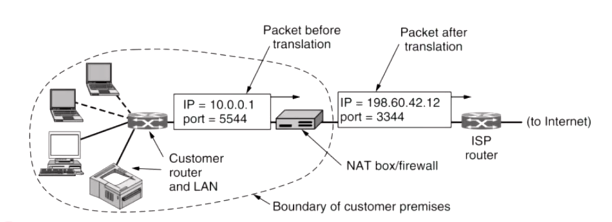
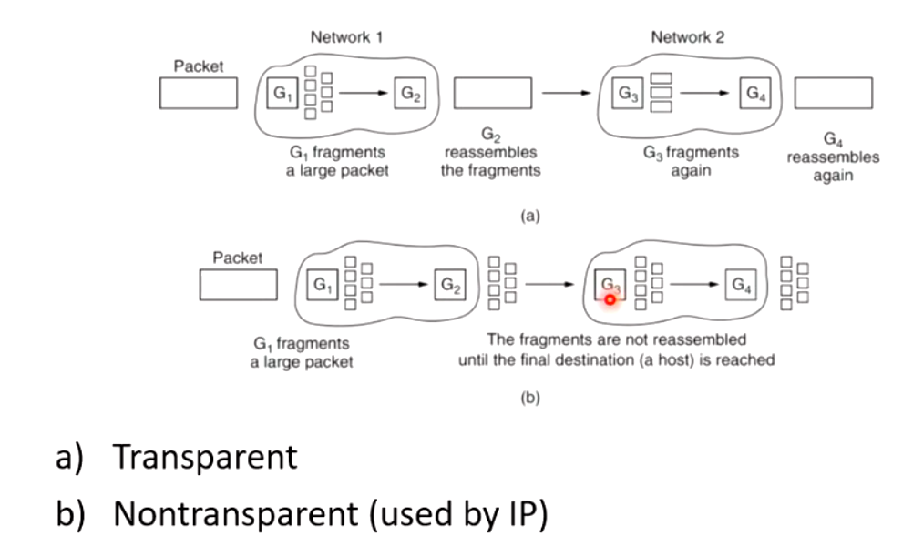
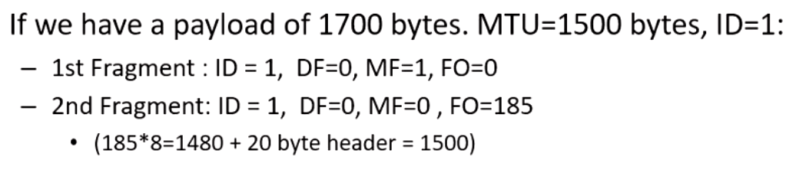
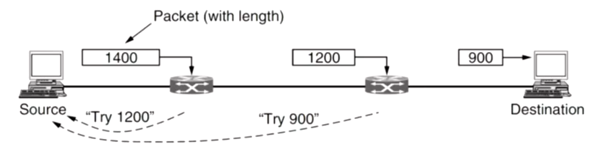
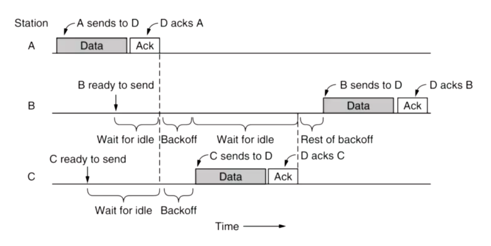

## IPv4 address scarcity and related solution

- As IP address became scare since the explosive increasing number in users, we need some approach to resolve this.
  - Use IPv6
    - But not fully implemented
  - Private addresses
    - Many hosts in a company only need internal access
    - Private subnets 192.168.0.0/16
    - Can be reused
      - Only require unique address within organisation, instead of globally
- NAT (Network Address Translation)
  - A type of port forwarding operating on network layer
  - Each customer/home is assigned one public IP address
  - Internally host/interfaces are issued Private IP address
  - Internal IP addresses are used for communicating amongst hosts in the Local Area Network (LAN)
  - They must never be used on the public internet
  - When a packet is handing out of the network (to ISP), the internal address is translated to the public IP address.
  - 
  - procedures
    - Assumes locations of source and destination port fields are specified
    - NAT box replace source address with public IP address
    - TCP source port replaced with index of entry in NAT **translation table**
      - Up to 65,536
      - Each entry contains private IP and original source port
    - IP and TCP checksums are recalculated
    - When a packet arrives from the internet at the NAT box, 
      - it looks up the destination port from the TCP header in the translation table
      - Retrieves original source port and source IP address, updates headers and checksums and sends to the internal host.
  - Problems
    - Breaks **end-to-end connectivity**
      - An interface in the private network can only receive packets once it has sent packets out and created a mapping
    -  **Layering** violation 
      - Initially only worked for TCP and UDP. Must edit FTP messages, because they mention port numbers, which are changed.
    - Violates **IP architectural** model
      - Which every interface on the internet has a unique IP address
      - Millions of interfaces connecting to the internet have 10.0.0.1
    - When NAT crashes, all connections are lost
    - Limits number of outgoing connection, since port numbers are 16 bits. (Up to 65535)
  - Advantages
    - ISP can only gives customers private addresses
    - Significant security advantage
      - Since packets can only be received once an outgoing connection has been created, the internal network is greatly shielded from the attacks from incoming unsolicited packets.
  - Likely to remain in use even after IPv6 is widely deployed and there is no longer a scarcity of IP address

## Fragmentation

- What

  - The action that the network breaks the large packets into smaller packets

- Why we need this?

  - Smaller packets, much easier to find the problem and doing re-transimission

- Why we don't send small packets at the very beginning?

  - Reduce overhead
    - Reduce the number of packets be sent
  - Reduce process time
    - Big packets has the same process time as smaller packets
  - Therefore, we want to minimize number of packets we sent

- Terminology

  - MTU (Maximum Transmission Unit)
    - Maximum packets that a particular network could carry
  - Path MTU
    - Maximum size for the path through the network
  - Why not just set the Path MTU at the sender?
    - Connectionless network with dynamic routing bot route and link MTU can change

- Problems

  - Breaking a large packet is easy, but put them back is much harder.
  - Approaches
    - Transparent Fragmentation
      - Reassembly is performed at next router, subsequent routers are unaware fragmentation has taken place
    - Nontransparent Fragmentation
      - Reassembly is performed at the destination host
    - 
    - G for gate way

- <u>IP header</u> could help the assemble of fragments

  - **Identification**
    - Use to identify fragments belongs to one packets
    - Need to be re-used, since we run out very fast
  - Flags (0 false, 1 true)
    - DF = Don't Fragment
    - MF = More Fragments (following me)
  - Fragment offset (like sliding window in TCP)
    - Offset in 8 byte blocks
      - 13 bits - max offset $(2^{13} -1) * 8 = 65528$
      - If the first one has length n, the offset for the next one is n
  - In real world, we could store the offset in a 8 bytes boundary, which ignore last 20 bytes in every blocks
    - (185*8 = 1480 +20 = header_size 1500)
    - 
  - Problems
    - The offset is smaller than we want to use
    - If a single fragment is lost then entire packet has to be resent
    - Overhead on hosts in performing reassembly higher than expected
  - Alternative
    - Path MTU discovery

- Path MTU discovery

  - Each packet is sent with the DF = 1
  - If a router cannot handle the packet size
    -  it sends a ICMP (Internet Control Message Protocol) to the sender host telling it to fragment its packets.
  - Disadvantages
    - May cause initial packets to be dropped, since host are learning the optimal size (its quick).
      - 
    - Fragmentation may still have to occur between hosts, unless upper layers can be informed of the size restriction
      - This is one reason why TCP/IP are typically implemented together so they can share such information
      - UDP relies on PMTUs discovered by TCP

- Fragmentation in IPv4 vs IPv6

  - IPv4 allows for either nontransparent fragmentation, or path MTU discovery
    - Minimum accept size 576 bytes
  - IPv6 expects hosts to discover the optimal path MTU, routers will not perform fragmentation in IPv6
    - Minimum accept size 1280 bytes
  - ICMP message are sometimes dropped by networks, causing Path MTU discovery to fail
    - Connection will only work for low volume

  

## Subnets

- A prefix in IP addressing indicates different destination networks on the internet
- The same approach can be used internally within an organisation to maximise the use of their assigned IP prefix

## MAC(medium access control)

- We prefer shared medium networks
  - But we only need one person to broadcast.
- Wireless communication
  - Such waves operate at a specific frequency
  - Different frequencies are reserved for different purposes, some are open and some are restricted
  - Ajacent channels are frequencies tend to interfere with each other
    - We normally have guards between two frequencies (a little gap)
- Aloha
  - Sending whenever you want
  - TOO MUCH COLLISION!
- CSMA/CD (carrier-sense multiple access)
  - Reduce collison
    - Don't start transmitting if someone else is already
- Collision detection
  - If we could detect a collision, we could do something else instead of simply waiting for timeout
  - Measure sum of my signal + theirs
    - If that exceeds a threshold, a collision occurred
  - Could not be used in wireless collisions
    - Since there is a big difference in size between transmit power and receive power
- CSMA/CA - WiFi MAC
  - Wait until other transmission finished
    - Time = sending time + ack time + backoff
  - 

- 