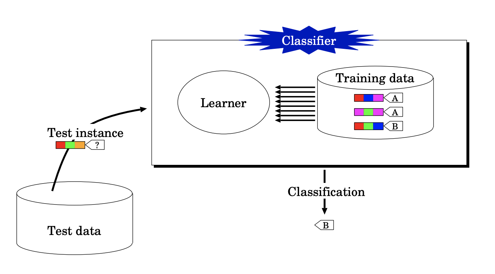

### Definitions

> **Instance** : A real world examples of a concept 
>
> **Attributes** : measuring aspects of an instance 
>
> **Concepts** : What we want to learn in the form of labels or classes 

### Type of Task in ML

>**<u>Supervised</u>** : prior knowledge of the relationship between instance and labels required
>
>**<u>Unsupervised</u>**: no external label required

- Classification
  - **<u>Supervised</u>**
  - Learning predicting which class does the new object belonging
    
  
- Clustering
  - **<u>Unsupervised</u>**
  - No prior knowledge required
  - Grouping similar instances together without giving the labels of all the instances.
- Regression
  - **<u>Supervised</u>**
  - Predicting a numeric quantity
  - A good regression is acceptably close to the true value
- Association Learning
  - Detecting useful associations or structures between attribute values
  
  - We can use the new rule to infer an attributes values based on another
  
    

### Different Type of Attribute
1. Nominal Quantities (**Categorical**, discrete)

   - values are distinct symbols, theirs no relation between them

   - can only perform equality tests
   - **<u>one-hot</u>** is the most salient method to process categorical data

2. Ordinal Quantities
   
   - Explicit order in-between possible values but **<u>no</u>** numerical distances are defined
   
3. Continuous Quantities

   - Real-valued attributes with well-defined zero point and no upper bound

   - Numerical distances are defined between values

   - Allow all mathematical operations

     

### Real world problem and world flow
1. Data Wrangling
2. Different Data Representations
   - e.g.  CSV, RAFF, etc 
3. Missing Values
   - Sometimes the missing value maybe really important, for example medical examination.
4. Inaccurate Values
   - maybe caused by unintentional (bad sensor on a robot) or deliberate (wrong post codes)
5. May cause some ethical problem
   - race & sex in medical application: OK
   - in loan or student application selections: unethical