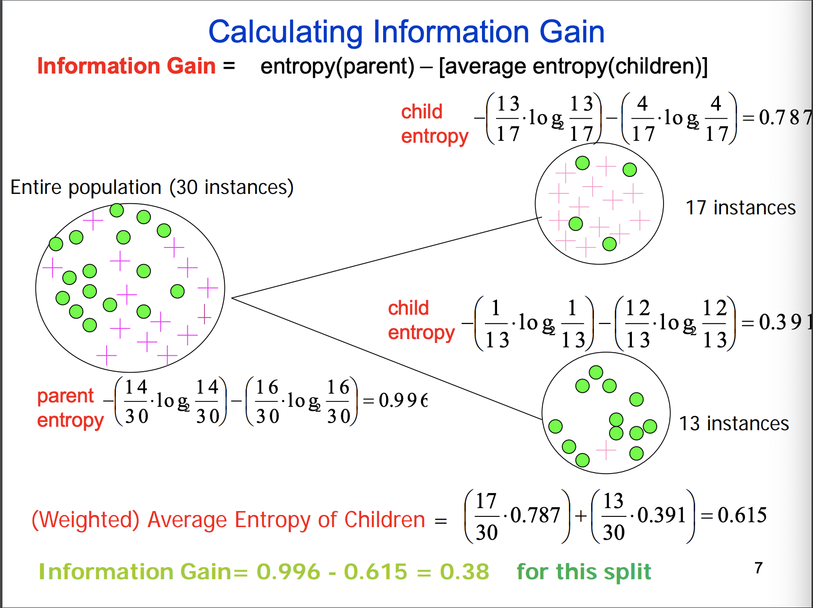

### Entropy

- A measure of unpredictability
- H(X) = $-\sum_{i=1}^{n}P(x_i)log_2P(x_i)$
  - where we define $0\log_20=0$
  - $P$ is the probability that $x_i$ occur, it is the frequency for most of the case.
- The range of the entropy value is **not** [0,1]
- $0 \leq Entropy \leq log(n)$, where n is the number of outcomes
  - 0 is a single event with probability 1, others are 0
  - log(n) uniform probability distribution which is each has $\frac{1}{n}$ 

### IG (information gain)

- Parent entropy - weighted child entropy

  

### Model

- Abstract representation of data

- probability model
  - we normally don’t know the probability so we have to estimate based on the incoming informations

### Naive Bayes 

- supervised machine learning algorithms
- Based on the bayes rule, for a given instance X with features $x^i$ ($i$ = 1…n)
  - We want
    -  $argmax\ P(Y=c_k|X=x^i) $ 
  - Now we have
    -  $P(Y=c_k|X_1=x_1, X_2=x_2…)$ 
  - Based on bayes rule
    -  $P(Y=c_k|X_1=x_1, X_2=x_2…)=\frac{P(X_1=x_1,X_2=x_2…|Y=c_k) P(Y=c_k)}{P(X_1=x_1,X_2=x_2…)}$ 
  - The denominator won't affect our result (since we only care who is the largest one), we can simply ignore that, then the equation becomes
    - $P(Y=c_k|X_1=x_1, X_2=x_2…) \propto P(X_1=x_1,X_2=x_2…|Y=c_k) P(Y=c_k)$ 
  - Assumption 
    - all of the features are independent. 
      - We might increase our error rate, but we reduce the complexity of the problem dramatically.
      - If the features are connected really closely, the premise for NB does not exist. Thus, the result will have a high error rate.
    - $P(Y=c_k)$ can be estimated using MLE or Bayesian estimate.
    - There is no big difference in distribution between training instance and testing instance.

- Smoothing
  - <u>Why?</u>
    - If the incoming instance has a feature that we haven't seen in the training set, we might get a 0 probability as a bad result.
    - However, nothing is 100% impossible.
  - <u>How?</u> 
    - Epsilon ($\epsilon$) smoothing
      - Replace all the 0 with a $\epsilon$ which is a number which greater than 0 but smaller than $\frac{1}{n}$ (preferably).
      - Assume $1+\epsilon \approx 1$
      - Reduce the problem to the cardinality of $\epsilon$ 
    - Laplace smoothing
      - $\hat{P}(X_i=x_i|Y=c_k) = \frac{\sum_i I(X_i=x_i,Y=c_k) + \lambda}{\sum I(Y=c_k) + n\lambda}$ Where n is the number of different attributes.
      - This equation comes from the combination of beta distribution (prior) and binomial distribution (posterior) which use the idea of bayes estimation.
      - Normally we set $\lambda$ to 1, but it actually can be any number.
      - It is known to systematically over-estimate the likelihood of unseen events, creating bias in certain circumstances.
        - When the training set are small.
    - Other choice
      - Add-k smoothing: set $\lambda$ to any integer which larger than one.
      - Regression
      - Good-Turing estimation
    - Which one is better?
      - Normally Laplace may perform better, but overall it depends on the data.
- Missing value
  - Ignore it in both training and testing dataset.
- Advantages of NB
  - Very simple to build, and run extremely fast to make decisions
  - <u>Works well in many application areas</u>, since it does not have a hash restriction of the data type.
  - <u>Scales easily</u> for large number of dimensions and data size
  - Decent interpretability
  - No need of exactly value of $P(Y=c_k|X_i=x_i)$, since we only care about which one is better.
  - Relative robust to two common type of errors:
    - ==Over-estimated some $P(Y=c_k|X_i=x_i)$, but we have under-estimated others. Overall, we tends to under-estimate overall probability.==
    - Some marginally-relevant attributes are correlated
- In practical
  - To prevent under-flow, we can use the log-transformation, which the final equation becomes
    - $argmax\ P(Y=c_k)\prod_i P(X_i=x_i|Y=c_k) = argmax[log(P(Y=c_k)) + \sum_ilog(P(X_i=x_i|Y=c_k))]$

