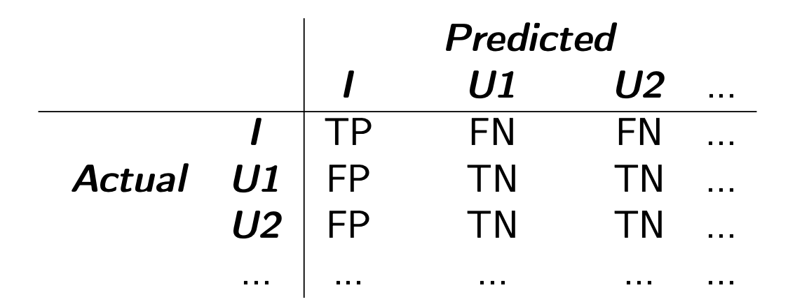

## Lecture 1

### classification evaluation

- Basic evaluation metric: Accuracy
  - $\frac{\text{number of correctly labelled test instances}}{\text{Total number of test instances}}$ 
  - how frequently the classifier is correct
- Need to split dataset
  - Training set
  - Test set
  - Evaluation set (not mentioned, but most of the case, we need this)
  - Testing on training set tends to grossly over-estimate
- Methods
  - Holdout
    - Pros
      - Simple to implement
      - Fairly high reproducibility
    - cons
      - Size of the split affects estimate of the classifier's behaviour
        - Too many testing instances results in the learner does not have enough instance to learn the pattern.
        - Too many training instances results in the evaluation might not be representative. (The estimation can be too high or too low)
  - Repeated Random Subsampling
    - Like holdout but iterated multiple times. New training set and test are chosen each time but relative size of training-test is fixed across iteration
    - pros
      - Can averaging holdout method tends to be more reliable
    - cons
      - More difficult to reproduce (actually we can set a sequence of random seed to reproduce)
      - Instances overlap
      - Slower than holdout, since it about doing hold-out multiple times
      - Hard to decide a perfect train-test ratio
  - K-fold cross validation
    - Data split into a number of partitions k. Iterate through all of them, use one to test and others to train, then average the results.
    - Take rough the same amount of time as Repeated Random Subsampling
    - Very reproducible 
    - Minimise **bias** and **variance** of our estimates of how good is our model
    - How big is m?
      - Impact runtime and size of datas
        - \# of partition $\uparrow$ , runtime $\uparrow$, variance in performance estimates $\downarrow$ 
      - Most common choice k = 10 (occasionally, 5)
      - Best choice is k= \# of instances (leave-one-out cross-validation) but too slow in practice
- Stratification (inductive bias)
  - We assume the distribution in bot seen and unseen data are the same
  - When doing holdout and cross validation, need to make sure that the distribution in both class are the same.
    - Also called <u>vertical sampling</u>

### evaluation metrics

- 4 possible class (needs to specify interesting class and an uninteresting class)
  - True Positive (TP)
  - True Negative (TN)
  - False Positive (FP)
  - False Negative (FN)
- Some useful figures
  - ACC = $\frac{\text{TP + TN}}{\text{TP + FP +FN + TN}}​$
  - ER = 1 - ACC
  - Precision: How often are we correct ,w.r.t the class that we are interested in
    - $\frac{\text{TP}}{\text{TP + FP}}$ 
  - Recall: among all the correctly identified instances, what is the proportion of the class we are interested in.
    - $\frac{\text{TP}}{\text{TP + FN}}$ 
  - F-score (harmonic mean of precision and recall)
    - $F_\beta = \frac{(1+\beta^2)PR}{\beta^2P + R}$
    - We normally use $F_1$-score, with $\beta =1$
- Expand to multi-class scenario
  - Confusion matrix
    - 
  - Macro-averaging (mean of each class)
    - $Precison_M = \frac{\sum^c_{i=1} Precision(i)}{c}$
    - $Recall_M = \frac{\sum^c_{i=1} Recall(i)}{c}​$
  - Weighted-averaging (based on the proportion of instances in that class)
    - $Precison_W = \sum^c_{i=1}(\frac{n_i}{N}) Precision(i)$
    - $Recall_W = \sum^c_{i=1}(\frac{n_i}{N}) Recall(i)$

### Results Comparison

- Baseline
  - Naive method which we would expect any reasonable well-developed method to better than that.
  - Random baseline
    - Randomly assign a class to each test instance (normally just calculate the probability distribution)
    - Randomly assign a class $c_k$ to each test instance, weighting the class assignment according to P($c_k $)
  - Zero-R (most commonly used baseline)
    - Classify all instances according to the most common class in the training data
    - <u>Inappropriate</u> if the majority class is FALSE and the learning task is to identify needles in the haystack
  - One-R
    - Create a **decision stamp** in the training data with branches for each values, and populate the leaf with the majority class at that leaf. Finally, select the decision stump which leads to the lowest error rate over the training data
    - pros
      - Simple to understand and implement
      - Simple to comprehend the results
      - Surprisingly good results
    - cons
      - Unable to capture attribute interactions
      - Bias when attributes with many possible values 
- Benchmark
  - Established rival technique which we are pitching our method to against.


## Lecture 2 (Decision Tree)

### ID3 Algorithm

- Construct decision tree using divide-and-conquer

  - ```pseudocode
    def ID3(Root):
    	if all instances at root have same class
      then stop
      else
      	1. selet an attribute
      	2. partitioning root node instances
      	3. create a branch for each attribute value
      	4. partition up root node instances according to each value
      	5. call ID3(LEAF) for each leaf node LEAF
    ```

- Since decision tree is a sequence of if-condition, it can be written in a disjunction form

### criterion for attribute selection

- Entropy
  - A measure of unpredictability
  - Given a probability distribution, the information required to predict an event is the **distribution's entropy**
  - $H(x) = -\sum^n_{i=1} P(i)log_2P(i) $
  - If most of the probability mass is assigned to a single event, **entropy is low** and the event is **predictable**. Otherwise, entropy is hight and the event is unpredictable.
- Information gain (IG)
  - Difference between the entropy after and before the splitting the tree
  - If the entropy decreases, then we have a better tree
- Mean Information