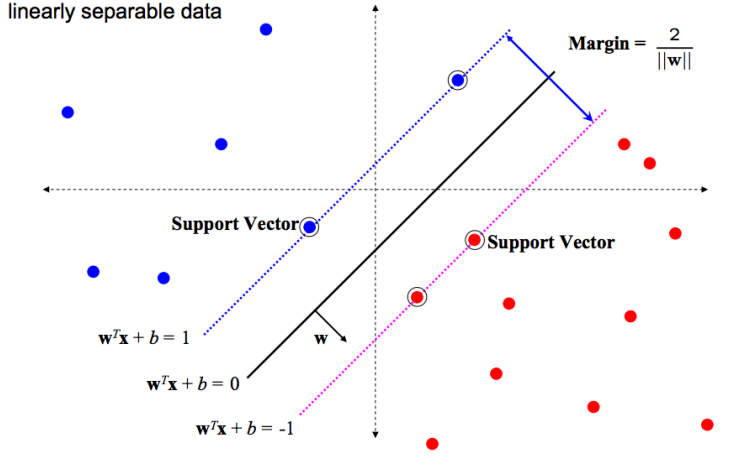
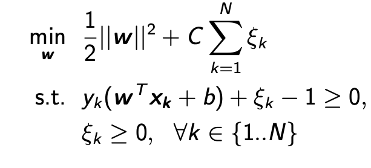

### Instance-Based Learning (IBL)

- IBL algorithms are **<u>supervised</u>** learning algorithms
- Require labelled data
- Directly “learn-by-example”
  - Input
    - instances
  - Model
    - Function that map instances to labels

###  Comparison of Similarity

- Jaccard Similarity
  - $sim(A, B) = \frac{|A \cap B|}{|A\cup B|}$
- Dice Coefficient
  - $sim(A, B) = \frac{2|A\cap B|}{|A|+|B|}$
  - Since there are 2 intersection part in $|A| + |B|$
- Similarity v.s. Dissimilarity
  - Similarity often falls in range [0,1], whereas dissimilarity does not have an upper bound.

### Feature vectors (very often used in NLP)

- n-dimensional vector of features of a object
  - Features can be any type
- A vector locates an instance as a point in an n-space. The angle of the vector in that space is determined by the relative weight of each term.

### Comparison of Distance

- Euclidean Distance ($L_2$ distance)

  - $d(A,B) = \sqrt{\sum^n_{i=1}(a_i-b_i)^2}$

- Manhattan Distance ($L_1$ distance)

  - $d(A,B) = \sum^n_{i=1}|a_i-b_i|$

- Cosine Similarity

  - $cos(P, Q) = \frac{pq}{|p||q|} = \frac{\sum_i p_iq_i}{\sqrt{\sum_ip_i^2}\sqrt{\sum_iq_i^2}}$

### Nearest Neighbours

- Different Form
  - K-NN
    - Classify the test input according to nearest K instance
    - K normally are odd numbers.
  - Weighted K-NN
    - Classify the test input according to the weighted accumulative class of the K nearest instances
    - Weights are based on similarity of the input to each of the K neighbours.
  - Offset-weighted K-NN
    - Where weights are based on similarity of the input to each of the K neighbours, and prior knowledge are introduced.
- Weighting Strategies
  - equal weight to all instances
    - Majority class rule
  - Inverse linear distance (ILD)
    - $w_j=\begin{cases}\frac{d_k-d_j}{d_k-d_1},& \text{if } d_j\neq d_1\\     1,& \text{if }d_j=d_1 \end{cases}\\ \text{where } d_1 \text{ is the nearest neighbour, and } d_k \text{ is the furthest neighbour}$
  - inverse distance (ID)
    - $w_j = \frac{1}{d_j + \epsilon}$
- Breaking Ties
  - Random tie breaking
  - Take class with highest prior probability
  - See if the addition of k+1 th instance(s) breaks the tie
- Choosing the value of K
  - Smaller values of K $\to $ overfitting
  - Larger values of K $\to$ performance to 0-R
- Pros
  - Simple
  - Can handle arbitrarily many classes
  - Incremental (can add extra data to the classifier on the fly)
- Weaknesses
  - Need
    - A useful distance function
    - An averaging function for combining the labels of multiple training examples
  - Expensive
    - In terms of index accesses
  - Everything is done at run time
    - Lazy learner
  - Hard to choose K, lead to bias

### Nearest Prototype

- How to calculate?
  1. We calculate the **<u>centroid</u>** of each class
     - Averaging the numeric values along each axis $\to $ centroid
  2. Classify each test instance according to the class of the centroid it is nearest to
- Classification is then simply based on euclidean distance

### Support Vector Machine (SVM)

- A **<u>linear classifier</u>** looks like
  - $f(x) = w^Tx + b$

- Optimal solution: find the hyperplane which maximize the margin

  - Which means maximizes the distance between the hyperplane and unconfident point close to decision boundary.
  - Intuition
    - If there are no points near the decision boundary/surface, then there are no very **<u>uncertain</u>** classification decisions.

- SVM-based Classification

  - Associate one class as positive(+1) and one as negative(-1)
  - Find the best hyperplane $w$ and $b$, which maximizes the margin between the positive and negative training instances

- Learning the SVM

  - Naive approach for small training set

    1. Pick a plane $w$ and b

    2. Find the worst classified sample $y_i$
       - This step is computationally expensive for large data sets

    3. Move plane $w$ and/or $b$ to improve the classification of $y_i$

    4. Repeat steps 2-3 until the algorithm converge

- **<u>Soft margins</u>** allow some data points to violate the separating hyperplane but the model remains robust.

- A kernel function can be used to allow the SVM to find a non-linear separating boundary between tow classes.

- Mathematical Perspective

  - Objective is to find the data points that act as the boundaries of the two classes
  - They called the “support vectors”
    - 
  - Optimization: maximizing the margin
    - Which is maximize $\frac{2}{||w||}$ same as minimize $\frac{1}{2}||w||^2$
      - As $||w||^2 = \sum\limits^n_{i=1}(w_i^2)$
  - Use “slack” to allow soft margins $\xi _k$
    - 
  - Use Lagrange multipliers to solve this constrained optimization problems

- Multi-class SVM

  - One-versus-all
    - Choose class which classifies test data point which greatest margin
  - One-versus-one
    - Choose class selected by most classifiers