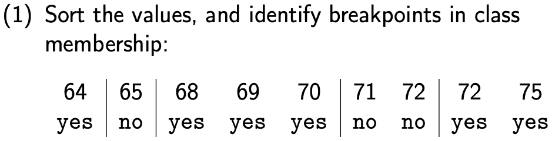
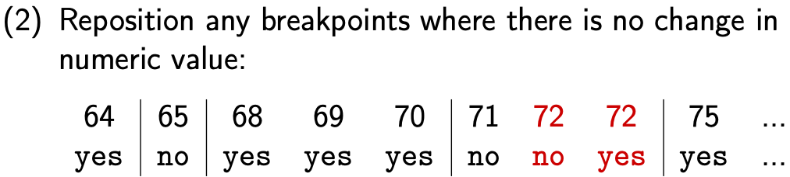
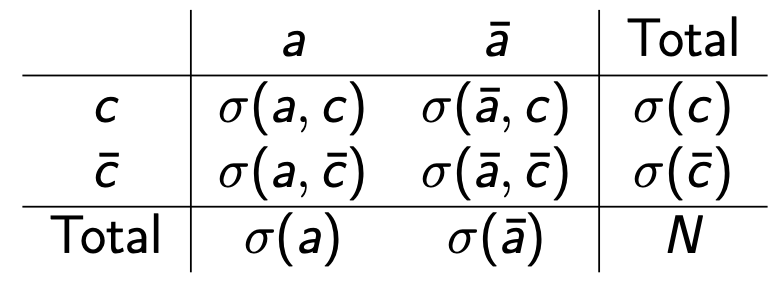

### Training Non-compatible models and data sets

- Nominal Attributes, Numeric learner
  - For K-NN and Nearest Prototype
    - We could use Hamming distance or Levenshtein distance
    - $d_H(A,B)=\sum_i\begin{cases}0,& \text{if } a_i=b_i\\     1,& \text{if }a_i\neq b_i \end{cases}\\ $
  - Randomly assign numbers to attribute values
    - If scale is constant between attributes, but still undesirable
    - ==Worse with attributes with many values==
      - But why?
    - Imposes an attribute ordering which may not exist
  - One-hot encoding (most common ML solution)
    - If nominal attribute takes m values, replace it with m booleans

- Numeric attributes, Nominal learner

  - Type of NB
    - Multivariate NB
      - Attributes are nominal, and can take any (fixed) number of values
      - Counts for a feature occur or not
    - Binomial (Bernoulli) NB
      - attributes are binary (special case of MV)
    - Multinomial NB
      - attributes are natural numbers
      - usually corresponding to frequencies
      - Count how many times that features occur
    - Gaussian NB
      - Attributes are real numbers
      - Can approximate use PDF
  - Decision
    - Use **<u>binarisation</u>** to split the tree
      - Two branch are created $a_k \leq m \text{ and }a_k>m$
      - IG/GR must be calculated for split which count each unique attribute value in the dataset
    - downside
      - It leads to arbitrarily large trees
    - Sometimes the data suggests a richer representation
      - Use ranges

- Discretisation

  - Translation of continuous attributes onto nominal attributes

  - Unsupervised

    - Naive

      - Each unique value as a discrete nominal value
      - Simple, but loss of generality, no sense of order and overfitting, since only describes the training data.

    - Equal width

      - Partition the values into bins of equal size

        - e.g. (1 $\to$ 11 $\to$ 21)

        - Simple, but badly effected by outliers and can create arbitrary n

    - Equal frequency

      - Sort the values, each bin has equal values
      - Simple and not affects by outliers, but can create arbitrary n.

    - K-menas clustering

      1. Select k points at random to act as seed clusters
      2. Assign each instance to the cluster with the nearest centroid
      3. Recomput centroid
      4. Repeat 2-3 until stable

      - Fast convergence
      - Weakness
        - Need multiple run
        - Random behaviour
        - Sensitive to outliers
        - Need to choose k

  - Supervised

    - Group values into class-contiguous interval
      - 
      - 
      - Simple, but usually creates too many categories (overfitting)
    - Modified procedure to avoid overfitting
      - Delay inserting a breakpoint until each “cluster” contains at least n instances of a single class
      - Merge neighbouring clusters until they reach a certain size/at least n instances of a single class

- Probability Density Function

  - Based on normal/gaussians distribution
  - A normal distribution is a reasonable approximation for many events.

### Feature Selection

- Wrapper
  - Aim
    - Choose subset of attributes that give best performance on the development data (w.r.t a single learner)
  - How it works
    - Train the model on all combination of the features, and chose the one with best feature set.
  - Advantages
    - Guarantee optimal solution.
  - Disadvantages
    - Too slow
  - Improvement
    - Greedy Approach
      - Train and evaluate model on each single attribute.
      - Do, until convergence
        - Train and evaluate model on best attributes, plus each remaining single attribute.
        - Choose best attribute out of the remaining set.
      - Pros
        - Normally converges very quick in practice
      - Cons
        - Normally converge to a sub-optimal solution
        - **<u>Assume independence</u>** of attributes
    - Ablation Approach
      - Start with all attributes, each time remove the most unhelpful one until divergence.
      - Terminate when performance starting to degrade by more than $\epsilon $
      - Pros
        - At the start mostly removes irrelevant attributes
      - Cons
        - Also assumes independence of attributes
        - Actually does take $O(m^2)$ time, cycles are slower with more attributes
        - ==Not feasible on non-trivial data sets.==
          - Non-trivial = complex
- Embedded
  - Some models actually perform feature selection
    - SVM and Logistic Regression
    - Decision Tree and Random Forest
  - Often benefit from other feature selection approaches
- Filters
  - Consider each attribute separately
  - Try to control inter-dependence

### Filtering method

- Pointwise Mutual Information (PMI)

  - Independent
    - $\frac{P(A,C)}{P(A)P(C)} = 1$, if independant
    - If LHS >> 1, attribute and class occur together much more often than random
    - If LHS $\approx$ 1, most likely independent
    - If LHS << 1,  attribute and class are negatively correlated
  - PMI(A = a, C = c) = $log_2\frac{P(a,c)}{p(a)P(c)}$ 
  - Higher PMI, more positively correlation with class
  - Problem
    - Could not show the case for all case, since one attribute may works well for one class but not the others.

- Contingency table and MI

  - Can be used to calculate PMI, MI and chi-square

  - 

    

- MI(mutual information)

  - $MI(O,C)=\sum_{i\in{s,o,r}}\sum_{j\in{c,\bar{c}}}P(i,j)log_2{\frac{P(i,j)}{P(i)P(j)}}$
  - MI(A,C) = $P(a, c)*PMI(a,c) \\+ P(\bar{a},c)*PMI(\bar{a},c) \\+ P(a,\bar{c})*PMI(a,\bar{c}) \\+ P(\bar{a}, \bar{c}) * PMI(\bar{a}, \bar{c})$ 
    - We still use $0log0 \equiv 0$
  - Problems
    - Biased toward common, uninformative features

- Chi-square

  - $\chi^2 = \sum\limits^r_{i=1}\sum\limits^c_{j=1} \frac{(O_{i,j}-E_{i,j})^2}{E_{i,j}}$

  - Normally expect value are uniform distribution

  - Problems

    - Biased toward rare, informative features, since we squaring the difference
    - If a feature is seen rarely but always with a given class, it will be seen as "good"

    

### Data Type Issue

- Nominal attributes
  - Treat as multiple binary
    - Sunny = Y, overcast = N, rainy = N
    - Difficult to interpret
  - Expand the contingency table
    - Outlook = {sunny, overcast, rainy}
    - $MI(O,C)=\sum\limits_{i\in{s,o,r}}\sum\limits_{j\in{c,\bar{c}}}P(i,j)log_2{\frac{P(i,j)}{P(i)P(j)}}$
    - ==Biased towards attributes with many values== 
      - Why?
- Continuous attributes
  - Fit the empirical data by using normal distribution
  - Discretised the values
- Ordinal attributes (low, med, high or 1,2,3,4)
  - Treat as binary
    - Count frequency
  - Treat as continuous
  - Treat as nominal
    - Throw away ordering