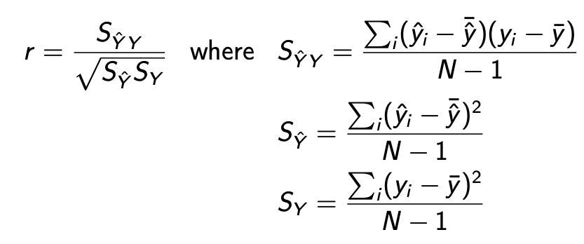

### Hyper-parameter Optimisation

- $\hat{\theta^h}=\arg\min_{\theta^h\in\Theta}Error(\theta^h;\mathcal{L},\mathcal{F}(\mathcal{T}))$
- Where $\mathcal{T}$ is a dataset, a feature representation $\mathcal{F}(\mathcal{T})$, a learner $\mathcal{L}$ with hyper-parameters $\theta^h$
- Analytic solution
  - derivatives
  - Requires solving $\frac{\partial(Error)}{\partial\theta_i} $
  - Whereas, derivatives are not defined.
- Grid Search
  - Indentify boundaries for hyper-parameter
  - Divide range into steps
  - Exhaustively search the space and find best score
- Hyper-parameter Tuning should avoid overfitting

### Regression

- Assuming linear relationship between the k attribute values $a_i$ and the numeric output c

  - $c = w_0 + \sum\limits^{k}_{i=0}w_ia_i \\ \text{where } w_i \text{ is a weight corresponding to } a_i$

- Fitting the model

  - **<u>Least squares estimation</u>** which minimise the Residual Sum of Squares
    - $RSS(\beta)=\sum\limits_i(y_i-\hat{y_i})^2 \\\text{ }\text{ }\text{ }\text{ }\text{ }\text{ }\text{ }\text{ }\text{ }\text{ }\text{    }\text{ }\text{   }=\sum\limits_i(y_i-\beta x_i)^2 \\\text{Notice that RSS is convex}$
    - Set derivatives of RSS, w.r.t weight vector $\beta $, for n instances, and D distribution to 0 and solve unknowns
  - Gradient Descent
    - $\beta_k^{i+1}:=\beta_k^i+2\alpha\sum\limits^N_{j=1}x_{jk}(y_j-\hat{y_j^i})$
    - The gradient points up-hill, we follow it down-hill. Each update reduces the error slightly
    - Learning rate $\alpha$
      - Small is slow
      - Large might miss minimum and never converge

- Evaluation of Numeric Prediction

  - Mean squared error
    - $MSE =\frac1N\sum\limits_i(\hat{y_i}-y_i)^2$
  - Root mean-squared error (RMSE)
    - RMSE=\sqrt{MSE}
  - Root relative squared error (RRSE)
    - $RRSE=\sqrt{\frac{\sum_i(\hat{y_i}-y_i)^2}{\sum_i(y_i-\bar{y})^2}},\text{where }\bar{y}=\frac{\sum_i{y_i}}N $
  - Person's correlation (statistical correlation between predicted and actual values)
    - 

  

### Logistic regression

- It is a **<u>linear</u>** classification algorithms.

  - Works well when data is linear separable.

- Output is the probability of a class

- Logit

  - $logit(P)=\log\frac{P}{1-P} \\ logit(1-P)=-logit(P)$

- Use **logistic function (sigmoid)** to make sure the probability is smooth and in range of [0,1]

  - $logitP(c|\textbf{x})=log\frac{P(c|\textbf{x})}{1-P(c|\textbf{x})}=\beta_0+\beta_1x_1+...+\beta_Dx_D$
  - $P(c|x) = \frac{1}{1+e^{-(\beta x)}} = h_\beta(x)$ 
  - Where $\beta x$ is the results of log linear regression
  - 

- Compare NB and LR

  - In NB, we are trying to maximize $P(x_i|c_j)$
  - In logistic regression we model $P(c_j|x_1,x_2,…,x_D)$ directly

- Using gradient descent to learn the $\beta$ 

  - We want the probability belongs to one class to be 1 and the other to be 0
  - In this case, we have the likelihood function
    - $P(Y|X;\beta) = \prod\limits^{N}_{I=1}(h_\beta(x_i))^{y_i} * (1-h_\beta(x_i))^{1-y_i}$
    - Where $y_i$ can only take 0 or 1 to indicate which class it belongs to
    - This is a Bernoulli distribution
    - Take log of it and use **<u>gradient ascent</u>** to maximize it

- LR for multi-class problem

  - Chose any class to be pivot, so that we can conclude linear relation between different class
  - Which is
    - $log\frac{P(A|x)}{P(C|x)} = \beta_A*x$
      - The larger the fraction, the more likely the instance belongs to non-pivot (Class A), the smaller the value, the more likely the instance belongs to pivot (Class B).
    - $P(A|x) = P(C|x) * exp(\beta_A *x)$
    - Similar for $P(B|x)$
    - $P(A|x) + P(B|x) + P(C|x) = 1$
    - Probability of all class sum to 1
    - $P(A|x) = \frac{1}{1+\sum\limits_{k \in A,B} -e^{\beta*x}}$
  - Therefore, we could express all other class in terms of all other class.
  - Make sure they sum to 1
    - $P(y=j|x;\beta)=\frac{\exp(\beta_jx)}{1+\sum_{k=1}^{|C|-1}\exp(\beta_kx)}$
  - Probability of “pivot” class has 1 in the numerator
  - Log-linear probabilities need to subtract a normalising term for softmax
    - $Z_i=\sum_{k=1}^{|C|}e^{\beta_kx_i}$

  

### Overview of Logistic Regression

- Pros
  - Vast improvement on Naive Bayes
  - Particularly suited to frequency-based features
- Cons
  - Slow to train
  - Some feature scaling issues
  - Often needs a lot of data to work well
  - Need regularisation to avoid overfitting

