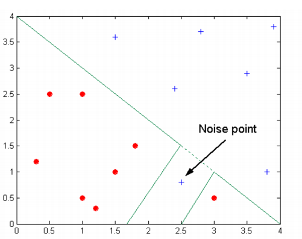

> **<u>Overfitting</u>**: the classifier works well on training set but really bad on evaluation set
>
> **<u>Consistency</u>**: classifier able to flawlessly predict the class of all training instance
>
> **<u>Generalisation</u>**: how well does the classifier generalise from the specifics of the training example to predict the target function

### Factors to consider

- Overfitting
  - Plot learning curves based on split sizes
  - If hold-out is used
    - Trade-off between more training instances and more evaluation instances (more reliable estimate of effectiveness)
- Generalisation
  - A good model should fit the training data well, and generalise well to unseen data
  - The expectation is that training and test data are randomly selected from the same population, but neither are the entire population.
- Possible evidences of overfitting
  - Decision boundary distorted by noice
    - 
  - Could be due to small numbers of examples
  - Could be due to non-randomness in training sample (sample bias)

### Model Bias and Variance

- Model bias
  - Classifier makes systematically wrong predictions
- Evaluation bias
  - Evaluation strategy to over or under estimate the effectiveness of our classifier
- Sampling bias
  - Training or evaluation dataset isn't representative of the population
- Model variance
  - Different training sets to produce different model/predictions with the same learner
  - Different randomly sampled training set leads to very different predictions on the evaluation set
- High bias and high variance are often bad, but low bias and low variance are no guarantee of good
  - Weighted random classifier is low bias
  - 0-R is low variance (zero variance)

### Evaluation bias and variance

- Evaluation bias
  - Similar logic to model bias
  - Our estimate of effectiveness of a model is systematically to high/low
- Evaluation variance
  - Our estimate of the effectiveness of a model changes a lot as we alter the instances in the evaluation set.
- Difference between evaluation bias and model bias
  - Whether we need to compare with external labeled data.
- Control evaluation basis and variance
  - Holdout partition size 
    - More training data: less model variance, more evaluation variance
  - Repeated random subsampling and K-fold Cross-Validation
  - Stratification
    - less model bias
  - Leave-one-out Cross-Validation
    - No possibility of sampling bias, lowest bias/variance in general