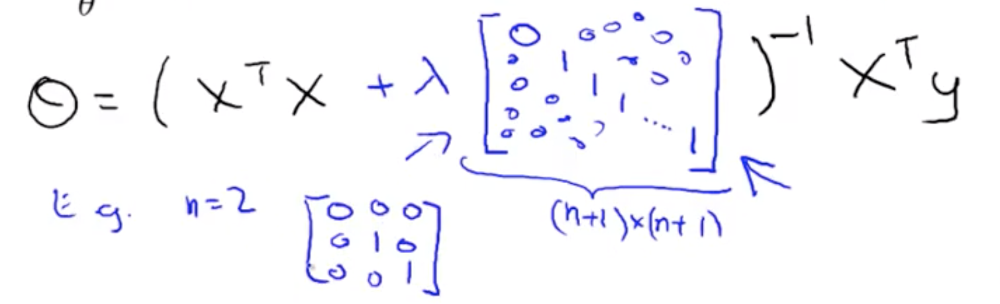
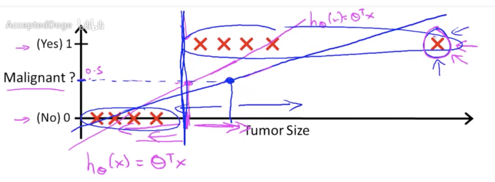
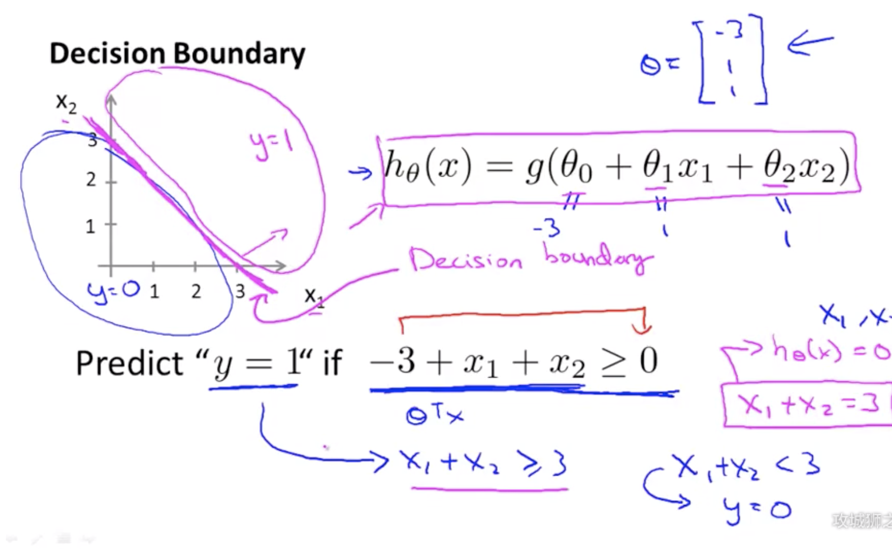
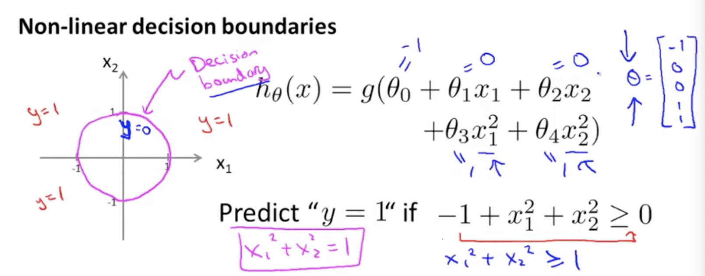
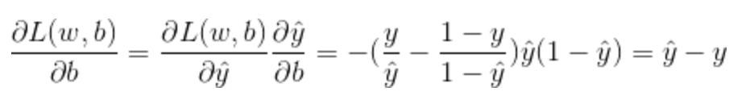

### Normal Equation for Linear Regression

- $\theta = (X^TX)^{-1} X^Ty$

- With regularization term

  - 

- Derived by linear algebra

- Where x is a matrices of features

  - 

- y is a matrix of target values

- Comparing GD and normal equation, assume **m** training examples and **n** features

  - | GD                                    | NE                                                           |
    | ------------------------------------- | ------------------------------------------------------------ |
    | Need to choose $\alpha$               | No need to choose $\alpha$ (better)                          |
    | Needs many iterations                 | Don't need to iterate (better)                               |
    | Works well even with large n (better) | Low if n is very large since the cost of calculating $(X^TX)^{-1}$ is huge $O(n^3)$ |

- Problem — $X^TX$ might be non-invertible (singular), it may caused by

  - Redundant features — features are linearly dependent
    - $x_1$ = size in feet^2^
    - $x_2$ = size in m^2^
  - Too many features (m $\ll$ n)
    - Delete some features
    - Use regularization

### Classification

- Why Linear Regression is not a good idea
  - Some extreme data will significantly shift the threshold, which could predict something right to the wrong side
  - 

- Logistic Regression
  - Interpretations
    - The probability of the event $\theta$
  - $P(Y=0|x;\theta) + P(Y=1|x;\theta) = 1$
  - When making predictions
    - $z = \theta^Tx$ is linear regression
    - $g(z) \geq 0.5 \implies z \geq 0$
      - Where g is the logistic(sigmoid) function
    - $g(z) \leq 0.5 \implies z \leq 0$
  - How decision boundary are made
    - 
  - Non-Linear decision boundaries
    - Just use hight order new features, e.g. add $x^2$ as a new features, where we could get a non-linear decision boundary
    - 
    - Or we could use a combination of different features to come up with some more complicated decision boundaries 
      - e.g. $x_1x_2$, $x_1x_2^2$ as new features
  - Cost function
    - MSE are non-convex for logistic regression
    - If y = 1
      - $Cost(h_\theta(x), y) = -log(h_\theta(x))$
    - If y = 0
      - $Cost(h_\theta(x), y) = -log(1-h_\theta(x))$
    - Combine
      - $Cost(h_\theta(x), y) = -y\ log(h_\theta(x)) - (1-y)log(1-h_\theta(x))$
      - Which is identical to above two
  - Update rule are same as Linear regression (surprise)
    - 

### Advanced Optimization Algorithms

- Conjugate gradient
- BFGS
- L-BFGS
- Pros
  - No need to manually pick $\alpha$
  - Often faster than gradient descent
- Cons
  - More complex

### PCA

- Reduce from n-dimension to k-dimension
  - Find $k$ vectors onto which to project the data, so as to minimize the **projection error**.
  - Whereas, Linear Regression is trying to minimise the distance between the prediction and real value.